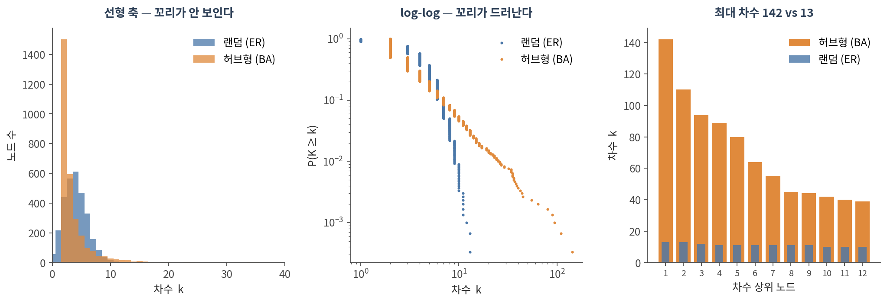
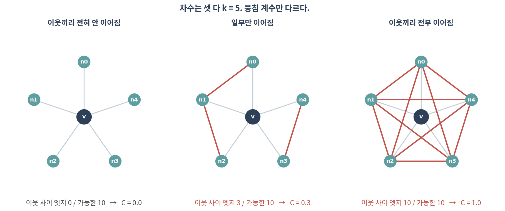
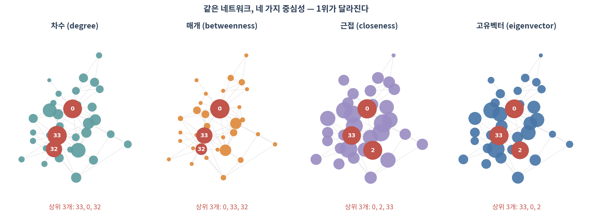

::: {.callout-note collapse="true"}
## 🎯 학습 목표

이 챕터를 마치면 다음을 할 수 있습니다.

-   차수 분포를 그리고, ⚠️ 왜 선형 축이 아니라 log-log로 봐야 하는지 말할 수 있다
-   ⚠️ "생물학 네트워크는 scale-free"라는 주장이 왜 과장인지 설명할 수 있다
-   평균 경로 길이·지름·뭉침 계수를 계산하고 해석할 수 있다
-   중심성 다섯 가지가 각각 무엇을 재는지 구분할 수 있다
-   ⚠️ hub과 bottleneck이 왜 다른 유전자인지, 논문에 쓸 때 무엇을 밝혀야 하는지 말할 수 있다
:::

> 🤔 **생각해볼 질문**
>
> 논문에 "TP53은 이 네트워크의 hub 유전자다"라고 씁니다. 어느 지표로 hub인가요? 지표를 바꾸면 순위가 그대로일까요?

------------------------------------------------------------------------

## 1. 차수 분포 📊 {#c03-s1}

### 1) 차수와 그 분포 {#c03-s1-1}

-   **차수(degree)** *k* — 한 노드에 붙은 엣지 수 (🔗 [02 §2.3](02_representation.qmd#c02-s2-3))
-   **차수 분포 P(k)** — 차수가 *k*인 노드의 비율. 네트워크 전체의 성격을 한 장으로 보여주는 요약

💡 평균 차수 하나만 보고하는 것은 거의 쓸모가 없습니다. 평균이 같아도 분포는 전혀 다를 수 있습니다.

### 2) 왜 log-log인가 {#c03-s1-2}

{fig-align="center"}

| | 랜덤 (ER) | 허브형 (BA) |
|-------------------|-------------------|-----------------------------------|
| 평균 차수 | 4.00 | 4.00 |
| 중앙값 | 4 | **2** |
| **최대 차수** | **13** | **142** |
| 평균 뭉침 계수 | 0.0011 | 0.0101 |

-   ⚠️ **평균은 같습니다.** 그런데 최대 차수는 11배 차이 납니다
-   선형 축에서는 꼬리에 있는 노드가 몇 개뿐이라 **보이지 않습니다**
-   ✅ 그래서 log-log로, 그리고 히스토그램보다 **CCDF**(P(K ≥ k))로 그립니다 — 구간 나누기(binning)에 결과가 좌우되지 않습니다

### 3) ⚠️ "생물학 네트워크는 scale-free"는 과장이다 {#c03-s1-3}

2000년대 초 "PPI 네트워크는 scale-free이고, 따라서 허브가 필수적이다"라는 서사가 널리 퍼졌습니다.

⚠️ 그런데:

-   Broido와 Clauset(2019)은 실제 네트워크 약 1,000개를 통계적으로 검정해, **강한 의미의 scale-free는 드물다**고 보고했습니다
-   log-log에서 직선처럼 보이는 것은 **증거가 아닙니다**. 로그 축에서는 여러 분포가 직선처럼 보입니다
-   PPI의 꼬리는 상당 부분 **연구 편향** 때문일 수 있습니다 — 많이 연구된 단백질에 엣지가 많이 달립니다(🔗 07)

✅ 실무적으로 할 일:

-   "꼬리가 두껍다", "차수가 매우 불균등하다"까지는 말해도 됩니다
-   "scale-free이므로 ⋯"라는 **인과 서사는 쓰지 마세요**
-   분포를 주장하려면 `powerlaw` 같은 패키지로 대안 분포(log-normal 등)와 **비교 검정**해야 합니다

------------------------------------------------------------------------

## 2. 거리와 뭉침 📏 {#c03-s2}

### 1) 최단경로, 지름, 평균 경로 길이 {#c03-s2-1}

-   **최단경로(shortest path)** — 두 노드를 잇는 가장 짧은 엣지 열
-   **거리(distance)** — 그 최단경로의 엣지 수
-   **지름(diameter)** — 모든 쌍의 거리 중 **최댓값**
-   **평균 경로 길이** — 모든 쌍 거리의 평균

⚠️ 주의할 점:

-   연결되지 않은 쌍은 거리가 무한대입니다 → **거대 요소 안에서만** 계산합니다(🔗 [02 §3.1](02_representation.qmd#c02-s3-1))
-   지름은 **가장 극단적인 한 쌍**이 정하므로 잡음에 약합니다. 평균 경로 길이를 함께 보고하세요
-   모든 쌍 최단경로는 O(n·m) 이라 큰 네트워크에서는 무겁습니다 → 표본 추출로 근사합니다

### 2) 뭉침 계수 {#c03-s2-2}

**뭉침 계수 C** — "내 이웃끼리도 서로 이웃인가"

{fig-align="center"}

-   차수 *k*인 노드의 이웃 쌍은 최대 **k(k−1)/2**개 → 그중 실제로 이어진 비율이 C
-   💡 분모를 전체 노드 수가 아니라 **이웃의 최대치**로 잡는 것이 핵심입니다. 실제 네트워크는 sparse해서 전체 대비로는 모든 값이 0에 가까워집니다

::: {.callout-warning collapse="true"}
## 평균 C 와 transitivity 는 다른 값입니다

두 가지가 흔히 혼동됩니다.

-   **평균 뭉침 계수** — 노드별 C를 구해 평균. 차수가 작은 노드도 한 표를 행사
-   **Transitivity(전역 뭉침 계수)** — 전체 삼각형 수 ÷ 전체 삼각형 후보 수. 차수가 큰 노드가 더 큰 영향

Zachary karate club에서:

-   평균 C = **0.571**
-   Transitivity = **0.256**

→ 두 배 이상 차이 납니다. ✅ **어느 쪽을 썼는지 반드시 밝히세요.** `nx.average_clustering()`과 `nx.transitivity()`는 다른 함수입니다.
:::

### 3) Small-world {#c03-s2-3}

-   **Small-world** = 평균 경로가 **짧으면서** 뭉침이 **높은** 성질
-   랜덤 네트워크는 경로는 짧지만 뭉침이 낮고, 격자는 뭉침이 높지만 경로가 깁니다
-   실제 생물학 네트워크는 대체로 둘 다 만족합니다
-   ⚠️ 하지만 "small-world다"는 **null model과 비교해야** 나오는 판정입니다. 04에서 실제로 검정합니다

------------------------------------------------------------------------

## 3. 중심성 — 허브는 하나가 아니다 🎯 {#c03-s3}

### 1) 다섯 가지 {#c03-s3-1}

| 중심성 | 재는 것 | 한 줄 직관 | 생물학적 해석 |
|------------|---------------|---------------|-----------------------------|
| **차수** | 이웃 수 | 아는 사람이 많다 | hub 유전자 |
| **매개(betweenness)** | 최단경로가 나를 지나는 비율 | 내가 빠지면 길이 끊긴다 | **bottleneck** — 모듈 사이 중개자 |
| **근접(closeness)** | 전체와의 평균 거리의 역수 | 어디든 빨리 닿는다 | 빠른 전파 위치 |
| **고유벡터** | 중요한 이웃과 연결된 정도 | 중요한 사람을 안다 | 핵심 코어 소속 |
| **PageRank** | 고유벡터 + 랜덤 점프 | 방향이 있어도 계산된다 | 방향 네트워크용, 막다른 길 처리 |

{fig-align="center"}

**Zachary karate club에서 상위 3개:**

| 중심성 | 1위 | 2위 | 3위 |
|-------------|-------------|-------------|-------------|
| 차수 | **33** | 0 | 32 |
| 매개 | **0** | 33 | 32 |
| 근접 | **0** | **2** | 33 |
| 고유벡터 | **33** | 0 | 2 |
| PageRank | **33** | 0 | 32 |

-   ⚠️ **1위가 지표마다 바뀝니다.** 차수로는 33번, 매개로는 0번이 1위입니다
-   근접에서는 차수 순위에 없던 **2번**이 올라옵니다 — 이웃은 적지만 위치가 중앙입니다

### 2) ⚠️ Hub과 bottleneck은 다른 유전자다 {#c03-s3-2}

-   **Hub** = 차수가 큰 노드. 한 모듈 안에서 많은 상대와 접촉
-   **Bottleneck** = 매개 중심성이 큰 노드. **모듈과 모듈 사이**를 잇는 자리

💡 둘은 겹칠 수도, 완전히 다를 수도 있습니다. 차수가 3인데 두 모듈 사이의 유일한 통로라면, hub은 아니지만 강력한 bottleneck입니다.

-   Yu 등(2007)은 효모 네트워크에서 **betweenness가 높은 bottleneck 단백질이 차수와 무관하게 필수 유전자와 상관**된다고 보고했습니다
-   → 표적 후보를 고를 때 차수만 보면 이런 단백질을 놓칩니다

✅ **논문에 쓸 때:** "hub gene"이라고만 쓰지 말고 **어느 중심성으로 몇 위인지** 적으세요. 심사자가 가장 먼저 묻는 질문입니다.

### 3) 그 밖에 알아둘 두 가지 {#c03-s3-3}

-   **Assortativity(차수 상관)** — 차수가 큰 노드끼리 붙는 경향. 값이 음수면 허브가 서로 피하는 구조
-   **k-core 분해** — 차수가 *k* 미만인 노드를 반복해서 떼어내며 남는 핵심. 잡음이 많은 네트워크에서 **핵심 부분만 보고 싶을 때** 유용합니다

### 4) ⚠️ 중심성을 해석하기 전에 {#c03-s3-4}

-   **중심성은 네트워크가 정확하다는 가정 위에 있습니다.** 엣지가 빠져 있으면 순위가 바뀝니다
-   ⚠️ PPI에서 차수 상위 유전자는 **많이 연구된 유전자**와 상당히 겹칩니다 — 07에서 다룹니다
-   ⚠️ "이 값이 큰가?"는 **null model 없이는 답할 수 없습니다** — 04 전체가 이 이야기입니다
-   ✅ 그리고 01의 질문이 여기서도 유효합니다: 임계값을 0.05 바꿔도 상위 10개가 그대로인가?

::: {.callout-tip collapse="true"}
## 🐍 실습 — 중심성 비교표 만들고 순위가 얼마나 흔들리는지 보기

Colab에서 실행합니다. 설치는 [90. Colab 환경 설정](90_colab_setup.qmd) 참고.

```python
import numpy as np, pandas as pd, networkx as nx
import matplotlib.pyplot as plt

G = nx.karate_club_graph()          # 자기 네트워크로 바꿔도 그대로 돌아갑니다
G = G.subgraph(max(nx.connected_components(G), key=len)).copy()   # 거대 요소만

# ── 1. 기본 요약 ─────────────────────────────────────────────────────
print(f"노드 {G.number_of_nodes()}, 엣지 {G.number_of_edges()}")
print(f"평균 경로 {nx.average_shortest_path_length(G):.3f}, "
      f"지름 {nx.diameter(G)}")
print(f"평균 C {nx.average_clustering(G):.3f}, "
      f"transitivity {nx.transitivity(G):.3f}")   # ⚠️ 두 값은 다릅니다

# ── 2. 차수 분포 (log-log CCDF) ──────────────────────────────────────
d = np.array([k for _, k in G.degree()])
x = np.sort(d); ccdf = 1 - np.arange(len(x)) / len(x)
plt.loglog(x, ccdf, "."); plt.xlabel("k"); plt.ylabel("P(K ≥ k)")

# ── 3. 중심성 5종 비교표 ─────────────────────────────────────────────
cent = pd.DataFrame({
    "degree":      nx.degree_centrality(G),
    "betweenness": nx.betweenness_centrality(G),
    "closeness":   nx.closeness_centrality(G),
    "eigenvector": nx.eigenvector_centrality(G, max_iter=1000),
    "pagerank":    nx.pagerank(G),
})
cent.sort_values("betweenness", ascending=False).head(10)

# 지표끼리 순위가 얼마나 일치하는가 (스피어만)
cent.corr(method="spearman").round(2)

# ── 4. ⚠️ 순위는 얼마나 튼튼한가 — 엣지 10%를 지워보기 ───────────────
rng = np.random.default_rng(0)
edges = list(G.edges())
top10_full = cent["betweenness"].nlargest(10).index

overlap = []
for rep in range(20):
    H = G.copy()
    drop = rng.choice(len(edges), size=int(0.1 * len(edges)), replace=False)
    H.remove_edges_from([edges[i] for i in drop])
    H = H.subgraph(max(nx.connected_components(H), key=len)).copy()
    bt = pd.Series(nx.betweenness_centrality(H))
    overlap.append(len(set(bt.nlargest(10).index) & set(top10_full)))
print(f"엣지 10% 제거 시 상위 10개 중 평균 {np.mean(overlap):.1f}개 유지")
```

**확인할 것:**

-   ⚠️ degree와 betweenness의 스피어만 상관이 얼마나 되는가 — 1에 가깝지 않다면 "hub"이라는 말이 모호합니다
-   ⚠️ 엣지 10%만 지워도 상위 10개가 몇 개나 바뀌는가. 절반 이하만 유지된다면 그 순위는 보고할 만한 결과가 아닙니다
-   `nx.eigenvector_centrality`가 수렴하지 않으면 `max_iter`를 올리거나 `eigenvector_centrality_numpy`를 쓰세요
:::

------------------------------------------------------------------------

## 📝 요약

-   평균 차수만 보고하는 것은 거의 쓸모가 없습니다 — 평균이 같아도 최대 차수가 11배 차이 날 수 있습니다
-   ✅ 차수 분포는 log-log CCDF로 그리세요. 선형 축에서는 꼬리가 보이지 않습니다
-   ⚠️ "scale-free이므로 ⋯"라는 서사는 쓰지 마세요. 강한 의미의 scale-free는 실제로 드뭅니다
-   거리·지름·평균 경로 길이는 **거대 요소 안에서만** 의미가 있습니다
-   ⚠️ 평균 뭉침 계수와 transitivity는 다른 값입니다 (karate: 0.571 vs 0.256). 어느 쪽인지 밝히세요
-   중심성 다섯 가지는 서로 다른 것을 잽니다. **1위가 지표마다 바뀝니다**
-   ⚠️ hub(차수)과 bottleneck(매개)은 다른 유전자이고, bottleneck은 차수와 무관하게 필수성과 관련됩니다
-   ✅ "hub gene"이라고만 쓰지 말고 어느 중심성으로 몇 위인지 적으세요
-   ⚠️ 어떤 값이 큰지는 null model 없이 답할 수 없습니다 → 04

------------------------------------------------------------------------

## ➕ 더 읽을거리

### 교과서

Newman M. *Networks.* 2nd ed. Oxford University Press; 2018. (7장: 중심성)

### 차수 분포와 scale-free 논쟁

Barabási AL, Albert R. [*Emergence of scaling in random networks.*](https://doi.org/10.1126/science.286.5439.509) Science. 1999.\
Broido AD, Clauset A. [*Scale-free networks are rare.*](https://doi.org/10.1038/s41467-019-08746-5) Nat Commun. 2019.\
Holme P. [*Rare and everywhere: perspectives on scale-free networks.*](https://doi.org/10.1038/s41467-019-09038-8) Nat Commun. 2019. (위 논문에 대한 균형 잡힌 논평)

### 중심성과 생물학적 의미

Jeong H, Mason SP, Barabási AL, Oltvai ZN. [*Lethality and centrality in protein networks.*](https://pubmed.ncbi.nlm.nih.gov/11333967/) Nature. 2001.\
Yu H, Kim PM, Sprecher E, Trifonov V, Gerstein M. [*The importance of bottlenecks in protein networks: correlation with gene essentiality and expression dynamics.*](https://doi.org/10.1371/journal.pcbi.0030059) PLoS Comput Biol. 2007.

### 도구

[NetworkX — 중심성 알고리즘 문서](https://networkx.org/documentation/stable/reference/algorithms/centrality.html)\
[powerlaw 패키지 — 분포 적합과 비교 검정](https://pypi.org/project/powerlaw/)
