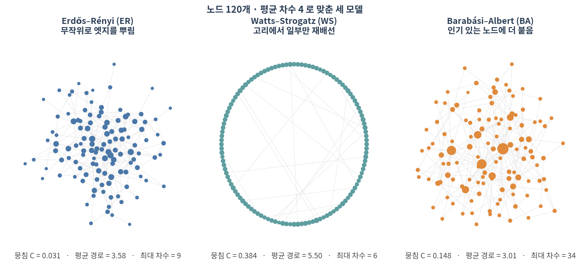
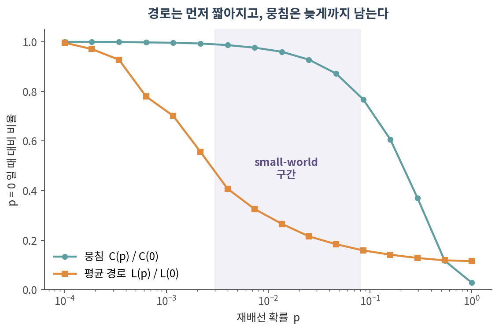
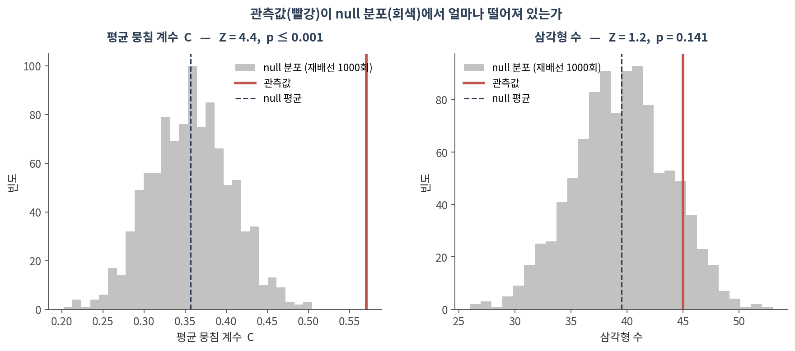
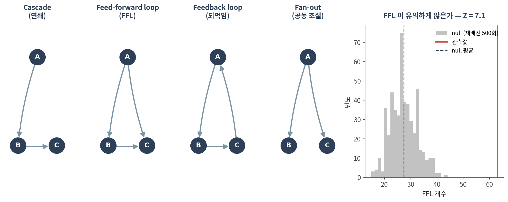

::: {.callout-note collapse="true"}
## 🎯 학습 목표

이 챕터를 마치면 다음을 할 수 있습니다.

-   ER·WS·BA 세 모델이 각각 무엇을 재현하고 무엇을 못 하는지 말할 수 있다
-   ⚠️ 왜 네트워크 지표를 단독으로 보고하면 안 되는지 설명할 수 있다
-   차수 보존 재배선으로 null 분포를 만들고 Z-score와 경험적 p-value를 계산할 수 있다
-   ⚠️ 같은 네트워크에서 지표를 바꾸면 결론이 뒤집힐 수 있음을 예로 들 수 있다
-   모티프의 정의가 왜 null model에 의존하는지, FFL이 무엇인지 말할 수 있다
:::

> 🤔 **생각해볼 질문**
>
> 내 PPI 네트워크의 뭉침 계수가 0.57로 나왔습니다. 큰 값인가요?

------------------------------------------------------------------------

## 1. 세 가지 생성 모델 🎲 {#c04-s1}

### 1) 무엇을 만드는 모델인가 {#c04-s1-1}

{fig-align="center"}

| 모델 | 만드는 규칙 | 뭉침 C | 평균 경로 | 최대 차수 |
|--------------|-------------------------|---------|---------|-------------|
| **Erdős–Rényi (ER)** | 모든 쌍에 같은 확률로 엣지 | 0.031 | 3.58 | 9 |
| **Watts–Strogatz (WS)** | 고리에서 확률 *p*로 재배선 | **0.384** | 5.50 | 6 |
| **Barabási–Albert (BA)** | 차수에 비례해 새 엣지가 붙음 | 0.148 | **3.01** | **34** |

-   **ER** — 가장 단순한 비교 기준. 경로는 짧지만 ⚠️ **뭉침이 거의 없습니다**. 실제 생물학 네트워크와 가장 다른 지점
-   **WS** — 뭉침을 살리면서 경로를 줄이는 방법. **small-world**의 설명 모델
-   **BA** — **허브**를 만드는 방법. 새 노드가 이미 인기 있는 노드에 붙는다는 가정(preferential attachment)

⚠️ 어느 모델도 실제 네트워크의 모든 성질을 재현하지 못합니다. 이들은 "실제 네트워크가 이렇게 생겼다"가 아니라 **"이 한 가지 규칙만으로 이만큼 설명된다"**는 사고 실험입니다.

### 2) Small-world가 생기는 구간 {#c04-s1-2}

{fig-align="center"}

-   *p*를 조금만 올려도 **평균 경로는 급격히 짧아지는데**, 뭉침은 거의 그대로입니다
-   *p* = 0.004에서 경로는 41%로 줄지만 뭉침은 **99%가 남아 있습니다**
-   💡 지름길 몇 개만 있으면 세계가 좁아진다 — 이것이 small-world의 정체입니다

⚠️ 그러니 "우리 네트워크는 small-world다"는 그 자체로 발견이 아닙니다. 웬만한 sparse 네트워크는 다 그렇습니다. 말하려면 **null 대비 얼마나 그런지**를 보여야 합니다.

------------------------------------------------------------------------

## 2. ⚠️ Null model이 핵심이다 {#c04-s2}

### 1) 관측값 하나로는 아무 말도 할 수 없다 {#c04-s2-1}

앞 질문으로 돌아갑니다. 뭉침 계수 0.57은 큰 값일까요?

-   비교 대상이 없으면 답이 없습니다
-   "ER 모델보다 크다"는 비교는 **너무 약합니다** — ER은 뭉침이 거의 0이라 거의 모든 실제 네트워크가 이깁니다
-   ✅ 제대로 된 비교는 **내 네트워크와 차수 분포가 똑같은** 가짜 네트워크입니다

### 2) 차수 보존 재배선 {#c04-s2-2}

**Degree-preserving rewiring** — 엣지 두 개를 골라 양끝을 맞바꿉니다.

```
(A–B), (C–D)   →   (A–D), (C–B)
```

-   각 노드의 **차수는 그대로**, 연결의 짜임만 무작위가 됩니다
-   이것을 수만 번 반복하면 "차수 분포는 같지만 나머지는 우연인" 네트워크 하나
-   그 과정을 1,000번 반복해 지표를 다시 재면 **null 분포**를 얻습니다

$$Z = \frac{\text{관측값} - \text{null 평균}}{\text{null 표준편차}}$$

-   경험적 p-value = (null이 관측값 이상인 횟수 + 1) / (반복 수 + 1)
-   ⚠️ 재배선 *N*회로 낼 수 있는 **가장 작은 p는 1/(N+1)**입니다. 1,000회면 p ≤ 0.001까지밖에 못 갑니다

### 3) ⚠️ 지표를 바꾸면 결론이 뒤집힌다 {#c04-s2-3}

{fig-align="center"}

| 지표 | 관측 | null 평균 ± 표준편차 | Z | p |
|-----------|-----------|-------------------|--------|---------------------|
| 평균 뭉침 계수 C | 0.571 | 0.357 ± 0.049 | **4.4** | ≤ 0.001 |
| 삼각형 수 | 45 | 39.5 ± 4.4 | **1.2** | 0.141 |

-   ⚠️ **"뭉침이 유의하게 높다"와 "삼각형이 유의하게 많지 않다"가 동시에 참입니다**
-   왜? 평균 뭉침 계수는 노드마다 한 표씩 주므로 **차수가 작은 노드**의 영향이 큽니다. 삼각형 총수는 허브가 지배합니다
-   → 이 네트워크에서 특별한 것은 "삼각형이 많다"가 아니라 **"차수가 작은 노드들이 촘촘히 뭉쳐 있다"**입니다

✅ 교훈: **어떤 지표를 골랐는지가 곧 결론입니다.** 논문에는 지표 이름과 null model 종류, 반복 횟수를 모두 적으세요.

::: {.callout-warning collapse="true"}
## null model 고를 때 흔한 실수 세 가지

-   ❌ **ER을 null로 쓰기** — 차수 분포를 보존하지 않으므로 "허브가 있다"는 당연한 결과만 재확인합니다
-   ❌ **재배선 횟수가 모자람** — 엣지 수의 10배 이상 섞어야 원래 구조가 충분히 지워집니다. `nswap=10*m` 정도부터
-   ❌ **null을 100번만 만들고 p \< 0.01 이라고 쓰기** — 100회로는 p ≤ 0.01이 한계입니다

💡 그리고 무엇을 보존할지는 **질문에 따라 달라집니다**. 차수만 보존할 수도 있고, 차수 + 커뮤니티 구조를 함께 보존해야 할 때도 있습니다. 보존하는 것이 많을수록 보수적인 검정이 됩니다.
:::

------------------------------------------------------------------------

## 3. 모티프와 그 유의성 🔺 {#c04-s3}

### 1) 부분구조, 모티프, graphlet {#c04-s3-1}

-   **부분구조(subgraph)** — 네트워크 안의 작은 연결 패턴. 그냥 세면 됩니다
-   **모티프(motif)** — 그중 **null보다 유의하게 자주** 나타나는 것. 정의부터가 §2에 의존합니다
-   **Graphlet / GDV** — 모티프를 노드 단위로 확장한 것. "이 노드는 어떤 모양들 속에 몇 번 등장하는가"

⚠️ 그래서 "이 네트워크에는 삼각형 모티프가 있다"는 말은 성립하지 않습니다. 삼각형은 **부분구조**이고, 모티프가 되려면 검정을 통과해야 합니다.

### 2) 방향 그래프의 3-노드 패턴 {#c04-s3-2}

{fig-align="center"}

| 패턴 | 생물학적 의미 |
|------------------|------------------------------------------------------|
| **Cascade** | 단순 연쇄 전달 |
| **Feed-forward loop (FFL)** | 잡음 여과, 신호 지연 — 전사조절에서 가장 많이 연구된 패턴 |
| **Feedback loop** | 되먹임. 🔗 [02 §3.3](02_representation.qmd#c02-s3-3)의 SCC가 바로 이것 |
| **Fan-out** | 한 조절자가 여러 표적을 동시에 조절 |

-   심어둔 FFL 25개 → 관측 63개, null 평균 27.4 ± 5.0, **Z = 7.1**
-   ⚠️ 방향 그래프의 null은 **in-degree와 out-degree를 모두 보존**해야 합니다 (`nx.directed_edge_swap`)
-   ⚠️ 관측값(63)이 심은 개수(25)보다 큰 이유 — 무작위 엣지가 우연히 만든 FFL이 섞여 있습니다. 그래서 null 비교가 필요합니다

### 3) Structural role vs community {#c04-s3-3}

-   **Community(커뮤니티)** = 어디에 속해 있는가 — 가까운 노드끼리 묶음 (05에서 다룸)
-   **Structural role(구조적 역할)** = 어떤 모양을 하고 있는가 — **멀리 떨어져 있어도** 같은 역할일 수 있음

💡 예: 서로 다른 경로에 있는 두 전사인자가 각각 자기 모듈에서 fan-out 허브 노릇을 한다면, 커뮤니티는 다르지만 **역할은 같습니다**. graphlet degree vector로 이런 유사성을 잽니다.

::: {.callout-tip collapse="true"}
## 🐍 실습 — 내 네트워크 지표에 Z-score 붙이기

Colab에서 실행합니다. 설치는 [90. Colab 환경 설정](90_colab_setup.qmd) 참고.

```python
import numpy as np, pandas as pd, networkx as nx
import matplotlib.pyplot as plt

G = nx.karate_club_graph()          # 자기 네트워크로 바꿔도 그대로 돌아갑니다
G = G.subgraph(max(nx.connected_components(G), key=len)).copy()
m = G.number_of_edges()

# ── 1. 재고 싶은 지표를 함수로 정의 ──────────────────────────────────
metrics = {
    "avg_clustering": nx.average_clustering,
    "transitivity":   nx.transitivity,
    "triangles":      lambda g: sum(nx.triangles(g).values()) // 3,
    "assortativity":  nx.degree_assortativity_coefficient,
    "avg_path":       nx.average_shortest_path_length,
}
obs = {k: f(G) for k, f in metrics.items()}

# ── 2. 차수 보존 재배선으로 null 분포 만들기 ─────────────────────────
N = 1000                             # ⚠️ p ≤ 1/(N+1) 까지만 말할 수 있습니다
rng = np.random.default_rng(0)
null = {k: [] for k in metrics}
for i in range(N):
    H = G.copy()
    nx.double_edge_swap(H, nswap=10 * m, max_tries=200 * m,
                        seed=int(rng.integers(1e9)))
    H = H.subgraph(max(nx.connected_components(H), key=len)).copy()
    for k, f in metrics.items():
        null[k].append(f(H))

# ── 3. Z-score 와 경험적 p ───────────────────────────────────────────
rows = []
for k in metrics:
    v = np.array(null[k])
    z = (obs[k] - v.mean()) / v.std(ddof=1)
    p_hi = (np.sum(v >= obs[k]) + 1) / (N + 1)      # 관측값이 큰 쪽
    p_lo = (np.sum(v <= obs[k]) + 1) / (N + 1)      # 작은 쪽
    rows.append({"metric": k, "observed": round(obs[k], 4),
                 "null_mean": round(v.mean(), 4),
                 "null_sd": round(v.std(ddof=1), 4),
                 "Z": round(z, 2), "p": round(min(p_hi, p_lo) * 2, 4)})
pd.DataFrame(rows)

# ── 4. 방향 그래프라면 (전사조절 등) ─────────────────────────────────
# nx.directed_edge_swap(H, nswap=5*m, max_tries=200*m)   # in/out 차수 모두 보존
```

**확인할 것:**

-   ⚠️ 지표마다 Z가 얼마나 다른가 — 하나가 유의하다고 다른 것도 유의하지 않습니다
-   ⚠️ `double_edge_swap`은 연결성을 보장하지 않습니다. 재배선 후 거대 요소를 다시 잡는 줄이 들어 있는 이유입니다
-   재배선 횟수를 `1*m`, `10*m`, `50*m`으로 바꿔가며 null 평균이 안정되는 지점 찾기
-   ✅ 이 표를 논문 supplement에 그대로 넣을 수 있습니다
:::

------------------------------------------------------------------------

## 📝 요약

-   ER·WS·BA는 실제 네트워크의 초상화가 아니라 **한 가지 규칙의 사고 실험**입니다
-   ER은 뭉침이 거의 없고, WS는 뭉침을 살리며, BA는 허브를 만듭니다 — 어느 것도 전부를 재현하지 못합니다
-   ⚠️ small-world는 웬만한 sparse 네트워크가 다 만족합니다. 그 자체로는 발견이 아닙니다
-   ✅ 표준 null은 **차수 보존 재배선**입니다. ER을 null로 쓰면 당연한 결과만 재확인합니다
-   Z-score = (관측 − null 평균) / null 표준편차, 경험적 p의 하한은 **1/(N+1)**
-   ⚠️ karate club에서 평균 뭉침 계수는 Z=4.4로 유의하지만 삼각형 수는 Z=1.2로 유의하지 않습니다 — **지표 선택이 곧 결론**
-   모티프는 "자주 나오는 패턴"이 아니라 **"null보다 유의하게 자주 나오는 패턴"**입니다
-   ⚠️ 방향 그래프의 null은 in-degree와 out-degree를 모두 보존해야 합니다
-   커뮤니티(위치)와 structural role(역할)은 다른 개념입니다

------------------------------------------------------------------------

## ➕ 더 읽을거리

### 생성 모델

Erdős P, Rényi A. *On random graphs I.* Publ Math Debrecen. 1959.\
Watts DJ, Strogatz SH. [*Collective dynamics of 'small-world' networks.*](https://doi.org/10.1038/30918) Nature. 1998.\
Barabási AL, Albert R. [*Emergence of scaling in random networks.*](https://doi.org/10.1126/science.286.5439.509) Science. 1999.

### Null model과 모티프

Maslov S, Sneppen K. [*Specificity and stability in topology of protein networks.*](https://doi.org/10.1126/science.1065103) Science. 2002. (차수 보존 재배선을 생물학 네트워크에 도입)\
Milo R, Shen-Orr S, Itzkovitz S, Kashtan N, Chklovskii D, Alon U. [*Network motifs: simple building blocks of complex networks.*](https://doi.org/10.1126/science.298.5594.824) Science. 2002.\
Mangan S, Alon U. [*Structure and function of the feed-forward loop network motif.*](https://doi.org/10.1073/pnas.2133841100) PNAS. 2003.

### 도구

[NetworkX — `double_edge_swap`](https://networkx.org/documentation/stable/reference/algorithms/generated/networkx.algorithms.swap.double_edge_swap.html)\
[NetworkX — `directed_edge_swap`](https://networkx.org/documentation/stable/reference/algorithms/generated/networkx.algorithms.swap.directed_edge_swap.html)
