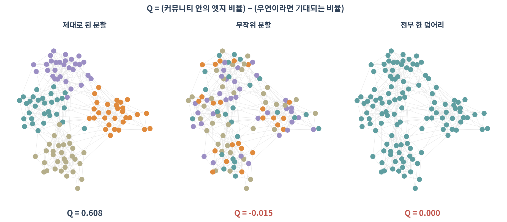
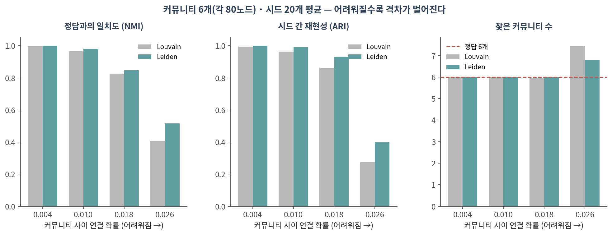
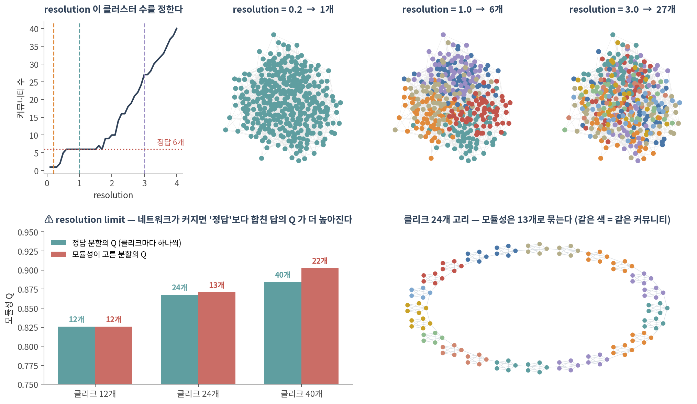
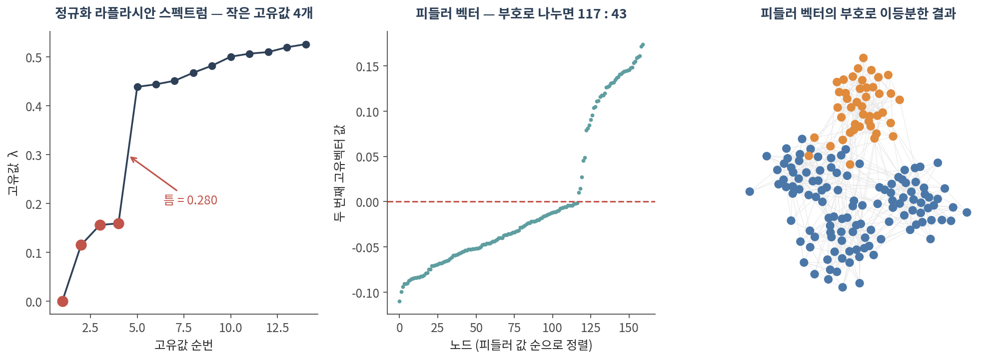

::: {.callout-note collapse="true"}
## 🎯 학습 목표

이 챕터를 마치면 다음을 할 수 있습니다.

-   모듈성 Q가 무엇을 재는지, 왜 04의 null model과 같은 아이디어인지 말할 수 있다
-   Girvan-Newman → Louvain → Leiden의 흐름과 Leiden을 쓰는 이유를 말할 수 있다
-   ⚠️ resolution 파라미터가 하는 일과, 옳은 값이 없다는 것을 설명할 수 있다
-   ⚠️ resolution limit이 알고리즘의 결함이 아니라 Q의 성질임을 예로 들 수 있다
-   라플라시안 고유값과 피들러 벡터로 그래프를 나누는 원리를 말할 수 있다
:::

> 🤔 **생각해볼 질문**
>
> `sc.tl.leiden(adata, resolution=1.0)`으로 클러스터 12개가 나왔습니다. 0.5로 바꾸면 8개가 됩니다. 어느 쪽이 맞나요?

------------------------------------------------------------------------

## 1. 모듈성 Q 🧱 {#c05-s1}

### 1) 정의 {#c05-s1-1}

$$Q = (\text{커뮤니티 안에 있는 엣지 비율}) - (\text{우연이라면 기대되는 비율})$$

-   뒷항이 바로 **null model**입니다 — 차수를 보존한 채 엣지를 아무렇게나 이었을 때의 기대값(🔗 [04 §2](04_random_null.qmd#c04-s2))
-   즉 Q는 "이 분할이 우연보다 얼마나 나은가"를 하나의 숫자로 요약한 것입니다

{fig-align="center"}

| 분할 | Q |
|------------------------|-----------|
| 제대로 된 분할 | **0.608** |
| 무작위 분할 | −0.015 |
| 전부 한 덩어리 | 0.000 |

-   💡 **전부 한 덩어리면 Q는 정확히 0입니다.** 모든 엣지가 "안"에 있지만, 기대값도 똑같이 100%라서 상쇄됩니다
-   무작위 분할은 **음수**가 될 수 있습니다 — 우연보다 못하다는 뜻

### 2) Q를 최대화한다는 것 {#c05-s1-2}

-   가능한 분할의 수는 노드 수에 대해 폭발적으로 늘어나므로 **전부 시도할 수 없습니다**
-   그래서 모든 커뮤니티 검출 알고리즘은 **근사**입니다 — 최적해를 찾았다는 보장이 없습니다
-   ⚠️ 그래서 시드를 바꾸면 답이 달라집니다. 이 점이 §2와 §3의 출발점입니다

------------------------------------------------------------------------

## 2. 알고리즘 계보 🧬 {#c05-s2}

### 1) 네 가지 {#c05-s2-1}

| 알고리즘 | 방식 | 지금 쓰나 |
|-----------|-------------------------------|---------------------------|
| **Girvan–Newman** | 매개 중심성이 큰 엣지부터 제거 | ❌ 느림. 개념 설명용 |
| **CNM (greedy)** | Q가 가장 많이 오르는 쌍부터 병합 | 가끔 |
| **Louvain** | 지역 이동 → 커뮤니티를 노드로 축약 → 반복 | 여전히 널리 |
| **Leiden** | Louvain + 분할 정련 단계 추가 | ✅ **현재 표준** |

-   Girvan–Newman은 03의 매개 중심성을 그대로 씁니다 — "모듈 사이를 잇는 엣지부터 끊자"
-   Louvain은 빠르고 좋아서 10년 넘게 표준이었습니다
-   **Leiden**(Traag et al. 2019)은 Louvain에 정련 단계를 넣어, Louvain이 만들 수 있는 **내부가 끊긴 커뮤니티** 문제를 막습니다

### 2) 정답을 아는 그래프에서 비교해보기 {#c05-s2-2}

확률 블록 모형으로 커뮤니티 6개(각 80노드)를 만들고, 커뮤니티 **사이** 연결 확률만 올려가며 두 알고리즘을 시드 20개로 돌렸습니다.

{fig-align="center"}

| 커뮤니티 사이 연결 확률 | NMI (정답 일치) | ARI (재현성) | 찾은 커뮤니티 수 |
|------------------|------------------|------------------|------------------|
| 0.004 (쉬움) | 0.996 / **1.000** | 0.994 / **1.000** | 6.0 / 6.0 |
| 0.010 | 0.965 / **0.981** | 0.965 / **0.991** | 6.0 / 6.0 |
| 0.018 | 0.825 / **0.848** | 0.863 / **0.931** | 6.0 / 6.0 |
| 0.026 (어려움) | 0.409 / **0.516** | 0.274 / **0.400** | 7.5 / **6.8** |

*(Louvain / Leiden 순. 정답은 6개)*

-   구조가 뚜렷하면 **둘 다 완벽합니다** — 쉬운 문제에서는 차이가 없습니다
-   ⚠️ 흐릿해질수록 격차가 벌어집니다. 가장 어려운 조건에서 **시드 간 재현성이 0.27 vs 0.40**
-   ⚠️ 그리고 Louvain은 정답보다 **더 잘게 쪼갭니다**(7.5개 vs 6.8개)

✅ 실무 지침: **Leiden을 쓰고, 시드를 고정하고, 시드를 바꿔 한 번은 확인하세요.** 답이 크게 달라진다면 그 클러스터링은 결과가 아닙니다.

::: {.callout-warning collapse="true"}
## `python-louvain`을 쓰지 마세요

-   `python-louvain`(import 이름 `community`)은 최신 numpy·pandas 환경에서 빌드에 실패합니다
-   ✅ 대신 networkx 내장 `networkx.algorithms.community.louvain_communities`를 쓰세요
-   ✅ Leiden은 `leidenalg` + `python-igraph` 조합입니다. R에서는 `igraph::cluster_leiden()`

⚠️ 참고: `leidenalg`의 기본 목적함수는 `ModularityVertexPartition`(모듈성)과 `RBConfigurationVertexPartition`(resolution 조절 가능)이 다릅니다. resolution을 쓰려면 후자여야 합니다. `scanpy`는 내부적으로 후자를 씁니다.
:::

------------------------------------------------------------------------

## 3. ⚠️ Resolution은 답이 없다 {#c05-s3}

{fig-align="center"}

### 1) 클러스터 수는 파라미터가 정한다 {#c05-s3-1}

정답이 6개인 그래프에서:

| resolution | 찾은 커뮤니티 수 |
|------------|-------------------|
| 0.2 | **1개** (전부 하나로) |
| 1.0 | **6개** ✅ |
| 3.0 | **27개** |

-   ⚠️ `sc.tl.leiden(adata, resolution=...)`의 그 값입니다. 세포 클러스터 수는 여기서 정해집니다
-   ⚠️ **통계적으로 옳은 값을 정하는 기준은 없습니다.** 알고리즘은 시키는 대로 쪼갭니다
-   🔗 [01 §3](01_why_networks.qmd#c01-s3)에서 kNN 그래프의 *k*가 그랬듯, 여기서도 숫자 하나가 결과를 만듭니다

✅ 대신 할 일:

-   **marker 유전자와 기존 지식**으로 검증하세요 — 점수가 아니라
-   **안정성**을 보세요: resolution을 ±20% 흔들어도, 시드를 바꿔도 그 클러스터가 살아남는가
-   높은 resolution에서 새로 생긴 클러스터에 **진짜 고유한 marker**가 있는지 확인
-   ✅ **쓴 값을 반드시 보고하세요**

### 2) ⚠️ Resolution limit — 알고리즘의 잘못이 아니다 {#c05-s3-2}

노드 5개짜리 완전 그래프(클리크)를 고리 모양으로 이어 붙입니다. 정답은 분명합니다 — **클리크마다 커뮤니티 하나**.

| 클리크 수 | 정답 분할의 Q | 모듈성이 고른 분할 | 그 Q |
|------------|--------------|-------------------|--------------|
| 12개 | 0.8258 | 12개 ✅ | 0.8258 |
| 24개 | 0.8674 | **13개** | **0.8709** |
| 40개 | 0.8841 | **22개** | **0.9025** |

-   ⚠️ 클리크 40개에서, **정답의 Q(0.8841)보다 이웃 클리크를 둘씩 합친 답의 Q(0.9025)가 더 높습니다**
-   즉 알고리즘이 실수한 것이 아니라, **Q라는 목적함수가 그 답을 더 좋아합니다**
-   왜? Q의 기대값 항은 **네트워크 전체 엣지 수**로 나눕니다 → 네트워크가 커질수록 작은 모듈은 "우연히도 생길 만한 것"으로 취급됩니다
-   💡 같은 클리크인데 **네트워크가 커졌다는 이유만으로** 못 찾게 됩니다 (Fortunato & Barthélemy 2007)

✅ 대응:

-   resolution을 올려 작은 모듈을 보이게 하거나
-   관심 영역만 잘라내 **부분 네트워크에서 다시** 클러스터링하거나
-   Leiden의 CPM(Constant Potts Model)처럼 **전체 크기에 의존하지 않는** 목적함수를 쓰거나

### 3) 겹치는 커뮤니티 {#c05-s3-3}

-   지금까지는 노드 하나가 커뮤니티 하나에만 속했습니다
-   ⚠️ 그러나 단백질은 여러 복합체에, 유전자는 여러 경로에 동시에 속합니다
-   **Clique percolation**, **BigCLAM** 등이 겹침을 허용합니다 — 개념만 알아두세요

------------------------------------------------------------------------

## 4. 스펙트럴 방법 🎼 {#c05-s4}

### 1) 라플라시안 {#c05-s4-1}

-   **라플라시안** $L = D - A$ (D는 차수를 대각선에 놓은 행렬, A는 인접 행렬)
-   **정규화 라플라시안**은 차수 차이를 보정한 것 — 실제로는 이쪽을 씁니다

{fig-align="center"}

### 2) 고유값이 커뮤니티 수를 귀띔한다 {#c05-s4-2}

가장 작은 고유값 8개: **0, 0.115, 0.156, 0.159**, 0.439, 0.444, 0.452, 0.468

-   0에 가까운 고유값이 **4개**, 그 뒤에 **0.28의 틈**이 있습니다 → 커뮤니티 4개
-   💡 연결 요소가 *k*개면 고유값 0이 정확히 *k*개입니다. 커뮤니티는 "거의 끊어진" 상태이므로 고유값이 "거의 0"이 됩니다
-   ⚠️ 실제 데이터에서 이 틈이 늘 뚜렷하지는 않습니다. 힌트이지 판정이 아닙니다

### 3) 피들러 벡터 {#c05-s4-3}

-   두 번째로 작은 고유값의 고유벡터 = **피들러 벡터**
-   그 **부호**로 노드를 나누면 그래프가 자연스러운 두 덩어리로 갈립니다
-   이것을 재귀적으로 적용하거나, 고유벡터 *k*개를 좌표로 삼아 k-means를 돌리는 것이 **스펙트럴 클러스터링**

💡 여기서 나온 고유벡터는 나중에 다시 등장합니다.

-   🔗 [06 네트워크 전파](06_propagation.qmd#c06-s2)도 같은 행렬을 씁니다
-   🔗 11 노드 임베딩이 사실은 이 행렬의 분해라는 것이 드러납니다

::: {.callout-tip collapse="true"}
## 🐍 실습 — Leiden으로 모듈 찾고, 그 모듈이 진짜인지 확인하기

Colab에서 실행합니다. 설치는 [90. Colab 환경 설정](90_colab_setup.qmd) 참고.

```python
import numpy as np, pandas as pd, networkx as nx
import igraph as ig, leidenalg as la
from networkx.algorithms.community import louvain_communities, modularity
from sklearn.metrics import adjusted_rand_score

G = nx.karate_club_graph()          # 자기 네트워크로 바꿔도 그대로 돌아갑니다
G = G.subgraph(max(nx.connected_components(G), key=len)).copy()
g = ig.Graph.from_networkx(G)

# ── 1. Louvain 과 Leiden ─────────────────────────────────────────────
lv = louvain_communities(G, seed=0)
ld = la.find_partition(g, la.RBConfigurationVertexPartition,
                       resolution_parameter=1.0, seed=0, n_iterations=2)
print(f"Louvain {len(lv)}개  Q={modularity(G, lv):.4f}")
print(f"Leiden  {len(ld)}개  Q={g.modularity(ld.membership):.4f}")
# ⚠️ karate club 처럼 작은 그래프(34노드)에서는 Leiden 의 Q 가 더 낮게 나오기도
#    합니다. 목적함수가 조금 다르고(RBConfiguration vs Modularity) 표본이 작아
#    생기는 차이입니다. §2 의 비교는 480노드·시드 20개로 한 것입니다.

# ── 2. ⚠️ resolution 훑기 — 클러스터 수가 어떻게 움직이는가 ──────────
rows = []
for r in np.arange(0.2, 3.01, 0.1):
    p = la.find_partition(g, la.RBConfigurationVertexPartition,
                          resolution_parameter=float(r), seed=0, n_iterations=2)
    rows.append({"resolution": round(r, 2), "n_clusters": len(p)})
pd.DataFrame(rows)          # 평평한 구간(plateau)이 있으면 그쪽이 안정적입니다

# ── 3. ⚠️ 시드를 바꿔도 같은 답이 나오는가 ───────────────────────────
def memb(seed, r=1.0):
    p = la.find_partition(g, la.RBConfigurationVertexPartition,
                          resolution_parameter=r, seed=seed, n_iterations=2)
    return np.array(p.membership)

labs = [memb(s) for s in range(20)]
ari = [adjusted_rand_score(labs[i], labs[j])
       for i in range(20) for j in range(i + 1, 20)]
print(f"시드 간 ARI 평균 {np.mean(ari):.3f} (1에 가까울수록 안정)")

# ── 4. 커뮤니티가 내부적으로 연결되어 있는지 점검 ────────────────────
for i, c in enumerate(lv):
    nc = nx.number_connected_components(G.subgraph(c))
    if nc > 1:
        print(f"⚠️ 커뮤니티 {i}가 {nc}조각으로 끊어져 있음")

# ── 5. 스펙트럼으로 커뮤니티 수 가늠 ─────────────────────────────────
L = nx.normalized_laplacian_matrix(G).todense()
w, v = np.linalg.eigh(np.asarray(L))
print("작은 고유값 8개:", np.round(w[:8], 4))
print("연속한 고유값 사이 틈:", np.round(np.diff(w[:8]), 4))   # 가장 큰 틈 앞까지가 후보

fiedler = np.asarray(v[:, 1]).ravel()
split = (fiedler > 0).astype(int)      # 피들러 부호로 이등분
print("이등분 크기:", np.bincount(split))
```

**확인할 것:**

-   ⚠️ resolution–클러스터 수 곡선에서 **평평한 구간**이 있는가. 있다면 그 구간이 상대적으로 안정적입니다
-   ⚠️ 시드 간 ARI가 0.9 아래로 떨어지면 그 클러스터링은 보고할 만한 결과가 아닙니다 (karate club은 구조가 뚜렷해 1.000이 나옵니다)
-   단일세포라면 `sc.tl.leiden(adata, resolution=r, random_state=s)`로 같은 검사를 그대로 할 수 있습니다
-   ✅ 공발현 모듈을 찾았다면 모듈별로 GO enrichment를 붙여 생물학적으로 말이 되는지 확인하세요
:::

------------------------------------------------------------------------

## 📝 요약

-   Q = (안의 엣지 비율) − (우연이라면 기대값). 뒷항이 04의 null model입니다
-   전부 한 덩어리면 Q = 0, 무작위 분할은 음수가 될 수 있습니다
-   ⚠️ 모든 커뮤니티 검출은 **근사**입니다. 시드를 바꾸면 답이 달라집니다
-   ✅ **Leiden이 현재 표준**입니다. 구조가 흐릿할수록 Louvain과의 격차가 벌어집니다(재현성 0.27 vs 0.40)
-   ⚠️ resolution이 클러스터 수를 정합니다. 옳은 값을 정하는 통계적 기준은 없습니다 → marker와 안정성으로 검증하고, **쓴 값을 보고하세요**
-   ⚠️ **resolution limit** — 클리크 40개 고리에서 정답 Q(0.884)보다 합친 답 Q(0.903)가 높습니다. 알고리즘의 결함이 아니라 Q의 성질입니다
-   라플라시안 고유값에서 0 근처 값의 개수와 그 뒤의 틈이 커뮤니티 수를 귀띔합니다
-   피들러 벡터의 부호로 그래프를 이등분할 수 있고, 이 고유벡터는 06과 11에서 다시 나옵니다

------------------------------------------------------------------------

## ➕ 더 읽을거리

### 알고리즘

Girvan M, Newman MEJ. [*Community structure in social and biological networks.*](https://doi.org/10.1073/pnas.122653799) PNAS. 2002.\
Blondel VD, Guillaume JL, Lambiotte R, Lefebvre E. [*Fast unfolding of communities in large networks.*](https://doi.org/10.1088/1742-5468/2008/10/P10008) J Stat Mech. 2008. (Louvain)\
Traag VA, Waltman L, van Eck NJ. [*From Louvain to Leiden: guaranteeing well-connected communities.*](https://doi.org/10.1038/s41598-019-41695-z) Sci Rep. 2019.

### Resolution limit

Fortunato S, Barthélemy M. [*Resolution limit in community detection.*](https://doi.org/10.1073/pnas.0605965104) PNAS. 2007.\
Fortunato S, Hric D. [*Community detection in networks: a user guide.*](https://doi.org/10.1016/j.physrep.2016.09.002) Phys Rep. 2016.

### 스펙트럴 방법

von Luxburg U. [*A tutorial on spectral clustering.*](https://doi.org/10.1007/s11222-007-9033-z) Stat Comput. 2007.

### 생물학 응용

Langfelder P, Horvath S. [*WGCNA: an R package for weighted correlation network analysis.*](https://doi.org/10.1186/1471-2105-9-559) BMC Bioinformatics. 2008.

### 도구

[leidenalg 문서](https://leidenalg.readthedocs.io/) · [NetworkX — 커뮤니티 알고리즘](https://networkx.org/documentation/stable/reference/algorithms/community.html) · [scanpy `sc.tl.leiden`](https://scanpy.readthedocs.io/en/stable/api/generated/scanpy.tl.leiden.html)
