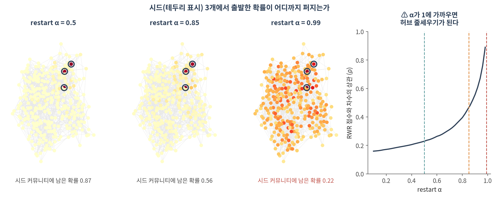
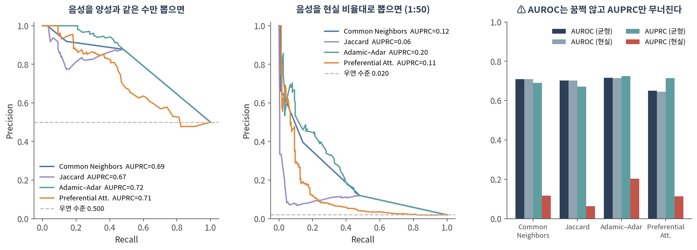
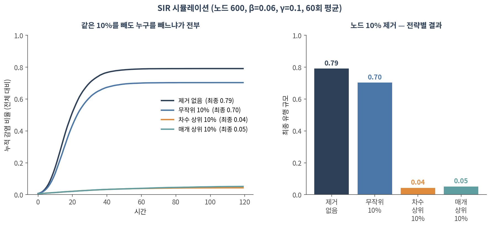

::: {.callout-note collapse="true"}
## 🎯 학습 목표

이 챕터를 마치면 다음을 할 수 있습니다.

-   guilt-by-association 가정이 무엇이고 언제 깨지는지 말할 수 있다
-   재시작 랜덤워크를 직접 구현하고 질병 유전자 우선순위에 쓸 수 있다
-   ⚠️ restart 파라미터가 결과를 어떻게 바꾸는지, 1에 가까울 때 무엇이 되는지 설명할 수 있다
-   링크 예측 heuristic 네 가지를 구분하고 ⚠️ **AUROC 대신 AUPRC를 봐야 하는 이유**를 말할 수 있다
-   ⚠️ 예측된 링크의 차수 편향을 확인할 수 있다
-   SIR 모형으로 개입 전략을 비교할 수 있다
:::

> 🤔 **생각해볼 질문**
>
> GWAS가 후보 영역 30개를 줬고, 그 안에 유전자가 400개 있습니다. 어느 것부터 실험하시겠습니까?

------------------------------------------------------------------------

## 1. Guilt-by-association 🤝 {#c06-s1}

### 1) 하나의 가정 {#c06-s1-1}

이 챕터의 모든 방법은 한 문장 위에 서 있습니다.

> **이웃은 서로 비슷하다** (homophily)

-   같은 복합체의 단백질은 같은 과정에 관여한다
-   같은 모듈의 유전자는 같은 조건에서 함께 움직인다
-   공간적으로 가까운 세포는 같은 미세환경에 있다

⚠️ 그런데 이 가정이 깨지는 경우가 있습니다.

-   **길항 관계** — 활성화와 억제는 둘 다 엣지이지만 방향이 반대입니다(🔗 [02 §1](02_representation.qmd#c02-s1))
-   **다기능 단백질** — 여러 모듈에 걸쳐 있어 어느 이웃을 닮아야 할지 모호합니다
-   **heterophily 네트워크** — 서로 다른 것끼리 붙는 구조. 이럴 때는 전파가 오히려 해롭습니다

✅ 그러니 전파를 쓰기 전에 **"내 네트워크에서 이웃이 실제로 비슷한가"**를 먼저 확인하세요. 이미 알려진 레이블로 검증할 수 있습니다.

### 2) 준지도 추론의 계보 {#c06-s1-2}

| 방법 | 방식 | 특징 |
|-------------------|---------------------------|--------------------------|
| **Relational classification** | 이웃 레이블의 가중 평균을 수렴할 때까지 반복 | 가장 단순. node feature를 못 씀 |
| **Iterative classification** | 이웃 요약을 특징으로 넣은 분류기를 반복 적용 | node feature 사용 가능 |
| **Belief propagation** | 이웃끼리 메시지를 주고받으며 확률 갱신 | 고리가 있으면 수렴 보장 없음 |

💡 셋 다 "이웃에게서 정보를 받아 나를 갱신하고, 그걸 반복한다"는 같은 뼈대입니다. **12의 그래프 신경망이 이 뼈대에 학습을 붙인 것**입니다.

------------------------------------------------------------------------

## 2. 네트워크 전파 🌊 {#c06-s2}

### 1) 재시작 랜덤워크 (RWR) {#c06-s2-1}

시드 유전자 몇 개에서 출발해 네트워크로 확률을 퍼뜨립니다.

$$p_{t+1} = \alpha \, W p_t + (1-\alpha)\, p_0$$

-   $p_0$ — 시드에만 1을 준 출발 벡터 (알려진 질병 유전자들)
-   $W$ — 열 정규화한 인접 행렬 (한 걸음 이동)
-   $\alpha$ — **restart 파라미터**. 매 걸음 $(1-\alpha)$의 확률로 시드로 되돌아갑니다
-   수렴한 $p$가 각 노드의 **점수**입니다

💡 $p_0$를 균등하게 주면 그냥 PageRank입니다. 시드에 몰아주므로 **personalized PageRank**라고도 부릅니다(🔗 [03 §3](03_metrics.qmd#c03-s3)).

### 2) ⚠️ restart 파라미터가 결과를 만든다 {#c06-s2-2}

{fig-align="center"}

| α | 시드 커뮤니티에 남은 확률 | 차수와의 상관 ρ |
|--------|------------------------|-----------------------|
| 0.30 | **0.939** | 0.188 |
| 0.50 | 0.866 | 0.229 |
| 0.70 | 0.737 | 0.311 |
| 0.85 | 0.559 | 0.464 |
| 0.95 | 0.347 | 0.713 |
| 0.99 | 0.222 | **0.954** |

-   α가 작으면 시드 **바로 옆**만 봅니다 — 보수적이지만 새로운 발견이 적습니다
-   ⚠️ **α가 1에 가까우면 차수와의 상관이 0.95입니다.** 질병 유전자를 찾는 게 아니라 **허브를 줄세우고 있는 것**입니다
-   흔히 쓰는 값은 0.5–0.8 사이입니다. 하지만 정답은 없습니다 → 01·05와 같은 이야기

✅ 반드시 할 일:

-   **α를 바꿔가며** 상위 후보가 유지되는지 확인
-   **차수와의 상관**을 계산해 보고하세요. 높으면 그 순위는 네트워크 전파의 결과가 아니라 차수의 결과입니다
-   ✅ 차수를 보존한 재배선 null(🔗 [04 §2](04_random_null.qmd#c04-s2))로 각 후보의 Z-score를 내면 가장 깔끔합니다

### 3) 어디에 쓰는가 {#c06-s2-3}

-   **질병 유전자 우선순위** — GWAS 후보 영역의 유전자 400개 중 어느 것부터 볼지
-   **유전자 기능 예측** — 기능이 밝혀지지 않은 유전자에 GO term 붙이기
-   **모듈 확장** — 알려진 경로 구성원에서 출발해 빠진 구성원 찾기
-   **약물 재창출** — 약물–표적–질병 지식 그래프에서 전파

------------------------------------------------------------------------

## 3. 링크 예측 🔮 {#c06-s3}

### 1) Heuristic 네 가지 {#c06-s3-1}

두 노드 *u*, *v*가 이어질 법한지 점수를 매깁니다. $\Gamma(u)$는 *u*의 이웃 집합.

| 방법 | 점수 | 아이디어 |
|-------------------|------------------------|-----------------------------|
| **Common Neighbors** | $|\Gamma(u) \cap \Gamma(v)|$ | 공통 이웃이 많으면 |
| **Jaccard** | 공통 이웃 / 전체 이웃 | 차수로 보정 |
| **Adamic–Adar** | $\sum_{w} 1/\log k_w$ | 공통 이웃이 **희귀할수록** 가중 |
| **Preferential Att.** | $k_u \times k_v$ | 둘 다 허브면 |

💡 Adamic–Adar가 대체로 가장 잘합니다 — "둘 다 아는 사람이 마당발이면 별 정보가 아니다"는 직관이 맞습니다.

### 2) ⚠️ 평가가 진짜 함정이다 {#c06-s3-2}

엣지 10%를 숨기고 복원해보는 실험입니다. **음성(비연결 쌍)을 몇 개나 뽑느냐**가 결과를 바꿉니다.

{fig-align="center"}

| 방법 | AUROC (균형) | AUROC (현실) | AUPRC (균형) | AUPRC (현실) |
|-----------|-----------|-----------|-----------|-----------|
| Common Neighbors | 0.709 | 0.709 | 0.690 | **0.117** |
| Jaccard | 0.702 | 0.702 | 0.672 | **0.063** |
| Adamic–Adar | 0.717 | 0.715 | 0.724 | **0.204** |
| Preferential Att. | 0.650 | 0.645 | 0.714 | **0.114** |

-   ⚠️ **AUROC는 소수점 셋째 자리까지 거의 그대로입니다.** 음성을 50배 늘려도 꿈쩍하지 않습니다
-   ⚠️ **AUPRC는 0.7에서 0.1 근처로 무너집니다**
-   왜? AUROC는 양성·음성 **비율에 둔감**하도록 설계된 지표입니다. 실제로 쓸 때 중요한 것은 "상위 100개를 실험하면 몇 개가 맞나"인데, 그건 AUPRC가 답합니다
-   실제 PPI는 밀도가 1% 미만이라 **현실의 불균형은 1:50보다 훨씬 심합니다**

✅ 링크 예측 논문·결과를 볼 때:

-   ✅ AUPRC와 **우연 수준(양성 비율)**을 함께 보세요. 위 그림의 회색 점선입니다
-   ✅ 음성을 어떻게 뽑았는지 확인하세요. 1:1로 뽑았다면 성능이 부풀려진 것입니다
-   ✅ 상위 *k*개 정밀도(precision@k)가 실무에는 가장 솔직한 지표입니다

### 3) ⚠️ 차수 편향 {#c06-s3-3}

같은 실험에서 Adamic–Adar 점수 상위 200쌍의 평균 차수를 재봤습니다.

| | 평균 차수 |
|--------------------------|-------------|
| 전체 노드 | 5.98 |
| **AA 상위 200쌍** | **14.80** |
| AA 하위 200쌍 | 5.47 |

-   예측된 링크는 **대체로 허브끼리의 연결**입니다
-   ⚠️ 그리고 허브는 곧 **많이 연구된 유전자**입니다(🔗 07) → "새로운 상호작용 예측"이 실은 "유명한 단백질 둘"일 수 있습니다
-   ✅ 대응: 차수를 맞춘 null과 비교하거나, 차수로 층화해서 평가하세요

### 4) 데이터 누출 {#c06-s3-4}

-   ⚠️ 엣지를 숨긴 뒤 **숨긴 엣지가 포함된 상태로** 특징을 계산하면 성능이 부풀려집니다
-   ⚠️ 시간 정보가 있다면 무작위 분할이 아니라 **시점 기준 분할**이어야 합니다 (과거로 미래를 예측)
-   ⚠️ 엣지를 지우면 고립되는 노드가 생깁니다. 그 노드는 어떤 방법으로도 맞힐 수 없습니다

------------------------------------------------------------------------

## 4. 확산 모델 🦠 {#c06-s4}

### 1) 두 계열 {#c06-s4-1}

-   **Linear threshold** — 이웃 중 일정 비율 이상이 활성화되면 나도 활성화. *결정론적*
-   **Independent cascade** — 활성화된 이웃이 각각 확률 *p*로 나를 감염시킴. *확률적*
-   **SIR / SIS** — 감수성(S) → 감염(I) → 회복(R). 역학의 고전 모형

💡 $R_0$(기초감염재생산수)가 1을 넘으면 유행이 퍼집니다. 네트워크에서는 **차수 분산이 클수록** 임계값이 낮아집니다 — 허브가 있으면 잘 퍼진다는 뜻입니다.

### 2) 같은 10%를 빼도, 누구를 빼느냐가 전부 {#c06-s4-2}

{fig-align="center"}

| 전략 | 최종 유행 규모 |
|-------------------|-------------|
| 제거 없음 | 0.79 |
| 무작위 10% | 0.70 |
| **차수 상위 10%** | **0.04** |
| 매개 상위 10% | 0.05 |

-   ⚠️ **무작위로 10%를 빼는 것은 거의 효과가 없습니다** (0.79 → 0.70)
-   ✅ 차수 상위 10%를 빼면 **유행이 20분의 1로** 줄어듭니다
-   허브가 있는 네트워크는 **무작위 고장에는 강하고 표적 공격에는 약합니다**

💡 이 결과의 함의:

-   백신·방역에서 접촉이 많은 집단을 우선하는 근거
-   ⚠️ 그런데 실무에서는 **누가 허브인지 모르는 것**이 문제입니다. 네트워크를 아는 것 자체가 개입입니다
-   생물학에서는 신호전달 캐스케이드 차단 표적 선정에 같은 논리가 쓰입니다

### 3) 영향력 최대화 {#c06-s4-3}

-   "*k*개 노드를 골라 확산을 최대화하라" — 최적해를 찾는 것은 계산적으로 어렵습니다(NP-hard)
-   ✅ 그런데 목적함수가 **submodular**(수확 체감)이라서, 하나씩 탐욕적으로 고르면 최적의 63% 이상이 보장됩니다 (Kempe et al. 2003)
-   ⚠️ 단순히 차수 상위 *k*개를 고르는 것과는 다릅니다 — 허브끼리 겹치면 낭비이므로

::: {.callout-tip collapse="true"}
## 🐍 실습 — RWR로 후보 유전자 우선순위 매기고, 차수 편향 점검하기

Colab에서 실행합니다. 설치는 [90. Colab 환경 설정](90_colab_setup.qmd) 참고.

```python
import numpy as np, pandas as pd, networkx as nx
from scipy.stats import spearmanr
from sklearn.metrics import roc_auc_score, average_precision_score

G = nx.karate_club_graph()          # 자기 네트워크로 바꿔도 그대로 돌아갑니다
G = G.subgraph(max(nx.connected_components(G), key=len)).copy()
order = list(G.nodes())
A = nx.to_numpy_array(G, nodelist=order)
W = A / A.sum(0)                     # 열 정규화
deg = np.array([G.degree(v) for v in order])

# ── 1. RWR 구현 ──────────────────────────────────────────────────────
def rwr(seeds, alpha=0.7, iters=300):
    p0 = np.zeros(len(order))
    for s in seeds:
        p0[order.index(s)] = 1 / len(seeds)
    p = p0.copy()
    for _ in range(iters):
        p = alpha * (W @ p) + (1 - alpha) * p0
    return pd.Series(p, index=order).sort_values(ascending=False)

seeds = [0, 1, 2]                    # 알려진 질병 유전자라고 치고
rwr(seeds, alpha=0.7).head(15)

# ── 2. ⚠️ alpha 를 바꿔가며 상위 후보가 유지되는가 ───────────────────
top_ref = set(rwr(seeds, 0.7).head(20).index)
for a in [0.3, 0.5, 0.7, 0.85, 0.95, 0.99]:
    s = rwr(seeds, a)
    keep = len(set(s.head(20).index) & top_ref)
    print(f"alpha={a:.2f}  상위20 유지 {keep}/20  "
          f"차수와의 상관 rho={spearmanr(s[order], deg).statistic:.3f}")
#   ⚠️ rho 가 0.8 을 넘으면 사실상 허브 순위입니다

# ── 3. 차수 보존 null 로 각 후보의 Z-score 내기 ──────────────────────
obs = rwr(seeds, 0.7)
N, m = 200, G.number_of_edges()
rng = np.random.default_rng(0)
null = np.zeros((N, len(order)))
for i in range(N):
    H = G.copy()
    nx.double_edge_swap(H, nswap=10*m, max_tries=200*m, seed=int(rng.integers(1e9)))
    Ah = nx.to_numpy_array(H, nodelist=order); Wh = Ah / Ah.sum(0)
    p0 = np.zeros(len(order))
    for s in seeds: p0[order.index(s)] = 1/len(seeds)
    p = p0.copy()
    for _ in range(300): p = 0.7*(Wh@p) + 0.3*p0
    null[i] = p
z = (obs[order].values - null.mean(0)) / null.std(0, ddof=1)
pd.Series(z, index=order).sort_values(ascending=False).head(15)

# ── 4. 링크 예측 — ⚠️ 음성 샘플 비율을 바꿔가며 평가 ─────────────────
edges = list(G.edges()); m = len(edges)
test = [edges[i] for i in rng.choice(m, max(1, int(0.1*m)), replace=False)]
H = G.copy(); H.remove_edges_from(test)
nodes = list(H.nodes())

def sample_neg(k):
    out = set()
    while len(out) < k:
        u, v = rng.choice(len(nodes), 2, replace=False)
        u, v = nodes[u], nodes[v]
        if u != v and not G.has_edge(u, v): out.add((u, v))
    return list(out)

for ratio in (1, 10, 50):
    neg = sample_neg(len(test)*ratio)
    pairs = test + neg
    y = np.r_[np.ones(len(test)), np.zeros(len(neg))]
    s = np.array([v for _, _, v in nx.adamic_adar_index(H, pairs)])
    print(f"음성 1:{ratio:<3} AUROC {roc_auc_score(y,s):.3f}  "
          f"AUPRC {average_precision_score(y,s):.3f}  (우연 {y.mean():.3f})")
#   ⚠️ AUROC 는 거의 그대로, AUPRC 만 무너지는 것을 확인하세요
```

**확인할 것:**

-   ⚠️ α를 올렸을 때 차수와의 상관이 얼마나 올라가는가
-   ⚠️ Z-score로 보면 순위가 바뀌는가 — 바뀐다면 원래 순위는 차수의 그림자였습니다
-   ⚠️ AUROC와 AUPRC의 간격. 논문에 AUROC만 있다면 의심하세요
-   SIR 시뮬레이션은 `ndlib` 패키지로 더 간단히 할 수 있습니다
:::

------------------------------------------------------------------------

## 📝 요약

-   이 챕터의 모든 방법은 **이웃끼리 비슷하다(homophily)**는 가정 위에 있습니다. 먼저 그 가정을 검증하세요
-   RWR: $p = \alpha W p + (1-\alpha) p_0$. 시드에서 출발해 퍼뜨리고, 수렴한 값이 점수
-   ⚠️ **α가 1에 가까우면 차수와의 상관이 0.95** — 질병 유전자가 아니라 허브를 줄세우게 됩니다
-   ✅ α를 흔들어 보고, 차수와의 상관을 보고하고, 재배선 null로 Z-score를 내세요
-   링크 예측 heuristic 중에서는 Adamic–Adar가 대체로 낫습니다
-   ⚠️ **AUROC는 불균형에 둔감합니다.** 음성을 50배 늘려도 0.71로 그대로인데 AUPRC는 0.72 → 0.20으로 무너집니다
-   ⚠️ 예측된 링크는 차수 편향이 큽니다 (상위 200쌍 평균 차수 14.8 vs 전체 5.98)
-   SIR에서 무작위 10% 제거는 유행을 0.79 → 0.70으로 거의 못 줄이지만, **차수 상위 10% 제거는 0.04로** 떨어뜨립니다
-   💡 relational classification → belief propagation → **12의 GNN**은 같은 뼈대 위에 있습니다

------------------------------------------------------------------------

## ➕ 더 읽을거리

### 네트워크 전파

Köhler S, Bauer S, Horn D, Robinson PN. [*Walking the interactome for prioritization of candidate disease genes.*](https://doi.org/10.1016/j.ajhg.2008.02.013) Am J Hum Genet. 2008.\
Vanunu O, Magger O, Ruppin E, Shlomi T, Sharan R. [*Associating genes and protein complexes with disease via network propagation.*](https://doi.org/10.1371/journal.pcbi.1000641) PLoS Comput Biol. 2010.\
Cowen L, Ideker T, Raphael BJ, Sharan R. [*Network propagation: a universal amplifier of genetic associations.*](https://doi.org/10.1038/nrg.2017.38) Nat Rev Genet. 2017. (이 주제의 표준 리뷰)

### 링크 예측과 그 평가

Liben-Nowell D, Kleinberg J. [*The link-prediction problem for social networks.*](https://doi.org/10.1002/asi.20591) J Am Soc Inf Sci Technol. 2007.\
Saito T, Rehmsmeier M. [*The precision-recall plot is more informative than the ROC plot when evaluating binary classifiers on imbalanced datasets.*](https://doi.org/10.1371/journal.pone.0118432) PLoS One. 2015.

### 확산과 영향력

Pastor-Satorras R, Vespignani A. [*Epidemic spreading in scale-free networks.*](https://doi.org/10.1103/PhysRevLett.86.3200) Phys Rev Lett. 2001.\
Kempe D, Kleinberg J, Tardos É. [*Maximizing the spread of influence through a social network.*](https://doi.org/10.1145/956750.956769) KDD. 2003.

### 도구

[NetworkX — 링크 예측](https://networkx.org/documentation/stable/reference/algorithms/link_prediction.html) · [NetworkX — `pagerank`](https://networkx.org/documentation/stable/reference/algorithms/generated/networkx.algorithms.link_analysis.pagerank_alg.pagerank.html) · [ndlib — 확산 모형 시뮬레이션](https://ndlib.readthedocs.io/)
