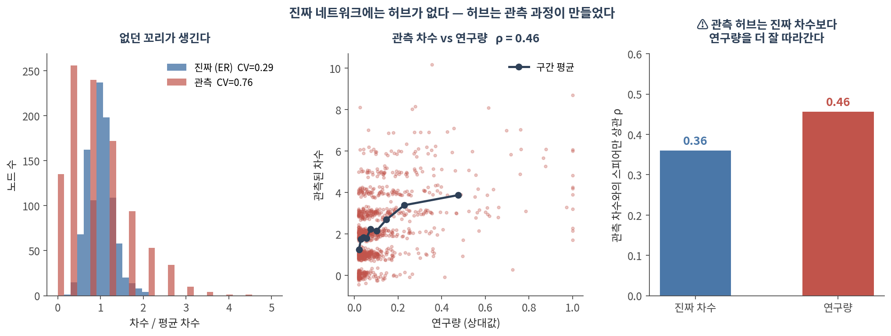
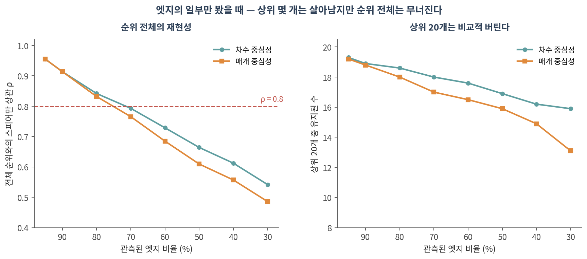
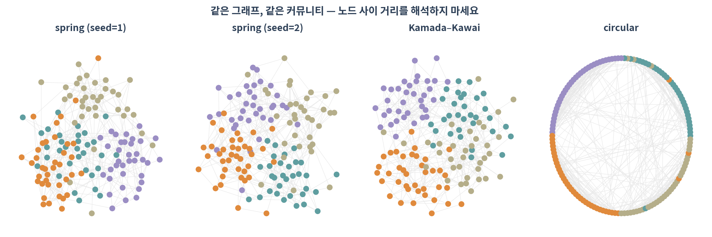

::: {.callout-note collapse="true"}
## 🎯 학습 목표

이 챕터를 마치면 다음을 할 수 있습니다.

-   주요 네트워크 데이터베이스가 각각 무엇을 담고 있는지, 어떤 필터가 필요한지 말할 수 있다
-   ⚠️ STRING의 "high confidence"가 무슨 뜻이고 무슨 뜻이 아닌지 설명할 수 있다
-   ⚠️ 연구 편향이 없던 허브를 만들어낼 수 있다는 것을 설명할 수 있다
-   ⚠️ 네트워크가 불완전할 때 어떤 결과가 살아남고 어떤 것이 무너지는지 말할 수 있다
-   레이아웃을 해석하면 안 되는 이유를 말하고, Cytoscape로 넘기는 파이프라인을 만들 수 있다
-   네트워크 분석 methods 문단에 무엇을 적어야 하는지 열거할 수 있다
:::

> 🤔 **생각해볼 질문**
>
> TP53이 PPI 네트워크의 최상위 허브입니다. 이것은 생물학인가요, 아니면 논문 수인가요?

------------------------------------------------------------------------

## 1. 네트워크는 어디서 오는가 🗄️ {#c07-s1}

### 1) 주요 데이터베이스 {#c07-s1-1}

| 자원 | 담고 있는 것 | ⚠️ 주의 |
|-------------|-------------------|------------------------------------|
| [**STRING**](https://string-db.org/) | 통합 PPI(실험 + 예측 + 문헌) | **채널이 섞여 있음**. 점수 필터 필수 |
| [**BioGRID**](https://thebiogrid.org/) | 실험 기반 상호작용, 유전적 상호작용 포함 | 많이 연구된 유전자에 편중 |
| [**IntAct**](https://www.ebi.ac.uk/intact/) | 큐레이션된 분자 상호작용 | 커버리지가 상대적으로 좁음 |
| [**Reactome**](https://reactome.org/) | 큐레이션 경로, 반응 수준 | 경로 경계는 사람의 판단 |
| [**KEGG**](https://www.kegg.jp/) | 대사·신호전달 경로 | 상업적 이용에 라이선스 제약 |
| [**OmniPath**](https://omnipathdb.org/) | **방향과 부호가 있는** 신호전달 | 출처별 신뢰도가 제각각 |
| [**HuRI**](http://www.interactome-atlas.org/) | 체계적 Y2H 인간 인터랙톰 | Y2H가 잡는 상호작용만 |

💡 **부호와 방향이 필요하면 OmniPath**를 보세요. STRING은 무방향·무부호입니다 — 활성화와 억제를 구분할 수 없습니다(🔗 [02 §1](02_representation.qmd#c02-s1)).

### 2) ⚠️ STRING의 combined score는 무엇인가 {#c07-s1-2}

STRING의 점수는 여러 **증거 채널**을 합친 값입니다.

-   실험(experiments) · 큐레이션 데이터베이스(database) · 공발현(coexpression)
-   유전자 이웃(neighborhood) · 유전자 융합(fusion) · 계통 프로파일(cooccurrence)
-   **문헌 텍스트마이닝(textmining)** · 종간 전이(homology 기반)

⚠️ 그래서:

-   combined score 0.9짜리 엣지가 **텍스트마이닝만으로** 만들어졌을 수 있습니다
-   같은 논문에 두 유전자 이름이 자주 등장하면 점수가 올라갑니다 — 상호작용의 증거가 아니라 **공동 언급의 증거**입니다
-   ✅ 실험적 근거만 쓰고 싶다면 **채널별 점수 열**을 직접 필터하세요. combined score로는 구분할 수 없습니다
    -   ⚠️ 채널 열 이름은 STRING 버전에 따라 달라집니다. 받아온 뒤 **열 목록을 먼저 확인**하세요 (실습 코드에 그렇게 해뒀습니다)

✅ 흔히 쓰는 기준: 0.4(medium), 0.7(high), 0.9(highest) — **반드시 보고하세요**(🔗 [01 §3](01_why_networks.qmd#c01-s3))

------------------------------------------------------------------------

## 2. ⚠️ 무엇이 왜곡되어 있는가 {#c07-s2}

### 1) 연구 편향이 허브를 만든다 {#c07-s2-1}

진짜 네트워크에 허브가 **하나도 없다고** 가정해봅니다(ER 네트워크, 노드 1,000개·엣지 6,000개). 그리고 규칙 하나만 넣습니다 — **"양쪽 유전자가 많이 연구되었을수록 그 상호작용이 발견될 확률이 높다."**

{fig-align="center"}

| | 진짜 (ER) | 관측 |
|-------------------------|-----------|------------|
| 변동계수 (CV) | 0.29 | **0.76** |
| 최대 차수 / 평균 차수 | 2.08 | **4.51** |
| 차수가 0인 노드 | 0개 | **135개** |

-   ⚠️ **없던 꼬리가 생겼습니다.** 허브가 없는 네트워크에서 허브처럼 보이는 노드가 나옵니다
-   ⚠️ 관측 차수는 **진짜 차수(ρ=0.36)보다 연구량(ρ=0.46)을 더 잘 따라갑니다**
-   ⚠️ 135개 노드는 "상호작용이 없는 단백질"처럼 보이지만, 실은 **아무도 안 본 단백질**입니다

💡 이 시뮬레이션은 실제 데이터가 아니라 메커니즘을 보여주는 것입니다. 하지만 함의는 분명합니다 — 🔗 [03 §1.3](03_metrics.qmd#c03-s1-3)에서 "생물학 네트워크는 scale-free"가 과장이라고 한 이유 중 하나가 이것입니다.

✅ 대응:

-   후보 유전자의 **PubMed 논문 수**를 같이 보고, 차수와의 상관을 확인하세요
-   차수를 보존한 null(🔗 [04 §2](04_random_null.qmd#c04-s2))로 Z-score를 내세요
-   여러 데이터베이스를 교차하거나, **체계적으로 생성된 데이터**(HuRI 같은)를 쓰세요
-   ⚠️ "허브이므로 중요하다"는 주장은 이 편향을 다루지 않으면 성립하지 않습니다

### 2) 없는 엣지는 부재가 아니다 {#c07-s2-2}

엣지의 일부만 관측했다고 치고, 전체를 봤을 때와 순위를 비교했습니다.

{fig-align="center"}

| 관측 엣지 | 차수 ρ | 차수 상위20 유지 | 매개 ρ | 매개 상위20 유지 |
|-----------|-----------|--------------|-----------|--------------|
| 90% | 0.914 | 18.9/20 | 0.914 | 18.8/20 |
| 70% | 0.793 | 18.0/20 | 0.766 | 17.0/20 |
| **50%** | **0.664** | 16.9/20 | **0.610** | 15.9/20 |
| 30% | 0.542 | 15.9/20 | 0.486 | 13.1/20 |

-   ⚠️ 엣지의 절반만 봤다면 **순위 전체의 상관은 0.66**입니다. 20위와 60위를 구분하는 주장은 할 수 없습니다
-   ✅ 반면 **상위 20개는 17개가 유지됩니다**. 최상위 몇 개에 대한 주장은 상대적으로 튼튼합니다
-   ⚠️ 매개 중심성이 차수보다 더 빨리 무너집니다 — 경로 기반 지표가 결측에 더 민감합니다

💡 결론: **"상위 몇 개"는 말해도 되고, "정확한 순위"는 말하면 안 됩니다.**

### 3) 그 밖의 왜곡 {#c07-s2-3}

-   **조직·조건 무시** — 대부분의 PPI DB는 "어디선가 한 번 관찰된" 상호작용의 합집합입니다. 내 조직에서 두 단백질이 같이 발현되는지는 별개 문제입니다
-   ✅ 발현 데이터로 필터하면 훨씬 현실적인 네트워크가 됩니다
-   **종간 전이(orthology transfer)** — 효모에서 본 것을 사람으로 옮긴 엣지가 섞여 있습니다
-   **자기 인용 순환** — 예측된 상호작용이 논문에 실리고, 그 논문이 다시 텍스트마이닝에 들어갑니다

------------------------------------------------------------------------

## 3. 시각화와 재현성 🎨 {#c07-s3}

### 1) ⚠️ 레이아웃은 데이터가 아니다 {#c07-s3-1}

{fig-align="center"}

-   ⚠️ **spring 레이아웃은 시드만 바꿔도 다르게 나옵니다**
-   ⚠️ 노드 사이의 거리, 그림에서의 위치, 덩어리의 면적 — **어느 것도 해석하면 안 됩니다**
-   🔗 단일세포의 UMAP과 완전히 같은 함정입니다. 그림은 그림이지 측정이 아닙니다

✅ 그림으로 주장하지 말고, **숫자로 주장하고 그림은 보조로** 쓰세요.

### 2) 도구 분업 {#c07-s3-2}

| 단계 | 도구 |
|--------------|-------------------------------------------|
| 분석 | `networkx`, `igraph`(Python/R), `scipy.sparse` |
| 교환 | **GraphML**, GEXF, 단순 edge list TSV |
| 최종 그림 | **Cytoscape**, Gephi |

-   networkx의 `draw`는 탐색용입니다. 논문 그림은 Cytoscape에서 만드는 편이 낫습니다
-   ✅ `nx.write_graphml(G, "network.graphml")` 한 줄이면 노드·엣지 속성까지 넘어갑니다

### 3) methods에 적어야 할 것 {#c07-s3-3}

Part 1 전체가 결국 이 목록으로 수렴합니다.

-   ✅ **데이터 출처와 버전** — "STRING v12.0, 2026-03-14 접근"
-   ✅ **필터** — combined score ≥ 0.7, 실험 채널만, 종 제한
-   ✅ **네트워크 구성 규칙** — 상관 임계값, *k*, β, PC 개수(🔗 [01 §3](01_why_networks.qmd#c01-s3))
-   ✅ **전처리** — 거대 요소만 썼는지, 몇 개를 버렸는지(🔗 [02 §3.1](02_representation.qmd#c02-s3-1))
-   ✅ **알고리즘과 파라미터** — Leiden resolution, 시드(🔗 [05 §3](05_community.qmd#c05-s3))
-   ✅ **null model** — 종류, 반복 횟수, Z-score 또는 경험적 p(🔗 [04 §2](04_random_null.qmd#c04-s2))
-   ✅ **안정성 검사** — 파라미터·시드를 흔들었을 때 결론이 유지되는지
-   ✅ **소프트웨어 버전** — networkx, igraph, leidenalg

::: {.callout-tip collapse="true"}
## 🐍 실습 — STRING에서 받아 Cytoscape까지, 재현 가능하게

Colab에서 실행합니다. 설치는 [90. Colab 환경 설정](90_colab_setup.qmd) 참고.

```python
import requests, io, json, datetime
import numpy as np, pandas as pd, networkx as nx

# ── 1. STRING API 로 직접 받기 (버전과 날짜를 기록해 둡니다) ──────────
genes = ["TP53", "MDM2", "CDKN1A", "ATM", "CHEK2", "BAX", "RB1", "E2F1",
         "BRCA1", "BRCA2", "PTEN", "AKT1", "EGFR", "MYC", "CCND1"]
url = "https://string-db.org/api/tsv/network"
params = {"identifiers": "%0d".join(genes), "species": 9606,
          "caller_identity": "knu_graph_course"}
r = requests.post(url, data=params, timeout=60)
df = pd.read_csv(io.StringIO(r.text), sep="\t")
print(df.columns.tolist())      # score 채널이 열로 들어 있습니다

meta = {"source": "STRING", "accessed": str(datetime.date.today()),
        "species": 9606, "n_query_genes": len(genes)}

# ── 2. ⚠️ 채널을 구분해서 필터 ───────────────────────────────────────
#    combined score 만 보면 텍스트마이닝만으로 만들어진 엣지를 거를 수 없습니다.
#    ⚠️ 열 이름은 STRING 버전에 따라 다릅니다 — 위에서 찍은 목록을 보고 맞추세요.
def find_col(df, *candidates):
    for c in candidates:
        if c in df.columns:
            return c
    raise KeyError(f"{candidates} 중 아무것도 없습니다. 열 목록: {df.columns.tolist()}")

col_a   = find_col(df, "preferredName_A", "stringId_A")
col_b   = find_col(df, "preferredName_B", "stringId_B")
col_all = find_col(df, "score", "combined_score")
col_exp = find_col(df, "escore", "experimental", "experiments")

print(f"combined ≥ 0.7 : {(df[col_all] >= 0.7).sum()}")
print(f"실험 근거 있음  : {(df[col_exp] > 0).sum()}")

strict = df[(df[col_all] >= 0.7) & (df[col_exp] > 0)]      # 실험 근거가 있는 것만
G = nx.from_pandas_edgelist(strict, col_a, col_b, edge_attr=[col_all, col_exp])
print(f"노드 {G.number_of_nodes()}, 엣지 {G.number_of_edges()}")

# ── 3. ⚠️ 연구 편향 점검 — 차수가 논문 수를 따라가는가 ───────────────
import time

def pubmed_count(gene):
    # ⚠️ NCBI E-utilities 는 API 키 없이 초당 3회로 제한됩니다
    r = requests.get("https://eutils.ncbi.nlm.nih.gov/entrez/eutils/esearch.fcgi",
                     params={"db": "pubmed", "term": f"{gene}[TIAB]",
                             "retmode": "json", "retmax": 0}, timeout=30)
    return int(r.json()["esearchresult"]["count"])

counts = {}
for g in G.nodes():
    counts[g] = pubmed_count(g)
    time.sleep(0.4)
deg = dict(G.degree())
from scipy.stats import spearmanr
common = list(G.nodes())
rho = spearmanr([deg[g] for g in common], [counts[g] for g in common]).statistic
print(f"차수와 논문 수의 상관 rho = {rho:.3f}")
#   ⚠️ 0.6 을 넘으면 '허브'는 상당 부분 연구량입니다

# ── 4. 거대 요소만 남기고, 몇 개를 버렸는지 기록 ─────────────────────
comps = sorted(nx.connected_components(G), key=len, reverse=True)
giant = G.subgraph(comps[0]).copy()
meta["dropped_nodes"] = G.number_of_nodes() - giant.number_of_nodes()
print(f"거대 요소 {giant.number_of_nodes()}개, 버린 노드 {meta['dropped_nodes']}개")

# ── 5. 속성을 붙여 Cytoscape 로 내보내기 ─────────────────────────────
nx.set_node_attributes(giant, {g: deg[g] for g in giant}, "degree")
nx.set_node_attributes(giant, {g: counts[g] for g in giant}, "pubmed")
nx.set_node_attributes(giant, nx.betweenness_centrality(giant), "betweenness")
nx.write_graphml(giant, "network.graphml")

# ── 6. 재현에 필요한 정보를 같이 저장 ────────────────────────────────
import networkx, importlib.metadata as md
meta["versions"] = {p: md.version(p) for p in ("networkx", "pandas", "numpy")}
meta["filters"] = {"combined_score": ">=0.7", "experimental": ">0"}
json.dump(meta, open("network_meta.json", "w"), indent=2, ensure_ascii=False)
print(json.dumps(meta, indent=2, ensure_ascii=False))
```

**확인할 것:**

-   ⚠️ 먼저 `df.columns`를 보고 채널 열 이름을 확인하세요. STRING 버전마다 다릅니다
-   ⚠️ combined score만 쓸 때와 실험 채널을 함께 쓸 때 엣지 수가 얼마나 다른가
-   ⚠️ 차수와 PubMed 논문 수의 상관. 높으면 "허브"라는 말을 조심해서 쓰세요
-   `network.graphml`을 Cytoscape에서 열고 노드 크기를 degree, 색을 betweenness로 매핑해보기
-   ✅ `network_meta.json`을 supplement에 그대로 넣을 수 있습니다

💡 Colab에서 외부 API가 막혀 있으면 STRING 웹에서 TSV를 내려받아 업로드해도 같습니다.
:::

------------------------------------------------------------------------

## 📝 요약

-   데이터베이스마다 담는 것이 다릅니다 — 방향·부호가 필요하면 OmniPath, 실험 근거만 필요하면 채널 필터
-   ⚠️ **STRING의 combined score에는 텍스트마이닝과 예측이 섞여 있습니다.** "high confidence"는 "관찰되었다"가 아닙니다
-   ⚠️ 연구 편향만으로도 **허브가 없는 네트워크에서 허브가 생깁니다** (CV 0.29 → 0.76, 관측 차수는 연구량과 더 상관)
-   ⚠️ 엣지의 절반만 관측하면 순위 상관은 0.66 — **"상위 몇 개"는 말해도 되고 "정확한 순위"는 안 됩니다**
-   ⚠️ 대부분의 PPI DB는 조직·조건을 무시한 합집합입니다. 발현으로 필터하세요
-   ⚠️ **레이아웃은 데이터가 아닙니다.** 시드만 바꿔도 그림이 달라집니다
-   ✅ 분석은 networkx/igraph, 최종 그림은 GraphML로 내보내 Cytoscape에서
-   ✅ methods에 적을 것: 출처·버전·필터·구성 규칙·전처리·파라미터·null model·안정성·소프트웨어 버전

------------------------------------------------------------------------

## 🗺️ Part 1을 마치며

일곱 챕터를 관통한 질문은 하나였습니다.

> **이 네트워크를 조금 다르게 만들었어도, 나는 같은 문장을 말할 수 있는가?**

-   01 — 엣지는 우리의 선택이었다
-   02 — 표현을 고르는 것도 선택이다
-   03 — 어느 중심성을 골랐는지가 곧 "허브"의 정의다
-   04 — null 없이는 어떤 숫자도 해석할 수 없다
-   05 — resolution이 클러스터 수를 정한다
-   06 — α가 순위를 정하고, 평가 지표가 결론을 정한다
-   07 — 데이터 자체가 이미 편향되어 있다

💡 Part 2에서는 이 규칙들을 **학습된 모델**로 바꿉니다. 자유도는 훨씬 커지고, 따라서 위 질문은 더 중요해집니다.

------------------------------------------------------------------------

## ➕ 더 읽을거리

### 데이터베이스

Szklarczyk D, et al. [*The STRING database in 2023.*](https://doi.org/10.1093/nar/gkac1000) Nucleic Acids Res. 2023.\
Oughtred R, et al. [*The BioGRID database.*](https://doi.org/10.1002/pro.3978) Protein Sci. 2021.\
Türei D, Korcsmáros T, Saez-Rodriguez J. [*OmniPath: guidelines and gateway for literature-curated signaling pathway resources.*](https://doi.org/10.1038/nmeth.4077) Nat Methods. 2016.\
Luck K, et al. [*A reference map of the human binary protein interactome.*](https://doi.org/10.1038/s41586-020-2188-x) Nature. 2020. (HuRI)

### 편향과 불완전성

Menche J, et al. [*Uncovering disease-disease relationships through the incomplete interactome.*](https://doi.org/10.1126/science.1257601) Science. 2015.\
Gillis J, Ballouz S, Pavlidis P. [*Bias tradeoffs in the creation and analysis of protein-protein interaction networks.*](https://doi.org/10.1016/j.jprot.2014.01.020) J Proteomics. 2014.\
Schaefer MH, Serrano L, Andrade-Navarro MA. [*Correcting for the study bias associated with protein-protein interaction measurements reveals differences between protein degree distributions from different cancer types.*](https://doi.org/10.3389/fgene.2015.00260) Front Genet. 2015.

### 시각화

Shannon P, et al. [*Cytoscape: a software environment for integrated models of biomolecular interaction networks.*](https://doi.org/10.1101/gr.1239303) Genome Res. 2003.\
[Cytoscape](https://cytoscape.org/) · [Gephi](https://gephi.org/)
