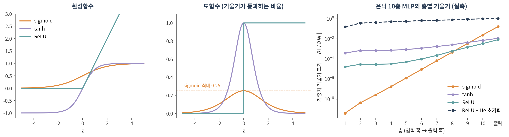
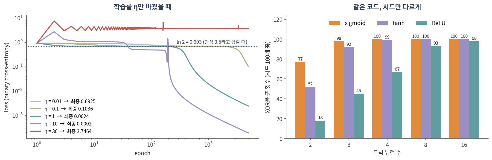
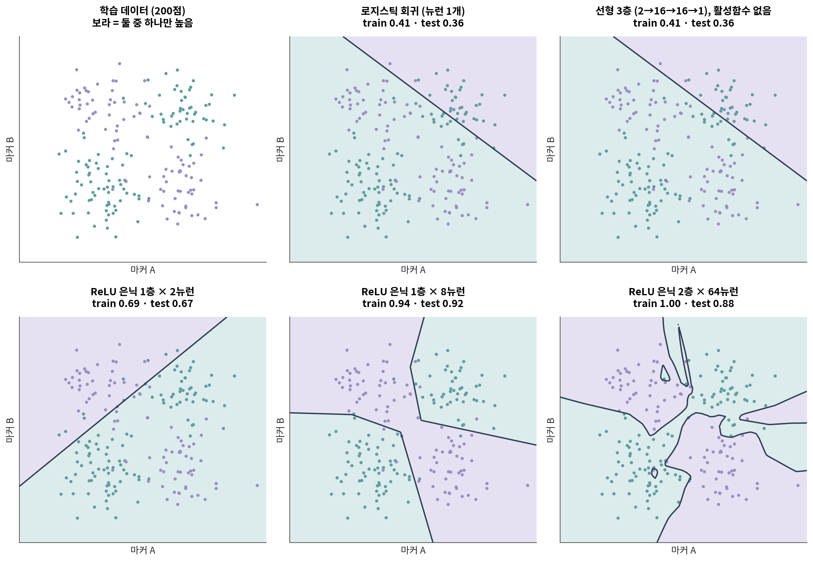

::: {.callout-note collapse="true"}
## 🎯 학습 목표

이 챕터를 마치면 다음을 할 수 있습니다.

-   로지스틱 회귀가 이미 **뉴런 하나**라는 것을 식으로 보일 수 있다
-   ⚠️ 활성함수 없이 층을 쌓으면 여전히 선형 모델이라는 것을 설명할 수 있다
-   과제에 맞는 출력층·손실 함수를 고르고, PyTorch에서 흔한 조합 실수를 피할 수 있다
-   역전파를 연쇄법칙으로 한 번 손으로 계산할 수 있다
-   ⚠️ 학습률·초기화·시드가 결과를 바꾼다는 것을 실측 숫자로 말할 수 있다
-   numpy로 2층 신경망을 직접 짜고, 같은 것을 PyTorch로 옮길 수 있다
:::

> 🤔 **생각해볼 질문**
>
> 로지스틱 회귀는 써봤습니다. 신경망은 그걸 여러 층 쌓은 것뿐인가요? 그렇다면 무엇이 새로 생기나요?

------------------------------------------------------------------------

## 1. 회귀에서 뉴런으로 🧮 {#c08-s1}

### 1) 로지스틱 회귀는 이미 뉴런 하나다 {#c08-s1-1}

-   **로지스틱 회귀** — 입력의 가중합 z = w₁x₁ + w₂x₂ + … + b 를 만들고, sigmoid σ(z)로 0\~1 사이 값으로 바꿈
-   **뉴런(퍼셉트론)** — 똑같이 *가중합 → 비선형 함수*. Rosenblatt(1958)의 퍼셉트론은 비선형 자리에 계단 함수를 썼을 뿐
-   마커 유전자 몇 개의 가중합으로 위험 점수를 만드는 모델은 **정확히 이 뉴런 하나**입니다

| 모델 | 식 | 출력 | 학습 |
|------------------|---------------------|------------------|------------------|
| 선형 회귀 | z = w·x + b | 연속값 | 닫힌 해 또는 경사하강 |
| 로지스틱 회귀 | σ(w·x + b) | 0\~1 | 경사하강 |
| 퍼셉트론 | step(w·x + b) | 0 또는 1 | 퍼셉트론 규칙 |
| **다층 신경망 (MLP)** | σ(W₂ · **f**(W₁x + b₁) + b₂) | 과제에 따라 | 경사하강 + **역전파** |

-   새로 생긴 것은 가운데의 **f** — 층과 층 사이의 활성함수 하나입니다

### 2) ⚠️ 층을 쌓아도 선형이면 선형이다 {#c08-s1-2}

활성함수 없이 선형층을 세 번 곱하면:

> W₃(W₂(W₁x + b₁) + b₂) + b₃ = (W₃W₂W₁) x + (상수) = **W′x + b′**

-   행렬 곱은 결합법칙이 성립하므로 몇 층을 쌓아도 **행렬 하나**로 접힙니다
-   실측: 2→16→16→1 선형 3층(파라미터 337개)을 행렬 하나로 접어 1,000개 입력에 넣었을 때 출력 차이는 최대 **1.2 × 10⁻⁷** — float32 반올림 수준입니다
-   §4 그림의 첫 두 패널이 이것입니다. 로지스틱 회귀(파라미터 3개)와 선형 3층의 결정경계가 같은 직선이고 정확도도 같습니다
-   ✅ 그러므로 신경망과 선형 모델의 **유일한** 차이는 층 사이의 비선형 활성함수입니다

🔗 [06 §2](06_propagation.qmd#c06-s2)의 재시작 랜덤워크(RWR)는 정규화한 인접 행렬을 **선형으로** 반복해서 곱하는 연산이었습니다. **12**에서 그 사이에 학습되는 W와 활성함수를 끼우면 그래프 신경망이 됩니다.

### 3) XOR — 직선 하나로 가를 수 없는 문제 {#c08-s1-3}

-   (0, 0) → 0, (0, 1) → 1, (1, 0) → 1, (1, 1) → 0. 둘 중 **하나만** 켜졌을 때 1
-   평면에 찍으면 대각선끼리 같은 반이라 직선 하나로 가를 수 없습니다
-   Minsky와 Papert(1969)가 단층 퍼셉트론은 XOR을 표현할 수 없음을 보였습니다
-   생물학식으로 바꾸면: *마커 A와 B 중 하나만 높을 때* 나타나는 표현형

XOR 4점에서 직접 돌려본 결과:

| 모델 | 입력 | 정확도 |
|------------------------------|-------------------|-------------------------|
| 로지스틱 회귀 | x₁, x₂ | 0.50 — 계수가 0이 되어 모든 점에 0.5 |
| 로지스틱 회귀 | x₁, x₂, **x₁·x₂** | 1.00 (규제 약하게, C = 10⁶) |
| MLP (은닉 4개) | x₁, x₂ | 1.00 |

-   💡 회귀에서는 **상호작용 항을 사람이 넣습니다.** 신경망은 은닉층에서 그런 특징을 **스스로 만듭니다**
-   ⚠️ 대신 공짜가 아닙니다. 그 특징을 배울 만큼의 데이터가 필요합니다 → **09**의 주제
-   ⚠️ 상호작용 항 모델도 기본 규제(C = 1)에서는 0.75에 그쳤습니다. 4점밖에 없어서 규제가 계수를 눌러버립니다

------------------------------------------------------------------------

## 2. 활성함수와 손실 ⚡ {#c08-s2}

{fig-align="center"}

### 1) 자주 쓰는 활성함수 {#c08-s2-1}

| 함수 | 식 | 출력 범위 | 주로 쓰는 곳 | 주의 |
|------------|----------------|------------|------------------|--------------------------|
| **ReLU** | max(0, z) | \[0, ∞) | 은닉층의 기본값 | 음수 입력에서 기울기 0 → 영영 안 움직이는 "죽은 뉴런" |
| **sigmoid** | 1 / (1 + e⁻ᶻ) | (0, 1) | 이진 분류의 출력 | 도함수 최대 **0.25** → 층을 거칠수록 기울기가 줄어듦 |
| **tanh** | (eᶻ − e⁻ᶻ) / (eᶻ + e⁻ᶻ) | (−1, 1) | 순환 신경망 등 | 양 끝에서 포화 |
| **softmax** | eᶻᵏ / Σⱼ eᶻʲ | 합이 1 | 다중 분류의 출력 | 확률처럼 보이지만 **보정된 확률이 아님** |

### 2) ⚠️ 기울기 소실 — 실측 {#c08-s2-2}

-   역전파에서 기울기는 층마다 활성함수의 도함수가 **곱해지며** 거슬러 갑니다 (§3)
-   sigmoid의 도함수는 아무리 커도 0.25 → 10층을 지나면 최선의 경우에도 0.25¹⁰ ≈ **9.5 × 10⁻⁷**
-   Glorot과 Bengio(2010)도 무작위 초기화한 깊은 망에는 sigmoid가 맞지 않는다고 보고했습니다 (상위 은닉층이 포화되기 쉬움)

위 그림 오른쪽의 실측값 (은닉 10층):

| 활성함수 · 초기화 | 1층 기울기 | 10층 기울기 | 1층 / 10층 |
|--------------------------|-----------------|-----------------|-----------------|
| sigmoid · 기본 | 4.1 × 10⁻¹⁰ | 2.4 × 10⁻² | **1.7 × 10⁻⁸** |
| tanh · 기본 | 3.8 × 10⁻⁴ | 7.1 × 10⁻³ | 5.4 × 10⁻² |
| ReLU · 기본 | 1.7 × 10⁻⁵ | 3.4 × 10⁻³ | 4.9 × 10⁻³ |
| ReLU · **He 초기화** | 1.6 × 10⁻¹ | 9.9 × 10⁻¹ | **0.16** |

-   sigmoid 망의 첫 층은 사실상 **학습되지 않습니다** — 기울기가 10층의 10⁻⁸ 배 수준
-   ⚠️ ReLU로 바꾸는 것만으로는 부족했습니다. `nn.Linear`의 기본 초기화는 U(−1/√n, 1/√n)(n = 입력 수)이고, ReLU용 He 초기화(He et al. 2015)는 분산이 그 6배입니다
-   ✅ 활성함수와 초기화는 **짝**으로 고릅니다. ReLU 계열이면 `nn.init.kaiming_normal_`

### 3) 손실 함수 {#c08-s2-3}

| 과제 | 예 | 출력층 | 손실 | PyTorch |
|--------------|--------------|-----------|---------------|-----------------------|
| 회귀 | 발현량 예측 | 선형 | 평균제곱오차(MSE) | `nn.MSELoss` |
| 이진 분류 | 종양 / 정상 | sigmoid | binary cross-entropy | `nn.BCEWithLogitsLoss` |
| 다중 분류 | 세포 유형 | softmax | cross-entropy | `nn.CrossEntropyLoss` |

-   ⚠️ **분류에 MSE를 쓰지 마세요.** 정답이 0인데 모델이 1이라고 확신할수록 MSE의 기울기는 오히려 0으로 갑니다 (σ′가 곱해지기 때문)

| 정답 0인데 틀리게 확신한 정도 | z에 대한 기울기 — MSE | cross-entropy |
|--------------------------|:------------:|:------------:|
| z = 4 (p = 0.982) | 0.035 | 0.982 (**28배**) |
| z = 8 (p = 0.9997) | 0.00067 | 0.9997 (**약 1,490배**) |

-   → 가장 크게 틀린 샘플에서 가장 적게 배웁니다. cross-entropy의 기울기는 p − y 로 깔끔하게 떨어집니다

::: {.callout-warning collapse="true"}
## CrossEntropyLoss 앞에 softmax를 또 씌우지 마세요

PyTorch 문서는 `nn.CrossEntropyLoss`의 입력을 *정규화되지 않은 logit*으로 규정하고, 내부에서 LogSoftmax + NLLLoss를 수행한다고 적고 있습니다. `nn.BCEWithLogitsLoss`도 이름 그대로 sigmoid를 안에 포함합니다.

그런데 모델 끝에 `nn.Softmax()`를 붙이면 softmax가 **두 번** 걸립니다. 에러는 나지 않습니다.

| logit \[2.0, 0.5, −1.0\], 정답 0번 | loss |
|-------------------------------------|---------|
| 올바른 사용 | 0.2413 |
| softmax 두 번 | 0.7017 |
| softmax 두 번일 때 도달 가능한 최솟값 (3클래스) | **0.5514** |

→ 아무리 학습해도 loss가 0.55 밑으로 내려가지 않고, 학습은 "그럭저럭" 됩니다. 그래서 오래 발견되지 않습니다.
:::

-   ⚠️ softmax가 0.95를 냈다고 그 예측이 95% 맞는 것은 아닙니다. 현대 신경망은 보정(calibration)이 잘 되어 있지 않다는 보고가 있습니다 (Guo et al. 2017)

------------------------------------------------------------------------

## 3. 경사하강법과 역전파 ⛰️ {#c08-s3}

{fig-align="center"}

### 1) 경사하강법과 학습률 {#c08-s3-1}

-   **규칙은 하나** — w ← w − η · ∂L/∂w. 손실이 줄어드는 방향으로 조금 움직임
-   **η(학습률)** 가 "조금"의 크기. 위 그림 왼쪽, 다른 조건은 전부 같습니다

| 학습률 η | 5,000 epoch 후 loss | 무슨 일이 있었나 |
|------------|-------------------|-------------------------------------|
| 0.01 | 0.6925 | ln 2까지만 내려오고 멈춤 — 아직 아무것도 못 배움 |
| 0.1 | 0.1036 | 2,700 epoch까지 ln 2 근처에 머물다 뒤늦게 풀기 시작 |
| 1 | 0.0024 | ✅ 순조롭게 수렴 |
| 10 | 0.0002 | 더 빠르지만 중간에 loss가 2.72까지 튐 |
| 30 | 3.7464 | ❌ 튀어 올라 시작(0.926)보다 나쁜 곳에 갇힘 |

-   💡 **0.693 = ln 2** 는 모든 샘플에 "0.5"라고 답하는 모델의 binary cross-entropy입니다. 이진 분류에서 loss가 이 근처에 머물면 **아무것도 배우지 않은 것**입니다
-   🔗 [04 §2](04_random_null.qmd#c04-s2)의 null model과 같은 역할 — 숫자를 해석하려면 "아무것도 모를 때의 값"부터 알아야 합니다

### 2) 역전파 = 연쇄법칙, 손으로 한 번 {#c08-s3-2}

가장 작은 2층 망: **x → z = w₁x → h = ReLU(z) → ŷ = w₂h → L = (ŷ − y)²**

-   **값** — x = 2, y = 1, w₁ = 0.5, w₂ = 3
-   **순전파 (앞에서 뒤로)** — z = 1, h = 1, ŷ = 3, **L = 4**
-   **역전파 (뒤에서 앞으로)** — 아래 표의 각 줄은 바로 윗줄에 *국소 기울기* 하나를 곱한 것

| 구하는 것 | 연쇄법칙 | 값 |
|------------|----------------------------|-----------|
| ∂L/∂ŷ | 2(ŷ − y) | 2 × 2 = 4 |
| ∂L/∂w₂ | ∂L/∂ŷ · h | 4 × 1 = **4** |
| ∂L/∂h | ∂L/∂ŷ · w₂ | 4 × 3 = 12 |
| ∂L/∂z | ∂L/∂h · ReLU′(z) | 12 × 1 = 12 |
| ∂L/∂w₁ | ∂L/∂z · x | 12 × 2 = **24** |

-   η = 0.01로 한 번 갱신하면 w₁ = 0.5 − 0.24 = 0.26, w₂ = 3 − 0.04 = 2.96 → 다시 순전파하면 **L = 0.29** (4에서)
-   💡 앞 층의 기울기는 뒤 층 기울기에 **곱으로** 얹힙니다. 곱하는 값이 계속 1보다 작으면 소실(§2-2), 크면 폭발
-   PyTorch의 `loss.backward()`는 이 표를 자동으로 채우는 것뿐입니다 — 실습 2에서 24와 4가 그대로 나오는지 확인합니다

### 3) ⚠️ 같은 코드, 다른 결과 — 시드와 초기화 {#c08-s3-3}

**은닉 뉴런 2개면 XOR을 표현할 수 있습니다.** 그런데 경사하강이 그 가중치를 *찾는지*는 별개입니다 (위 그림 오른쪽).

-   ⚠️ 은닉 2개일 때 시드 100개 중 성공: sigmoid **77**, tanh **52**, ReLU **18**. 최소 구조에서는 **시드가 결과를 정합니다**
-   은닉 8개로 늘리면 100 / 100 / 93 — 이 실험에서는 뉴런을 넉넉히 줄수록 실패가 줄었습니다
-   ⚠️ 이 작은 문제에서는 ReLU가 가장 나빴습니다. 은닉 2개 ReLU가 실패한 82번 중 55번은 네 입력 모두에서 출력이 0인 **죽은 뉴런**이 있었습니다 (성공한 18번에는 0번). "ReLU가 기본값"은 **깊은** 망의 기울기 소실 때문이지 모든 경우에 최선이라서가 아닙니다
-   ⚠️ **모든 가중치를 같은 값으로 시작하면** 은닉 뉴런들이 같은 기울기를 받아 끝까지 똑같이 움직입니다. 실측: 상수 0.5로 시작한 은닉 4개가 학습 후에도 네 행이 모두 \[7.038, 7.038\] → 뉴런 1개와 같아져 정확도 **0.75**. 0으로 시작하면 XOR에서는 기울기가 정확히 0이라 loss 0.6931에서 멈춥니다
-   ✅ 시드를 고정하고 **보고**하세요. ✅ 여러 시드로 돌려 **분포**를 보세요. ❌ 잘 나온 시드 하나만 보고하지 마세요 — 🔗 [01 §3](01_why_networks.qmd#c01-s3)의 "예뻐 보이는 임계값 고르기"와 같은 문제입니다

::: {.callout-tip collapse="true"}
## 🐍 실습 1 — numpy로 2층 신경망 직접 만들기 (XOR)

Colab에서 실행합니다. 설치는 [90. Colab 환경 설정](90_colab_setup.qmd) 참고.

```python
import numpy as np

X = np.array([[0, 0], [0, 1], [1, 0], [1, 1]], dtype=float)   # XOR
y = np.array([[0], [1], [1], [0]], dtype=float)
sigmoid = lambda z: 1 / (1 + np.exp(-z))

rng = np.random.default_rng(0)
H, lr = 4, 1.0                                   # 은닉 뉴런 수, 학습률
W1 = rng.normal(0, 1, (2, H)); b1 = np.zeros(H)
W2 = rng.normal(0, 1, (H, 1)); b2 = np.zeros(1)

def forward(W1):
    h = sigmoid(X @ W1 + b1)
    return h, sigmoid(h @ W2 + b2)

def bce(p):
    return -np.mean(y * np.log(p) + (1 - y) * np.log(1 - p))

for epoch in range(5001):
    h, p = forward(W1)                           # 1) 순전파
    dz2 = (p - y) / len(X)                       # 2) 역전파: BCE+sigmoid → (p − y)
    dW2, db2 = h.T @ dz2, dz2.sum(0)
    dz1 = (dz2 @ W2.T) * h * (1 - h)             #    sigmoid′ = σ(1 − σ)
    dW1, db1 = X.T @ dz1, dz1.sum(0)
    W1 -= lr * dW1; b1 -= lr * db1               # 3) 경사하강
    W2 -= lr * dW2; b2 -= lr * db2
    if epoch % 1000 == 0:
        print(f"epoch {epoch:5d}  loss {bce(p):.4f}")
print("예측:", p.ravel().round(3))

# 역전파가 맞는지 확인 — W1[0, 0] 하나를 수치 미분과 비교
h, p = forward(W1)
dW1 = X.T @ ((p - y) / len(X) @ W2.T * h * (1 - h))
E = np.zeros_like(W1); E[0, 0] = 1e-5
numeric = (bce(forward(W1 + E)[1]) - bce(forward(W1 - E)[1])) / 2e-5
print(f"역전파 {dW1[0, 0]:.6e}   수치 미분 {numeric:.6e}")
```

**확인할 것:**

-   loss가 0.9258에서 시작해 0.0024까지 내려가고, 예측이 \[0, 1, 1, 0\]에 가까워지는가 (시드 0)
-   마지막 줄: 손으로 짠 역전파와 수치 미분이 소수점 여섯째 자리까지 같은가 — 역전파 코드를 짰으면 **반드시** 이렇게 확인합니다
-   `H = 2`로 바꾸고 `default_rng(0)`의 시드를 0\~9로 바꿔보세요. 몇 번 실패하나요?
-   `lr`을 0.01, 30으로 바꿔 위 그림 왼쪽을 재현해보세요
:::

------------------------------------------------------------------------

## 4. 층을 쌓으면 무엇이 바뀌나 📊 {#c08-s4}

{fig-align="center"}

### 1) 결정경계가 휜다 {#c08-s4-1}

| 모델 | 파라미터 수 | train | test |
|-----------------------------|-----------:|:-------:|:-------:|
| 로지스틱 회귀 | 3 | 0.41 | 0.36 |
| 선형 3층, 활성함수 없음 | 337 | 0.41 | 0.36 |
| ReLU 은닉 1층 × 2 | 9 | 0.69 | 0.67 |
| ReLU 은닉 1층 × 8 | 33 | 0.94 | **0.92** |
| ReLU 은닉 2층 × 64 | 4,417 | **1.00** | 0.88 |

-   **선형 두 모델은 결과까지 똑같습니다** — 파라미터가 100배 넘게 많아도 §1-2대로 직선 하나입니다. 둘 다 우연(0.5)보다 못합니다
-   **ReLU 하나 = 꺾이는 점 하나.** 은닉 뉴런 수만큼 직선을 꺾어 이어 붙일 수 있습니다 (조각별 선형)
-   은닉 2개 모델은 표현력은 충분하지만, 이 시드에서는 뉴런 하나가 학습 200점 모두에서 0을 내는 **죽은 뉴런**이 되어 경계선이 하나뿐입니다 — §3-3의 실패가 여기서도 보입니다
-   ⚠️ **가장 큰 모델이 train은 완벽하고 test는 더 나쁩니다.** 오른쪽 아래 패널의 구불구불한 경계는 노이즈를 외운 흔적입니다 → **09**

### 2) ⚠️ 표현할 수 있다 ≠ 찾을 수 있다 ≠ 일반화한다 {#c08-s4-2}

-   **보편 근사 정리** — 은닉층이 하나뿐이어도 뉴런이 충분하면 연속함수를 원하는 정확도로 근사할 수 있습니다 (Cybenko 1989; Hornik 1991)
-   흔히 "신경망은 뭐든 배운다"로 인용되지만, 정리가 말해주지 **않는** 것이 셋입니다

    -   뉴런이 **몇 개** 필요한가
    -   경사하강이 그 가중치를 **찾는가** — XOR 은닉 2개 ReLU는 100번 중 18번만 성공
    -   새 데이터에서도 **맞는가** — 64 × 2층은 train 1.00, test 0.88 (8개짜리 0.92보다 나쁨)

-   오믹스 규모로 옮기면: 유전자 20,000개 → 은닉 256 → 2클래스 MLP의 파라미터는 **5,120,770개**입니다. 샘플은 보통 수십\~수백 개입니다
-   💡 Part 1의 교훈이 그대로 옵니다. 모델의 자유도가 커질수록 *null과 비교했는가*, *선택을 보고했는가*가 더 중요해집니다

::: {.callout-tip collapse="true"}
## 🐍 실습 2 — 같은 네트워크를 PyTorch로 + 흔한 함정 두 개

Colab에서 실행합니다. `torch`는 Colab에 이미 설치되어 있습니다.

```python
import torch, torch.nn as nn

# ── 1. §3-2의 손 계산을 autograd로 확인 (x = 2, y = 1) ────────────
w1 = torch.tensor(0.5, requires_grad=True)
w2 = torch.tensor(3.0, requires_grad=True)
L = (w2 * torch.relu(w1 * 2.0) - 1.0) ** 2
L.backward()
print(f"L = {L.item()}, dL/dw1 = {w1.grad.item()}, dL/dw2 = {w2.grad.item()}")

# ── 2. 실습 1의 XOR 네트워크를 torch로 ─────────────────────────────
X = torch.tensor([[0, 0], [0, 1], [1, 0], [1, 1]], dtype=torch.float32)
Y = torch.tensor([[0], [1], [1], [0]], dtype=torch.float32)

def train(model, epochs=5000, lr=1.0):
    opt = torch.optim.SGD(model.parameters(), lr=lr)
    loss_fn = nn.BCEWithLogitsLoss()             # sigmoid가 안에 들어 있음
    for epoch in range(epochs + 1):
        opt.zero_grad()                          # ① 지난 기울기 지우기
        loss = loss_fn(model(X), Y)              # ② 순전파
        loss.backward()                          # ③ 역전파 (실습 1의 dW1, dW2)
        opt.step()                               # ④ 경사하강
    return model, loss.item()

torch.manual_seed(0)
model, loss = train(nn.Sequential(nn.Linear(2, 4), nn.Sigmoid(), nn.Linear(4, 1)))
pred = torch.sigmoid(model(X)).detach().ravel().numpy()
print("loss", round(loss, 4), "예측", pred.round(3))

# ── 3. ⚠️ 모든 가중치를 같은 값으로 시작하면 ────────────────────────
same = nn.Sequential(nn.Linear(2, 4), nn.Sigmoid(), nn.Linear(4, 1))
for p in same.parameters():
    nn.init.constant_(p, 0.5)
same, _ = train(same)
print(same[0].weight.detach().numpy().round(3))  # 행 하나 = 은닉 뉴런 하나
print("정확도", ((same(X) > 0).float() == Y).float().mean().item())

# ── 4. ⚠️ CrossEntropyLoss 앞에 softmax를 또 씌우면 ───────────────
ce, target = nn.CrossEntropyLoss(), torch.tensor([0])
logits = torch.tensor([[2.0, 0.5, -1.0]])
print("올바른 사용  ", round(ce(logits, target).item(), 4))
print("softmax 두 번", round(ce(torch.softmax(logits, 1), target).item(), 4))
print("그때의 바닥  ", round(ce(torch.tensor([[1.0, 0.0, 0.0]]), target).item(), 4))
```

**확인할 것:**

-   첫 줄의 24와 4가 §3-2 손 계산표와 같은가
-   numpy 버전의 `dW1`, `dW2` 계산 여섯 줄이 `loss.backward()` 한 줄로 바뀌었다 — 그 대신 **무엇을 계산하는지 보이지 않게** 되었다
-   같은 값으로 시작한 은닉 뉴런 4개의 가중치가 네 행 모두 같은가
-   마지막 세 줄: 0.2413 / 0.7017 / 0.5514. `[[1.0, 0.0, 0.0]]`은 softmax 출력이 가질 수 있는 최선이므로 그 밑으로는 못 내려갑니다
:::

------------------------------------------------------------------------

## 📝 요약

-   로지스틱 회귀는 이미 뉴런 하나(가중합 → sigmoid)이고, 신경망은 그 사이에 은닉층을 넣은 것입니다
-   ⚠️ 활성함수 없이 쌓은 선형층은 행렬 하나로 접힙니다 (선형 3층 = 로지스틱 회귀, 정확도까지 동일). 차이는 **비선형 활성함수 하나**입니다
-   XOR처럼 상호작용이 있는 패턴을 회귀는 사람이 넣은 x₁·x₂ 항으로, 신경망은 은닉층에서 스스로 만든 특징으로 풉니다
-   ⚠️ sigmoid는 깊은 망에서 기울기를 없앱니다 (10층에서 1층/10층 기울기 비 1.7 × 10⁻⁸). ReLU도 **초기화와 짝**이어야 합니다 (He 초기화 0.16)
-   분류에는 cross-entropy. MSE는 크게 틀린 샘플에서 오히려 덜 배웁니다 (z = 4에서 1/28)
-   ⚠️ `nn.CrossEntropyLoss`·`nn.BCEWithLogitsLoss`는 logit을 받습니다. softmax를 또 씌우면 에러 없이 loss 바닥이 생깁니다
-   역전파는 연쇄법칙을 출력 쪽부터 곱해 내려가는 것이고, `loss.backward()`는 그 표를 자동으로 채웁니다
-   ⚠️ 학습률·시드·초기화가 결과를 바꿉니다 (XOR 은닉 2개 ReLU: 성공 18/100). 시드를 고정하고 여러 번 돌려 보고하세요
-   binary cross-entropy 0.693(= ln 2)은 "아무것도 배우지 않음"의 기준선입니다
-   표현할 수 있다 ≠ 경사하강이 찾는다 ≠ 새 데이터에 맞는다 — 세 번째가 **09**의 주제입니다

------------------------------------------------------------------------

## ➕ 더 읽을거리

### 고전

Rosenblatt F. [*The perceptron: a probabilistic model for information storage and organization in the brain.*](https://doi.org/10.1037/h0042519) Psychol Rev. 1958.\
Minsky M, Papert S. *Perceptrons: An Introduction to Computational Geometry.* MIT Press; 1969.\
Rumelhart DE, Hinton GE, Williams RJ. [*Learning representations by back-propagating errors.*](https://doi.org/10.1038/323533a0) Nature. 1986.\
Cybenko G. [*Approximation by superpositions of a sigmoidal function.*](https://doi.org/10.1007/BF02551274) Math Control Signals Syst. 1989.\
Hornik K. [*Approximation capabilities of multilayer feedforward networks.*](https://doi.org/10.1016/0893-6080(91)90009-T) Neural Netw. 1991.

### 학습이 잘 안 되는 이유와 대책

Glorot X, Bengio Y. [*Understanding the difficulty of training deep feedforward neural networks.*](https://proceedings.mlr.press/v9/glorot10a.html) AISTATS. 2010.\
He K, Zhang X, Ren S, Sun J. [*Delving deep into rectifiers.*](https://doi.org/10.1109/ICCV.2015.123) ICCV. 2015. (He 초기화)\
Guo C, Pleiss G, Sun Y, Weinberger KQ. [*On calibration of modern neural networks.*](https://proceedings.mlr.press/v70/guo17a.html) ICML. 2017.

### 교과서

Goodfellow I, Bengio Y, Courville A. [*Deep Learning.*](https://www.deeplearningbook.org/) MIT Press; 2016. (6장이 이 챕터 범위)

### 생물학에서의 딥러닝

Ching T, et al. [*Opportunities and obstacles for deep learning in biology and medicine.*](https://doi.org/10.1098/rsif.2017.0387) J R Soc Interface. 2018.\
Eraslan G, Avsec Ž, Gagneur J, Theis FJ. [*Deep learning: new computational modelling techniques for genomics.*](https://doi.org/10.1038/s41576-019-0122-6) Nat Rev Genet. 2019.

### 도구 문서

PyTorch — [`nn.CrossEntropyLoss`](https://docs.pytorch.org/docs/stable/generated/torch.nn.CrossEntropyLoss.html) · [`nn.Linear`](https://docs.pytorch.org/docs/stable/generated/torch.nn.Linear.html) · [`nn.init`](https://docs.pytorch.org/docs/stable/nn.init.html)
