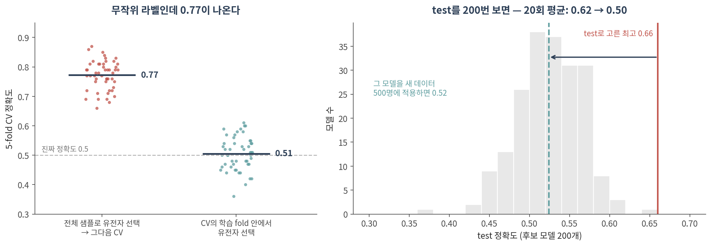
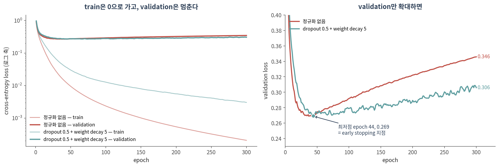

::: {.callout-note collapse="true"}
## 🎯 학습 목표

이 챕터를 마치면 다음을 할 수 있습니다.

-   train / validation / test의 역할을 구분하고, ⚠️ test를 왜 한 번만 봐야 하는지 숫자로 말할 수 있다
-   ⚠️ 특징 선택·정규화·배치 보정이 split 앞에 오면 어떤 일이 생기는지 설명할 수 있다
-   학습 곡선을 읽고 early stopping 지점을 찾을 수 있다
-   weight decay, dropout, early stopping이 각각 무엇을 하는지 말할 수 있다
-   ⚠️ 신경망과 정규화된 선형 모델·랜덤 포레스트를 **같은 조건에서** 비교할 수 있다
-   ⚠️ 라벨과 섞인 batch가 모델에 지름길을 준다는 것을 설명할 수 있다
:::

> 🤔 **생각해볼 질문**
>
> RNA-seq 샘플이 200개 있습니다. 딥러닝으로 분류하면 로지스틱 회귀보다 나을까요? 그걸 어떻게 확인하죠?

------------------------------------------------------------------------

## 1. 데이터를 나누는 법 ✂️ {#c09-s1}

{fig-align="center"}

### 1) train · validation · test {#c09-s1-1}

| 이름 | 무엇에 쓰나 | 몇 번 보나 |
|--------------|------------------------------------|--------------|
| **train** | 가중치를 학습 | 매 epoch |
| **validation** | 모델·하이퍼파라미터·멈출 시점을 **고름** | 고를 때마다 |
| **test** | 최종 성능을 **보고** | **한 번** |

-   ⚠️ test를 보고 무언가를 고르는 순간, test는 validation이 됩니다. 그러면 보고할 숫자가 없어집니다
-   **실측 (그림 오른쪽)** — 라벨이 무작위인데 후보 모델 200개 중 test 최고를 고르면 test 정확도 **0.62 ± 0.03**, 그 모델을 새 데이터에 적용하면 **0.50 ± 0.02** (20회)
    -   → 0.12만큼이 "고른 행위"가 만든 가짜 성능입니다
-   💡 교차검증(CV)으로 고르고 그 CV 점수를 그대로 보고하는 것도 같은 문제입니다. 고르는 CV를 바깥 CV로 한 번 더 감싸는 **nested CV**가 정직한 추정입니다 (Varma & Simon 2006)

### 2) ⚠️ 특징 선택을 나누기 전에 하면 {#c09-s1-2}

오믹스에서 가장 흔한 실수입니다. "차등발현 유전자 상위 50개를 뽑고, 그걸로 분류기를 만들어 CV했다."

-   **실측 (그림 왼쪽)** — 라벨이 무작위인데도
    -   ❌ 전체 샘플로 유전자를 고른 뒤 CV: **0.77 ± 0.05** (50회 중 최저 0.66)
    -   ✅ CV의 학습 fold 안에서만 고름: **0.51 ± 0.06**
-   이유: 유전자가 2만 개면 **우연히** 라벨과 상관된 유전자가 수십 개는 있습니다. 전체로 고르면 test fold의 우연까지 같이 고른 것입니다
-   p ≫ n일수록 심해집니다 (Ambroise & McLachlan 2002; Simon et al. 2003)

| 단계 | ❌ 누수 | ✅ 올바른 방법 |
|------------------|----------------------------|--------------------------------|
| 유전자 선택 | 전체 샘플로 차등발현·분산 계산 | train으로만 계산해서 test에 그대로 적용 |
| 표준화 | 전체의 평균·표준편차 | train의 평균·표준편차를 test에 적용 |
| 배치 보정 | 라벨을 공변량으로 넣고 전체에 적용 | 설계에서 막고, 보정도 train 안에서 (Nygaard et al. 2016) |
| 하이퍼파라미터 | test 점수로 고름 | validation 또는 nested CV |
| 한 환자의 여러 샘플 | 샘플 단위로 무작위 split | **환자 단위**로 split (`GroupKFold`) |

-   💡 분산 상위 유전자처럼 라벨을 쓰지 않는 필터는 누수가 훨씬 약합니다. 그래도 이 챕터의 모든 실험과 실습은 train으로만 계산합니다

### 3) 무엇을 n으로 셀 것인가 {#c09-s1-3}

-   환자 20명에게서 세포 20,000개를 얻었다면, 환자를 예측하는 문제의 n은 **20**입니다
-   ⚠️ 세포를 무작위로 나누면 같은 환자의 세포가 train과 test 양쪽에 들어갑니다 → 모델은 질병이 아니라 **그 환자**를 외워도 점수를 받습니다
-   단일세포 연구에서 세포를 독립 샘플로 세는 문제는 pseudoreplication으로 알려져 있습니다 (Zimmerman et al. 2021)
-   → **13**에서 논문을 읽을 때 가장 먼저 확인할 것 중 하나입니다

------------------------------------------------------------------------

## 2. 과적합과 정규화 🎛️ {#c09-s2}

{fig-align="center"}

### 1) p ≫ n {#c09-s2-1}

-   이 챕터의 데이터: TCGA 유방암 환자 **981명** × 유전자 **20,511개**, PAM50 아형 5개 (LumA 499, LumB 197, Basal 171, Her2 78, Normal 36)
-   은닉층 하나짜리 2000 → 256 → 5 MLP도 파라미터가 **513,541개** — 학습 샘플 588명의 약 **870배**
-   ⚠️ 이 정도면 신경망은 학습 데이터를 **완벽하게 외울 수 있습니다** (아래 그림의 train loss)
-   선형 모델도 마찬가지입니다. 유전자가 샘플보다 많으면 학습 데이터를 완벽히 맞히는 계수 조합이 무수히 많아서, ridge·lasso·elastic net 같은 규제로 하나를 골라야 합니다 (Zou & Hastie 2005)

### 2) 학습 곡선 읽기 {#c09-s2-2}

-   **train loss**는 끝없이 내려갑니다 — 300 epoch에서 0.0002
-   **validation loss**는 44 epoch에서 최저(0.269)를 찍고 다시 올라 300 epoch에서 0.346
-   ✅ **early stopping** — validation loss가 최저인 시점의 가중치를 쓰고 거기서 멈춥니다
-   ⚠️ 이 데이터에서는 dropout 0.5 + weight decay 5를 넣어도 **최저점은 거의 같았습니다** (0.269, 역시 44 epoch). 바뀐 것은 그 뒤에 나빠지는 **속도**입니다 (300 epoch에서 0.346 → 0.306)
-   💡 뒤의 모델 비교에서 validation으로 고른 MLP들은 대부분 lr 10⁻³에서 **2–6 epoch**만에 멈췄습니다. 이 데이터에서 가장 강한 정규화는 early stopping이었습니다

### 3) 정규화 도구 {#c09-s2-3}

| 도구 | 하는 일 | 선형 모델의 짝 | PyTorch |
|--------------|--------------------------------|-----------------|------------------------|
| **weight decay** | 가중치가 커지지 못하게 매 step 줄임 | ridge (L2) | `AdamW(weight_decay=...)` |
| **dropout** | 학습 중 뉴런을 무작위로 끔 (Srivastava et al. 2014) | — | `nn.Dropout(p)` |
| **early stopping** | validation loss 최저점에서 멈춤 | 규제 강도 λ 고르기 | 직접 구현 (실습) |
| **모델 줄이기** | 층·뉴런 수를 줄임 | 변수 수 줄이기 | — |
| **데이터 늘리기** | 가장 확실하지만 가장 비쌈 | 같음 | — |

-   **Adam** — 파라미터마다 학습률을 자동으로 조절하는 경사하강 변형. 기본 lr = 10⁻³ (Kingma & Ba 2015)
-   ⚠️ Adam에서는 L2 벌점과 weight decay가 같은 것이 아닙니다 → 둘을 분리한 **AdamW**를 씁니다 (Loshchilov & Hutter 2019)

------------------------------------------------------------------------

## 3. ⚠️ 정직한 비교 ⚖️ {#c09-s3}

{fig-align="center"}

### 1) 비교의 규칙 {#c09-s3-1}

-   ✅ **같은 split, 같은 test** — 모델마다 다른 데이터로 평가하면 비교가 아닙니다
-   ✅ **같은 튜닝 기회** — 모든 모델이 같은 validation으로 하이퍼파라미터를 고릅니다
-   ✅ **아무것도 안 배운 기준선** — 다수 클래스만 찍으면 balanced accuracy 0.20. 🔗 [04 §2](04_random_null.qmd#c04-s2)의 null model과 같은 역할
-   ✅ **split을 여러 번** — 평균과 흩어짐을 같이 보고합니다
-   ✅ **선형 모델은 반드시** 포함합니다

이 챕터 실험의 튜닝 범위:

| 모델 | 고른 것 | 후보 |
|-------------------------|---------------|----------------------------------------|
| 로지스틱 회귀 (L2) | 규제 강도 C | 0.001, 0.01, 0.1, 1 |
| elastic net (L1:L2 = 1:1) | 규제 강도 C | 0.03, 0.1, 0.3, 1 |
| 랜덤 포레스트 | — | 트리 500개, 나머지 기본값 |
| MLP (2000 → 256 → 5) | 학습률 · weight decay · dropout · epoch | 학습률 {10⁻³, 10⁻⁴} × weight decay {10⁻⁴, 10⁻²} × dropout {0, 0.5} = 8개, epoch는 early stopping |

-   ⚠️ MLP의 후보가 8개로 가장 많습니다. **튜닝 예산도 비교 조건**입니다
-   ⚠️ 선형 모델의 C는 후보의 끝값(1)이 자주 골렸습니다 (로지스틱 회귀 10번 중 4번, elastic net 5번) — 범위를 더 넓혔다면 조금 달라졌을 수 있습니다

### 2) 실측: 이 데이터에서는 누가 이겼나 {#c09-s3-2}

학습 735명, test 246명, split 10회:

| 모델 | balanced accuracy | split 10회 중 최저 – 최고 |
|---------------------|:----------------:|:----------------:|
| 다수 클래스만 찍기 | 0.20 | — |
| 랜덤 포레스트 | 0.725 ± 0.026 | 0.68 – 0.75 |
| 로지스틱 회귀 (L2) | 0.788 ± 0.039 | 0.73 – 0.86 |
| elastic net | 0.792 ± 0.041 | 0.73 – 0.84 |
| **MLP** | **0.817 ± 0.041** | 0.73 – 0.87 |

-   MLP − elastic net = **+0.025 ± 0.034**, 10번 중 7번 MLP가 앞섬 — 차이가 split 사이의 흔들림과 비슷한 크기입니다
-   ⚠️ **split 하나만 봤다면 어느 결론이든 낼 수 있었습니다.** split 0: elastic net 0.841 > MLP 0.793. split 2: MLP 0.866 > elastic net 0.835
-   학습 샘플을 줄여도 (그림 위) 이 데이터에서는 MLP가 elastic net과 같거나 앞섰습니다 — 60명 0.663 vs 0.645, 120명 0.711 vs 0.644, 240명 0.758 vs 0.718
-   ⚠️ 라벨 자체가 발현에서 나왔다는 점도 감안해야 합니다. PAM50 아형은 유전자 50개 발현이 기준 centroid와 얼마나 닮았는지로 정한 것입니다 (Parker et al. 2009)

### 3) 그런데 시뮬레이션에서는 졌다 {#c09-s3-3}

그림 아래 — 참 함수를 우리가 정해둔 데이터:

| 학습 샘플 3,000개일 때 | 로지스틱 회귀 | 랜덤 포레스트 | MLP | 참 모형 |
|--------------------|:------:|:------:|:------:|:------:|
| 참 함수가 선형 | 0.729 | **0.735** | 0.712 | 0.778 |
| 선형 + 상호작용 | 0.570 | **0.582** | 0.552 | 0.775 |

-   ⚠️ 참 함수가 선형일 때는 물론, **상호작용이 있을 때도** MLP가 가장 낮았습니다. 특징 500개 중 485개 이상이 잡음인 상태에서 곱셈 구조를 찾기에는 3,000개로도 부족했습니다
-   문헌도 비슷합니다
    -   전사체로 표현형을 예측한 비교에서 표준 머신러닝이 딥러닝 표현학습보다 나았습니다 (Smith et al. 2020)
    -   임상 예측 모델 체계적 문헌고찰에서 머신러닝은 로지스틱 회귀보다 나은 점이 없었습니다 (Christodoulou et al. 2019)
    -   일반 표 데이터 벤치마크에서는 트리 기반 모델이 신경망보다 나은 경우가 많았습니다 (Grinsztajn et al. 2022) — 이 챕터의 유방암 데이터에서는 반대로 랜덤 포레스트가 가장 낮았습니다
-   ✅ **결론: 누가 이길지는 미리 알 수 없고, 재봐야 압니다.** 그래서 딥러닝 결과는 언제나 같은 조건의 선형 모델 옆에 놓고 보고합니다

::: {.callout-tip collapse="true"}
## 🐍 실습 — 유방암 아형 분류: elastic net · 랜덤 포레스트 · MLP를 같은 조건에서

Colab에서 실행합니다. 설치는 [90. Colab 환경 설정](90_colab_setup.qmd) 참고. 발현 파일이 약 150 MB이고, 전체 실행에 몇 분 걸립니다.

```python
import warnings; warnings.filterwarnings("ignore")
import copy
import numpy as np, pandas as pd, torch, torch.nn as nn
from sklearn.model_selection import train_test_split
from sklearn.linear_model import LogisticRegression
from sklearn.ensemble import RandomForestClassifier
from sklearn.metrics import balanced_accuracy_score as bacc

# ── 1. TCGA 유방암 RNA-seq (cBioPortal datahub, 약 150 MB) ────────────
BASE = ("https://media.githubusercontent.com/media/cBioPortal/datahub/master/"
        "public/brca_tcga_pan_can_atlas_2018/")
expr = pd.read_csv(BASE + "data_mrna_seq_v2_rsem.txt", sep="\t")
clin = pd.read_csv(BASE + "data_clinical_patient.txt", sep="\t", comment="#")

def find_col(df, *keys):                          # 열 이름이 조금 바뀌어도 찾도록
    for c in df.columns:
        if all(k in c.lower() for k in keys):
            return c
    raise KeyError(f"{keys} 열이 없습니다: {list(df.columns)[:10]}")

g = find_col(expr, "hugo")
expr = expr.dropna(subset=[g]).drop_duplicates(g).set_index(g)
expr = expr[[c for c in expr.columns if c.startswith("TCGA")]]
X = np.log2(expr.T.astype(float) + 1)
X.index = X.index.str[:12]                         # 샘플 ID → 환자 ID
y = clin.set_index(find_col(clin, "patient", "id"))[find_col(clin, "subtype")].dropna()
common = X.index.intersection(y.index)
X, y = X.loc[common], y.loc[common].astype("category").cat.codes.values
print(X.shape, np.bincount(y))

# ── 2. test는 맨 먼저 떼어두고 끝까지 건드리지 않는다 ──────────────────
X_dev, X_te, y_dev, y_te = train_test_split(X, y, test_size=0.25, stratify=y,
                                            random_state=0)

def train_mlp(A, y_tr, V, y_va, seed=0):
    torch.manual_seed(seed)
    net = nn.Sequential(nn.Linear(A.shape[1], 256), nn.ReLU(), nn.Dropout(0.5),
                        nn.Linear(256, y.max() + 1))
    opt = torch.optim.AdamW(net.parameters(), lr=1e-3, weight_decay=1e-2)
    loss_fn = nn.CrossEntropyLoss()
    At, yt, Vt, yv = map(torch.tensor, (A, y_tr.astype("int64"), V, y_va.astype("int64")))
    best, wait = (np.inf, None), 0
    for epoch in range(200):
        net.train()
        for idx in torch.randperm(len(At)).split(64):         # 미니배치 64
            opt.zero_grad(); loss_fn(net(At[idx]), yt[idx]).backward(); opt.step()
        net.eval()
        with torch.no_grad():
            val_loss = loss_fn(net(Vt), yv).item()
        if val_loss < best[0]:
            best, wait = (val_loss, copy.deepcopy(net.state_dict())), 0
        else:
            wait += 1
            if wait == 20: break                              # early stopping
    net.load_state_dict(best[1]); net.eval()
    return net

def compare(X_dev, y_dev, seed=0):
    """dev를 train/validation으로 나눠 모델을 고르고, test에서 한 번만 평가"""
    X_tr, X_va, y_tr, y_va = train_test_split(X_dev, y_dev, test_size=0.2,
                                              stratify=y_dev, random_state=seed)
    genes = X_tr.var().nlargest(2000).index                  # train으로만 고른다
    mu, sd = X_tr[genes].mean(), X_tr[genes].std() + 1e-8
    A, V, T = [((d[genes] - mu) / sd).values.astype("float32")
               for d in (X_tr, X_va, X_te)]
    ens = [LogisticRegression(penalty="elasticnet", solver="saga", l1_ratio=0.5, C=C,
                              max_iter=1000, tol=1e-3, random_state=seed).fit(A, y_tr)
           for C in (0.1, 1.0)]                                # C는 validation으로 고름
    en = max(ens, key=lambda m: bacc(y_va, m.predict(V)))
    rf = RandomForestClassifier(500, n_jobs=-1, random_state=seed).fit(A, y_tr)
    net = train_mlp(A, y_tr, V, y_va, seed)
    with torch.no_grad():
        mlp_pred = net(torch.tensor(T)).argmax(1).numpy()
    return {"다수 클래스": bacc(y_te, np.full_like(y_te, np.bincount(y_tr).argmax())),
            "elastic net": bacc(y_te, en.predict(T)),
            "random forest": bacc(y_te, rf.predict(T)),
            "MLP": bacc(y_te, mlp_pred)}

# ── 3. 전체 dev(735명)로 한 번, 그리고 줄여가며 ────────────────────────
rows = {len(y_dev): compare(X_dev, y_dev)}
for n in [60, 120, 240]:
    X_n, _, y_n, _ = train_test_split(X_dev, y_dev, train_size=n, stratify=y_dev,
                                      random_state=0)
    rows[n] = compare(X_n, y_n)
print(pd.DataFrame(rows).T.sort_index().round(3))

# ── 4. 누수 점검: 라벨을 섞으면 모두 0.2 근처로 떨어져야 정상 ─────────
# y_te = np.random.default_rng(0).permutation(y_te)
# y_dev = np.random.default_rng(1).permutation(y_dev)
# print(compare(X_dev, y_dev))
```

**확인할 것:**

-   첫 줄 `(981, 20511) [171  78 499 197  36]` — 환자 981명, 아형 5개 (Basal, Her2, LumA, LumB, Normal 순)
-   dev 735명(그중 학습 588명): elastic net 0.835, MLP 0.839, 랜덤 포레스트 0.724, 다수 클래스 0.20
-   줄이면 순위가 흔들립니다 — 120명에서는 MLP 0.747 > elastic net 0.581인데, 240명에서는 elastic net 0.702 > MLP 0.625. `compare()`의 `seed`와 줄이는 `random_state`를 바꿔 몇 번 돌려보세요. split 하나로 결론을 내면 안 되는 이유가 보입니다
-   **누수 점검** — 맨 끝 주석 세 줄을 풀어 라벨을 섞고 다시 돌리면 네 모델 모두 0.2 근처(0.195–0.211)로 떨어집니다. 떨어지지 않으면 어딘가에서 새고 있는 것입니다
:::

------------------------------------------------------------------------

## 4. ⚠️ batch와 지름길 🧪 {#c09-s4}

{fig-align="center"}

### 1) 모델은 지름길을 찾는다 {#c09-s4-1}

-   모델은 라벨과 같이 움직이는 신호라면 **무엇이든** 씁니다. 그것이 생물학인지 기술적 인공물인지 구분하지 않습니다 (Geirhos et al. 2020)
-   유명한 예: 흉부 X선 폐렴 CNN이 사진만 보고 **어느 병원 시스템에서 찍었는지**를 99.95% 이상 맞혔고, 병원 간 유병률 차이가 커지면 내부 test 성능은 올랐지만 외부 병원으로는 일반화되지 않았습니다 (Zech et al. 2018)
-   오믹스에서는 처리 날짜, 시퀀싱 lane, 채취 기관이 그 역할을 합니다 (Leek et al. 2010)
-   **실측** — TCGA 유방암에서 LumA 환자만 골라(아형이 같으니 생물학적 차이를 줄인 상태) 5개 채취 기관을 발현으로 맞혀보면 balanced accuracy가 우연(0.20)보다 높습니다: 로지스틱 회귀 **0.35**, MLP **0.38**, 랜덤 포레스트 **0.29** (5-fold × 3회)

### 2) 라벨과 batch가 섞이면 — 실측 {#c09-s4-2}

위 그림: batch 효과가 4배(δ = +2)일 때

| 모델 | batch 없음 | batch 무작위 test | **방향을 뒤집은 test** |
|---------------|:---------:|:---------:|:---------:|
| 로지스틱 회귀 (L2) | 0.88 | 0.83 | **0.72** |
| 랜덤 포레스트 | 0.86 | 0.73 | **0.52** |
| MLP | 0.88 | 0.85 | **0.79** |

-   ⚠️ 세 모델 **모두** batch를 지름길로 썼습니다. 방향이 뒤집히자 모두 떨어졌습니다
-   이 실험에서 가장 크게 속은 것은 **랜덤 포레스트**였습니다 — 거의 우연 수준(0.52)
-   ⚠️ "딥러닝이 batch를 더 잘 학습한다"는 이 데이터에서는 **확인되지 않았습니다.** 어느 모델이 얼마나 속을지는 데이터와 batch의 모양에 따라 달라지고, 미리 알 수 없습니다
-   💡 실제 TCGA 채취 기관을 반씩 나눠 같은 방식으로 섞어봤을 때는 성능 저하가 보이지 않았습니다 (10회 평균, 섞어서 학습 0.845 vs 섞지 않고 학습 0.833, 로지스틱 회귀). 기관 신호(위의 0.35)가 LumA/LumB 신호(0.8 이상)보다 약했기 때문으로 보입니다 — batch가 늘 치명적인 것은 아니지만, **그것도 재봐야 압니다**

### 3) ✅ 설계로 막는다 {#c09-s4-3}

-   ✅ **실험 설계** — 조건과 batch(날짜, lane, 기관)를 섞지 않고 교차시킵니다. 모델링으로 사후에 고치는 것보다 확실합니다
-   ✅ **batch별로 따로 보고** — 전체 정확도 하나 대신 batch마다 정확도를 봅니다
-   ✅ **batch 단위로 나누기** — 한 batch를 통째로 test로 빼는 leave-one-batch-out 검증
-   ❌ 라벨을 공변량으로 넣은 배치 보정을 전체 데이터에 먼저 적용하지 마세요 — 그룹 차이를 부풀립니다 (Nygaard et al. 2016)

------------------------------------------------------------------------

## 📝 요약

-   train은 학습, validation은 고르기, test는 보고용 — ⚠️ test는 **한 번만** 봅니다 (후보 200개 중 test로 고르면 무작위 라벨에서도 0.62, 새 데이터에서는 0.50)
-   ⚠️ 특징 선택을 split 앞에서 하면 무작위 라벨로도 CV 0.77이 나옵니다 (옳게 하면 0.51). 표준화·배치 보정·하이퍼파라미터도 같은 원칙
-   n은 독립 단위로 셉니다 — 환자를 예측한다면 세포가 아니라 환자 수
-   p ≫ n: 파라미터 513,541개 MLP를 588명으로 학습하면 train loss는 0으로 가고 validation loss는 44 epoch에서 바닥을 찍고 올라갑니다 → early stopping
-   dropout·weight decay는 이 데이터에서 과적합의 속도를 늦췄지만 최저점은 거의 같았습니다
-   ⚠️ 비교는 같은 split·같은 튜닝 기회·기준선·반복·선형 모델 포함이 조건입니다
-   TCGA 유방암에서는 MLP 0.817, elastic net 0.792, 로지스틱 회귀 0.788, 랜덤 포레스트 0.725 (split 10회) — 차이는 split 사이 흔들림과 비슷한 크기
-   시뮬레이션에서는 반대로 MLP가 가장 낮았습니다 → 누가 이길지는 **재봐야 압니다**
-   ⚠️ 라벨과 섞인 batch는 모든 모델이 지름길로 씁니다 (4배 batch, 방향을 뒤집으면 랜덤 포레스트 0.52, 로지스틱 회귀 0.72, MLP 0.79). 막는 곳은 설계입니다

------------------------------------------------------------------------

## ➕ 더 읽을거리

### 누수와 검증

Ambroise C, McLachlan GJ. [*Selection bias in gene extraction on the basis of microarray gene-expression data.*](https://doi.org/10.1073/pnas.102102699) PNAS. 2002.\
Simon R, Radmacher MD, Dobbin K, McShane LM. [*Pitfalls in the use of DNA microarray data for diagnostic and prognostic classification.*](https://doi.org/10.1093/jnci/95.1.14) J Natl Cancer Inst. 2003.\
Varma S, Simon R. [*Bias in error estimation when using cross-validation for model selection.*](https://doi.org/10.1186/1471-2105-7-91) BMC Bioinformatics. 2006.\
Zimmerman KD, Espeland MA, Langefeld CD. [*A practical solution to pseudoreplication bias in single-cell studies.*](https://doi.org/10.1038/s41467-021-21038-1) Nat Commun. 2021.

### 정규화와 최적화

Zou H, Hastie T. [*Regularization and variable selection via the elastic net.*](https://doi.org/10.1111/j.1467-9868.2005.00503.x) J R Stat Soc B. 2005.\
Breiman L. [*Random forests.*](https://doi.org/10.1023/A:1010933404324) Mach Learn. 2001.\
Srivastava N, et al. [*Dropout: a simple way to prevent neural networks from overfitting.*](https://www.jmlr.org/papers/v15/srivastava14a.html) JMLR. 2014.\
Kingma DP, Ba J. [*Adam: a method for stochastic optimization.*](https://arxiv.org/abs/1412.6980) ICLR. 2015.\
Loshchilov I, Hutter F. [*Decoupled weight decay regularization.*](https://arxiv.org/abs/1711.05101) ICLR. 2019.

### 딥러닝은 고전 모델보다 나은가

Smith AM, et al. [*Standard machine learning approaches outperform deep representation learning on phenotype prediction from transcriptomics data.*](https://doi.org/10.1186/s12859-020-3427-8) BMC Bioinformatics. 2020.\
Christodoulou E, et al. [*A systematic review shows no performance benefit of machine learning over logistic regression for clinical prediction models.*](https://doi.org/10.1016/j.jclinepi.2019.02.004) J Clin Epidemiol. 2019.\
Grinsztajn L, Oyallon E, Varoquaux G. [*Why do tree-based models still outperform deep learning on typical tabular data?*](https://proceedings.neurips.cc/paper_files/paper/2022/hash/0378c7692da36807bdec87ab043cdadc-Abstract-Datasets_and_Benchmarks.html) NeurIPS Datasets and Benchmarks. 2022.

### batch와 지름길

Leek JT, et al. [*Tackling the widespread and critical impact of batch effects in high-throughput data.*](https://doi.org/10.1038/nrg2825) Nat Rev Genet. 2010.\
Nygaard V, Rødland EA, Hovig E. [*Methods that remove batch effects while retaining group differences may lead to exaggerated confidence in downstream analyses.*](https://doi.org/10.1093/biostatistics/kxv027) Biostatistics. 2016.\
Geirhos R, et al. [*Shortcut learning in deep neural networks.*](https://doi.org/10.1038/s42256-020-00257-z) Nat Mach Intell. 2020.\
Zech JR, et al. [*Variable generalization performance of a deep learning model to detect pneumonia in chest radiographs.*](https://doi.org/10.1371/journal.pmed.1002683) PLoS Med. 2018.

### 이 챕터의 데이터

Parker JS, et al. [*Supervised risk predictor of breast cancer based on intrinsic subtypes.*](https://doi.org/10.1200/JCO.2008.18.1370) J Clin Oncol. 2009. (PAM50)\
Hoadley KA, et al. [*Cell-of-origin patterns dominate the molecular classification of 10,000 tumors from 33 types of cancer.*](https://doi.org/10.1016/j.cell.2018.03.022) Cell. 2018. (TCGA PanCanAtlas)\
Cerami E, et al. [*The cBio cancer genomics portal.*](https://doi.org/10.1158/2159-8290.CD-12-0095) Cancer Discov. 2012. · [cBioPortal datahub](https://github.com/cBioPortal/datahub)

