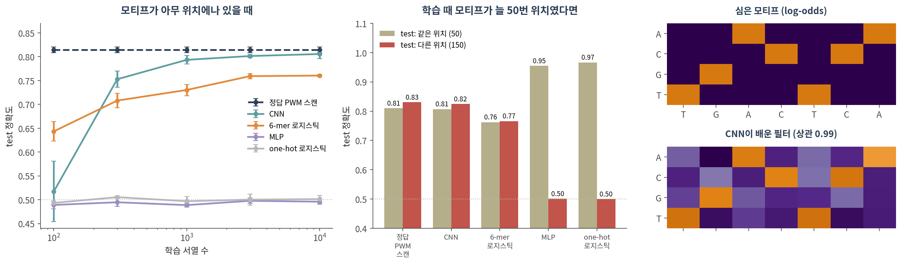
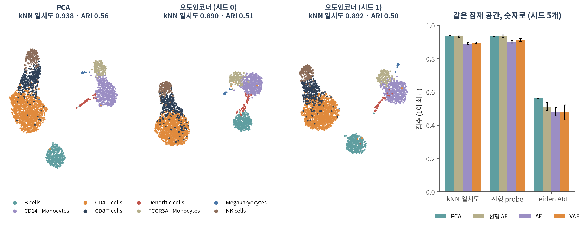

::: {.callout-note collapse="true"}
## 🎯 학습 목표

이 챕터를 마치면 다음을 할 수 있습니다.

-   아키텍처를 이름이 아니라 **어떤 가정(귀납 편향)을 넣었는가**로 설명할 수 있다
-   CNN의 지역성·가중치 공유가 서열 모티프 탐지에 왜 맞는지 실측 숫자로 말할 수 있다
-   ⚠️ 가정이 데이터와 맞지 않으면 오히려 손해라는 것을 예로 들 수 있다
-   오토인코더와 VAE의 구조를 그리고, 선형 오토인코더가 PCA와 같은 것을 배운다는 것을 설명할 수 있다
-   ⚠️ 두 잠재 공간을 UMAP 그림이 아니라 **수치로** 비교할 수 있다
-   어텐션이 무엇을 계산하는지 말하고, **12**의 GAT·**13**의 그래프 트랜스포머와 연결할 수 있다
:::

> 🤔 **생각해볼 질문**
>
> methods에 "CNN 기반", "VAE 기반", "트랜스포머 기반"이라고 적혀 있습니다. 이름 말고 무엇을 확인해야 하나요?

------------------------------------------------------------------------

## 1. CNN — 서열 위를 미끄러지는 모티프 스캐너 🔍 {#c10-s1}

### 1) 아키텍처는 가정이다 {#c10-s1-1}

-   **귀납 편향(inductive bias)** — 데이터를 보기 전에 모델에 넣어둔 가정. "어떤 함수부터 먼저 고려할 것인가"
-   **08·09의 MLP**는 가정이 거의 없습니다. 입력 800개가 서로 어떤 관계인지 모르고 전부 데이터에서 배웁니다 → 그래서 데이터가 많이 필요합니다
-   이 챕터의 구조들은 각자 **데이터의 모양에 대한 가정**을 하나씩 넣은 것입니다 (Battaglia et al. 2018)
-   💡 Part 1과 같은 이야기입니다. 그래프를 만드는 순간 "이 쌍이 관련 있다"는 가정을 넣었습니다 (🔗 [01 §3](01_why_networks.qmd#c01-s3))

### 2) 합성곱 = 지역성 + 가중치 공유 {#c10-s1-2}

-   **PWM 스캔을 떠올리세요.** 모티프의 위치별 가중치 행렬(4 염기 × 폭)을 서열 위로 한 칸씩 밀며 점수를 매깁니다
-   **1D 합성곱 필터가 정확히 그 연산입니다.** 다른 점은 PWM을 사람이 주지 않고 **학습한다**는 것 하나

| 가정 | 뜻 | 구현 |
|------------------|------------------------------------|----------------------|
| **지역성** | 의미 있는 패턴은 가까이 붙은 염기 몇 개로 이루어진다 | 필터 폭 12 — 한 번에 12 bp만 봄 |
| **가중치 공유** | 같은 모티프는 어디 있든 같은 뜻이다 | 모든 위치에 **같은** 필터 |
| **위치 무시** | 있기만 하면 된다, 어디 있는지는 상관없다 | 전역 max pooling — 가장 센 반응 하나만 남김 |

-   파라미터 수가 극적으로 줄어듭니다 — 필터 16개 × 폭 12 CNN은 **801개**, 같은 입력(one-hot 800)에 은닉 64개 MLP는 **51,329개**
-   생물학 예: 단백질 결합 서열 특이성 예측(DeepBind; Alipanahi et al. 2015), 비부호화 변이 효과 예측(DeepSEA; Zhou & Troyanskaya 2015), 염색질 접근성(Basset; Kelley et al. 2016)

### 3) 실측 — 모티프를 심은 합성 DNA {#c10-s1-3}

{fig-align="center"}

**모티프가 아무 위치에나 있을 때** (그림 왼쪽)

| 학습 서열 수 | 정답 PWM 스캔 (상한) | CNN | 6-mer 빈도 + 로지스틱 | MLP | one-hot 로지스틱 |
|:----------:|:------:|:------:|:------:|:------:|:------:|
| 100 | 0.814 | 0.517 | **0.643** | 0.489 | 0.493 |
| 300 | 0.814 | **0.753** | 0.708 | 0.495 | 0.505 |
| 1,000 | 0.814 | **0.793** | 0.730 | 0.489 | 0.497 |
| 10,000 | 0.814 | **0.806** | 0.760 | 0.496 | 0.501 |

-   **정답 PWM 스캔** — 심은 모티프를 알고 가장 높은 점수로 판정. 모티프에 돌연변이가 섞여 있고 무작위 서열에도 비슷한 조각이 우연히 생기므로 0.81이 도달 가능한 상한입니다
-   ✅ CNN은 학습 1,000개에서 상한 가까이(0.793) 갑니다
-   ⚠️ **MLP와 one-hot 로지스틱 회귀는 학습 10,000개에서도 0.50 — 전혀 배우지 못했습니다.** 모티프가 194곳 중 어디에 올지 모르므로, 위치마다 따로 배워야 합니다
-   💡 **6-mer 빈도**는 사람이 넣은 귀납 편향입니다 (위치를 버리고 짧은 단어만 셈). 학습 100개에서는 CNN보다 나았습니다 — 가정이 강할수록 적은 데이터로 버팁니다

### 4) ⚠️ 가정이 틀리면 손해다 {#c10-s1-4}

학습 때 모티프가 **늘 50번 위치**에만 있었다면? (그림 가운데, 시드 3개 평균)

| test | 정답 PWM 스캔 | CNN | 6-mer + 로지스틱 | MLP | one-hot 로지스틱 |
|--------------|:------:|:------:|:------:|:------:|:------:|
| 같은 위치 (50) | 0.810 | 0.807 | 0.762 | **0.955** | **0.966** |
| 다른 위치 (150) | 0.831 | **0.824** | 0.766 | 0.501 | 0.500 |

-   위치가 고정되면 MLP와 로지스틱 회귀가 **CNN보다 훨씬 낫습니다.** "50번 자리만 보면 된다"는 정보를 쓰기 때문입니다 — CNN은 max pooling으로 그 정보를 **스스로 버립니다**
-   ⚠️ 그러나 모티프를 150번으로 옮기면 MLP와 로지스틱 회귀는 **우연 수준(0.50)**. 배운 것은 "모티프"가 아니라 "50번 자리의 모티프"였습니다
-   ✅ 결론: 귀납 편향은 공짜가 아닙니다. **데이터가 실제로 그 가정을 따를 때만** 이득입니다

**필터는 정말 모티프가 되었나** (그림 오른쪽)

-   필터 16개 중 **3개**가 심은 모티프의 log-odds와 상관 **0.96 이상**이었습니다 (최고 0.99). 나머지 13개는 0.35 이하
-   가장 닮은 필터가 최대로 반응한 위치가 심은 위치와 정확히 일치한 비율: 양성 test 서열의 **83%**
-   ⚠️ 이렇게 깔끔한 것은 **필터 폭·pooling을 그렇게 설계했기 때문**입니다. 층을 깊게 쌓아 부분 모티프를 조립하게 만들면 첫 층 필터는 모티프의 조각만 배우는 경향이 있습니다 (Koo & Eddy 2019). 필터를 "발견한 모티프"로 보고하기 전에 구조부터 확인하세요

::: {.callout-tip collapse="true"}
## 🐍 실습 1 — CNN으로 모티프 찾기 (합성 DNA)

Colab에서 실행합니다. `torch`는 Colab에 이미 있습니다. CPU에서 몇 분 걸립니다 (모델 4개 × 100 epoch).

```python
import numpy as np, torch, torch.nn as nn

# ── 1. 합성 DNA: 양성에만 모티프 TGACTCA를 심는다 ────────────────────
L, MOTIF = 200, "TGACTCA"
IDX = np.array(["ACGT".index(b) for b in MOTIF])

def make(n, rng, pos=None):
    S = rng.integers(0, 4, (n, L))                     # 무작위 서열 (0=A 1=C 2=G 3=T)
    y = rng.permutation(np.arange(n) % 2)              # 절반은 양성
    for i in range(n):
        m = IDX.copy()
        if y[i]:                                       # 양성: 자리마다 10% 확률로 다른 염기
            mut = rng.random(len(m)) < 0.1
            m[mut] = (m[mut] + rng.integers(1, 4, mut.sum())) % 4
        else:                                          # 음성: 같은 염기를 순서만 섞어서
            while (m == IDX).all():
                m = rng.permutation(IDX)
        p = rng.integers(0, L - len(m) + 1) if pos is None else pos
        S[i, p:p + len(m)] = m
    X = np.eye(4, dtype=np.float32)[S].transpose(0, 2, 1)   # one-hot (n, 4, L)
    return torch.tensor(X), torch.tensor(y, dtype=torch.float32)

# ── 2. CNN(필터 16개 × 폭 12, 전역 max pooling) vs MLP ─────────────────
class CNN(nn.Module):
    def __init__(self):
        super().__init__()
        self.conv = nn.Conv1d(4, 16, kernel_size=12)   # 필터 하나 = 학습되는 PWM
        self.fc = nn.Linear(16, 1)
    def forward(self, x):
        h = torch.relu(self.conv(x))                   # 모든 위치를 같은 필터로 스캔
        return self.fc(h.max(dim=2).values).squeeze(1) # 위치는 잊고 가장 센 반응만

def MLP():
    return nn.Sequential(nn.Flatten(), nn.Linear(4 * L, 64), nn.ReLU(),
                         nn.Linear(64, 1), nn.Flatten(0))

def train(model, X, y, epochs=100):
    opt = torch.optim.Adam(model.parameters(), lr=1e-3)
    loss_fn = nn.BCEWithLogitsLoss()
    for _ in range(epochs):
        for b in torch.randperm(len(y)).split(64):
            opt.zero_grad(); loss_fn(model(X[b]), y[b]).backward(); opt.step()
    return model.eval()

def acc(model, X, y):
    with torch.no_grad():
        return ((model(X) > 0).float() == y).float().mean().item()

rng = np.random.default_rng(0)
Xtr, ytr = make(3000, rng)
Xte, yte = make(2000, rng)
torch.manual_seed(0); cnn = train(CNN(), Xtr, ytr)
torch.manual_seed(0); mlp = train(MLP(), Xtr, ytr)
print(f"모티프가 아무 데나   CNN {acc(cnn, Xte, yte):.3f}   MLP {acc(mlp, Xte, yte):.3f}")

# ── 3. ⚠️ 학습 때 모티프가 늘 50번 자리였다면 ──────────────────────────
Xtr, ytr = make(3000, rng, pos=50)
torch.manual_seed(0); cnn50 = train(CNN(), Xtr, ytr)
torch.manual_seed(0); mlp50 = train(MLP(), Xtr, ytr)
for p in (50, 150):
    X, y = make(2000, rng, pos=p)
    print(f"test 위치 {p:3d}       CNN {acc(cnn50, X, y):.3f}   MLP {acc(mlp50, X, y):.3f}")

# ── 4. 필터가 모티프가 되었나 — 가장 큰 필터를 서열로 읽기 ───────────────
W = cnn.conv.weight.detach()                           # (필터 16, 염기 4, 폭 12)
for f in W.norm(dim=(1, 2)).argsort(descending=True)[:3]:
    print("필터", int(f), "".join("ACGT"[i] for i in W[f].argmax(0)),
          f"(크기 {W[f].norm():.2f})")
```

**확인할 것:**

-   첫 줄: CNN 0.795, MLP 0.501 — 같은 데이터, 같은 학습인데 MLP는 아무것도 배우지 못합니다
-   위치를 50으로 고정해 학습하면 같은 위치에서는 MLP가 이깁니다(0.943 vs 0.817). 150으로 옮기면 MLP 0.501, CNN 0.816
-   마지막 세 줄: 가장 큰 필터 셋을 가장 센 염기로 읽으면 `CCTTTGACTCAT`, `CTTTTGACTCAG`, `TGACTCAACTGC` — 세 필터 모두 **TGACTCA**를 품고 있습니다. 모티프를 알려준 적은 없습니다
-   `nn.Conv1d`의 `kernel_size`를 4로 줄여 보세요. 필터가 모티프 전체를 담을 수 없게 되면 무슨 일이 생기나요?
:::

### 5) RNN은 짧게 {#c10-s1-5}

-   **순환 신경망(RNN)** — 서열을 한 칸씩 읽으며 은닉 상태를 갱신합니다. 가정: *순서대로 읽으면 앞의 정보가 뒤로 전달된다*
-   멀리 떨어진 정보는 기울기가 여러 번 곱해지며 사라집니다 (🔗 [08 §2](08_nn_basics.qmd#c08-s2)의 기울기 소실) → **LSTM**이 게이트로 이를 완화했습니다 (Hochreiter & Schmidhuber 1997)
-   한 칸씩 읽어야 해서 병렬화가 어렵고, 지금은 긴 서열에도 §3의 어텐션 계열이 주로 쓰입니다

------------------------------------------------------------------------

## 2. 오토인코더와 VAE — 압축하며 배운다 🗜️ {#c10-s2}

### 1) 구조 {#c10-s2-1}

> 입력 x → **인코더** → 잠재 z (좁은 병목) → **디코더** → 복원 x̂, 손실 = ‖x − x̂‖²

-   라벨이 필요 없습니다(비지도). 병목이 좁으니 복원에 꼭 필요한 정보만 z에 담기게 됩니다
-   가정: **데이터는 저차원 구조 위에 놓여 있다** — 유전자 1,838개가 세포 상태 몇 개의 조합으로 움직인다
-   z가 사는 공간이 **잠재 공간**입니다. 단일세포 분석에서 PCA 자리에 이것을 씁니다 (Hinton & Salakhutdinov 2006)

💡 **선형 오토인코더는 PCA입니다.** 활성함수를 빼면 인코더·디코더가 행렬 하나씩으로 접히고(🔗 [08 §1](08_nn_basics.qmd#c08-s1-2)), 복원 오차를 최소화하는 해는 주성분과 **같은 부분공간**입니다 (Baldi & Hornik 1989). 비선형 활성함수가 있어야 PCA와 다른 것을 배울 수 있습니다.

### 2) VAE와 scVI {#c10-s2-2}

-   **VAE(변분 오토인코더)** — 세포 하나를 점 z가 아니라 **분포**(평균 μ, 분산 σ²)로 보냅니다 (Kingma & Welling 2014)
    -   손실 = 복원 오차 + **KL 항**(각 분포가 표준정규분포에서 너무 멀어지지 않게 묶음)
    -   효과: 잠재 공간이 매끄러워지고, z를 뽑아 디코더에 넣으면 **새 샘플을 생성**할 수 있습니다
-   **scVI**(Lopez et al. 2018)는 VAE를 단일세포에 맞춘 것입니다

| | PCA | 오토인코더 | VAE | scVI |
|---------------|-------------|-------------|-------------|--------------------|
| 입력 | 정규화·표준화한 값 | 같음 | 같음 | **원래 count** |
| 인코더 | 선형 | 비선형 | 비선형 → (μ, σ) | 비선형 → (μ, σ) |
| 손실 | 복원 오차 | 복원 오차 | 복원 + KL | count 분포의 우도 + KL |
| batch | — | — | — | batch를 디코더에 **조건으로** 넣음 |

-   ✅ scVI의 핵심 가정: *관측된 count는 세포 상태 z, 시퀀싱 깊이, batch가 함께 만든 것이다.* batch를 모델 안에 넣어 잠재 공간에서 빼냅니다
-   ⚠️ 그 가정도 가정입니다. batch와 생물학적 조건이 섞여 있으면(🔗 [09 §4](09_training.qmd#c09-s4)) 어떤 모델도 둘을 가를 수 없습니다

### 3) ⚠️ 잠재 공간은 숫자로 비교한다 {#c10-s2-3}

{fig-align="center"}

같은 세포를 PCA · 선형 AE · 비선형 AE · VAE로 10차원까지 줄이고, **라벨을 쓰지 않고 만든** 잠재 공간이 세포유형을 얼마나 보존하는지 쟀습니다.

| 잠재 10차원 | kNN 일치도 | Leiden ARI (군집 수) | 선형 probe | 복원 오차 (held-out) |
|------------------|:----------:|:-------------:|:----------:|:----------:|
| **PCA** | **0.938** | **0.562** (10) | 0.933 | **0.830** |
| 선형 오토인코더 | 0.933 ± 0.004 | 0.511 ± 0.025 (11.0) | **0.935** ± 0.007 | 0.831 |
| 오토인코더 (ReLU) | 0.890 ± 0.006 | 0.481 ± 0.025 (10.4) | 0.901 ± 0.008 | 0.835 |
| VAE | 0.895 ± 0.004 | 0.476 ± 0.045 (10.6) | 0.911 ± 0.009 | 0.834 |

*(오토인코더 계열은 시드 5개의 평균 ± 표준편차. PCA는 결정적이라 한 번)*

-   **kNN 일치도** — 잠재 공간에서 가장 가까운 세포 15개 중 같은 세포유형의 비율
-   **Leiden ARI** — 잠재 공간으로 kNN 그래프를 만들어 Leiden(resolution 1.0)으로 나눈 결과와 라벨의 일치도 (🔗 [05 §2](05_community.qmd#c05-s2))
-   **선형 probe** — 잠재 10차원으로 로지스틱 회귀를 학습해 세포유형을 맞히는 5-fold balanced accuracy
-   **복원 오차** — 세포 80%로 학습하고 나머지 20%를 복원했을 때의 평균제곱오차

-   ⚠️ **이 데이터에서는 비선형 오토인코더가 PCA보다 나은 점이 없었습니다.** 네 지표 모두 PCA나 선형 오토인코더가 가장 좋았고, 비선형 오토인코더와 VAE가 가장 낮았습니다
-   비선형 오토인코더는 시드 5개 모두 **약 10 epoch**에서 validation 복원 오차가 바닥을 찍었습니다 — 그 뒤로는 외우기 시작했습니다 (🔗 [09 §2](09_training.qmd#c09-s2))
-   선형 오토인코더는 복원 오차가 PCA와 같았지만(0.831 vs 0.830) PCA 좌표와의 정준상관은 평균 0.875였습니다. 이론상의 해(PCA 부분공간)에 경사하강이 **완전히 도달하지는 않았습니다** — 🔗 [08 §4](08_nn_basics.qmd#c08-s4-2)의 "표현할 수 있다 ≠ 찾는다"
-   💡 그렇다고 오토인코더가 쓸모없다는 뜻은 아닙니다. 이 비교는 표준화까지 끝난 유전자 1,838개, 기증자 한 명이라는 가장 단순한 조건이고, scVI 계열의 강점(count 분포, batch, 여러 데이터 통합)은 여기서 시험되지 않았습니다. 결론은 09와 같습니다 — **재봐야 압니다**

-   ⚠️ **라벨이 어디서 왔는지 보세요.** 이 데이터의 세포유형은 scanpy 튜토리얼 흐름대로 PCA 성분으로 kNN 그래프(k = 10)를 만들고, 그 위의 Louvain 군집에 마커 유전자로 이름을 붙인 것입니다. 정답 자체가 PCA 쪽에 유리하게 만들어졌을 수 있습니다 → **13**에서 다시
-   ⚠️ **그림은 측정이 아닙니다.** 그림 왼쪽 세 UMAP은 모두 "깔끔한 섬들"로 보입니다. 시드만 바꾼 두 오토인코더의 UMAP은 섬의 배치가 다르지만 수치는 거의 같습니다. UMAP·t-SNE는 거리와 군집 크기를 왜곡하므로 그 모양으로 방법을 비교하면 안 됩니다 (Kobak & Berens 2019; Chari & Pachter 2023)

::: {.callout-tip collapse="true"}
## 🐍 실습 2 — PBMC 3k: PCA와 오토인코더를 숫자로 비교

Colab에서 실행합니다. `!pip install -q scanpy` 먼저 ([90. Colab 환경 설정](90_colab_setup.qmd)). 1분 안쪽으로 끝납니다.

```python
import warnings; warnings.filterwarnings("ignore")
import numpy as np, scanpy as sc, torch, torch.nn as nn
from sklearn.decomposition import PCA
from sklearn.neighbors import NearestNeighbors
from sklearn.metrics import adjusted_rand_score

# ── 1. PBMC 3k: 세포 2,638 × 유전자 1,838 (정규화·표준화 완료) ──────────
adata = sc.datasets.pbmc3k_processed()
X = np.asarray(adata.X, dtype=np.float32)
lab = adata.obs["louvain"].astype(str).values          # 세포유형 8개
print(X.shape, len(set(lab)))

# ── 2. 두 가지 10차원 잠재 공간: PCA와 오토인코더 ──────────────────────
Z = {"PCA": PCA(10, random_state=0).fit_transform(X)}

torch.manual_seed(0)
enc = nn.Sequential(nn.Linear(X.shape[1], 256), nn.ReLU(), nn.Linear(256, 10))
dec = nn.Sequential(nn.Linear(10, 256), nn.ReLU(), nn.Linear(256, X.shape[1]))
opt = torch.optim.Adam([*enc.parameters(), *dec.parameters()], lr=1e-3)
Xt = torch.tensor(X)
for epoch in range(10):                                # 본문 실험의 early stopping 지점 근처
    for b in torch.randperm(len(Xt)).split(128):
        opt.zero_grad()
        loss = ((dec(enc(Xt[b])) - Xt[b]) ** 2).mean()  # 복원 오차 — 라벨은 쓰지 않음
        loss.backward(); opt.step()
with torch.no_grad():
    Z["오토인코더"] = enc(Xt).numpy()

# ── 3. 그림 말고 숫자로 비교 ─────────────────────────────────────────
def knn_agree(z, k=15):
    idx = NearestNeighbors(n_neighbors=k + 1).fit(z).kneighbors(z, return_distance=False)[:, 1:]
    return (lab[idx] == lab[:, None]).mean()

def leiden_ari(z):
    a = sc.AnnData(z); a.obs["type"] = lab
    sc.pp.neighbors(a, n_neighbors=15, use_rep="X", random_state=0)
    sc.tl.leiden(a, resolution=1.0, flavor="igraph", n_iterations=2, random_state=0)
    return adjusted_rand_score(lab, a.obs["leiden"]), a

for name, z in Z.items():
    ari, a = leiden_ari(z)
    print(f"{name:6s}  kNN 일치도 {knn_agree(z):.3f}   Leiden ARI {ari:.3f}"
          f"   (군집 {a.obs['leiden'].nunique()}개)")
    # 그림은 숫자 옆에 — 모양으로 판단하지 말 것
    # sc.tl.umap(a, random_state=0); sc.pl.umap(a, color="type", title=f"{name}  ARI {ari:.2f}")
```

**확인할 것:**

-   `(2638, 1838) 8` — 세포 2,638개, 유전자 1,838개, 세포유형 8개
-   PCA는 kNN 일치도 0.938, Leiden ARI 0.562 (군집 10개), 오토인코더는 0.891, 0.478 (군집 12개) — 위 표와 같은 방향입니다
-   마지막 주석 줄을 풀어 UMAP을 그려보세요. 두 그림 모두 "깔끔해" 보일 것입니다. 그림만 봤다면 어느 쪽이 낫다고 했을까요?
-   `range(10)`을 `range(100)`으로 바꿔 오래 학습시켜 보세요. 복원 오차는 줄지만 kNN 일치도는 어떻게 되나요?
:::

------------------------------------------------------------------------

## 3. 어텐션 — 어디를 볼지 입력마다 정한다 👀 {#c10-s3}

### 1) 무엇을 계산하나 {#c10-s3-1}

위치(또는 토큰) i가 다른 위치 j들의 정보를 모을 때:

$$
\text{출력}_i = \sum_j a_{ij}\, v_j, \qquad a_{ij} = \operatorname{softmax}_j\!\left(\frac{q_i \cdot k_j}{\sqrt{d}}\right)
$$

-   **q (query)** — i가 찾는 것, **k (key)** — j가 가진 것의 이름표, **v (value)** — j가 실제로 넘겨주는 내용. 셋 다 입력에 학습되는 행렬을 곱해 만듭니다
-   가중치 $a_{ij}$는 **입력마다 새로 계산**됩니다. CNN 필터는 학습이 끝나면 고정되고 폭 12 안만 보지만, 어텐션은 서열 전체의 **아무 쌍**이나 볼 수 있습니다
-   대가: 길이 L이면 쌍이 L²개 → 긴 서열에서 계산량이 급격히 늘어납니다
-   트랜스포머는 이 연산(self-attention)을 층으로 쌓은 구조입니다 (Bahdanau et al. 2015; Vaswani et al. 2017)
-   생물학 예: Enformer는 서열에서 유전자 발현을 예측하며 멀리 떨어진 조절 요소와의 상호작용을 어텐션으로 통합했습니다 (Avsec et al. 2021)

### 2) 그래프로 보면 {#c10-s3-2}

-   self-attention = **모든 위치가 서로 연결된 완전 그래프** 위에서, 엣지 가중치 $a_{ij}$를 학습하며 이웃 정보를 가중 평균하는 것
-   이것을 **실제 그래프의 이웃에만** 적용하면 → **12**의 GAT(graph attention network)
-   다시 **모든 노드 쌍**으로 넓히고 그래프 구조는 위치 정보로 넣으면 → **13**의 그래프 트랜스포머
-   💡 가정의 차이: GAT는 "관련 있는 쌍은 그래프가 알려준다", 트랜스포머는 "관련 있는 쌍도 데이터에서 배운다" — 후자는 더 유연하고, 그만큼 데이터를 더 요구합니다

### 3) ⚠️ 어텐션 가중치는 설명이 아니다 {#c10-s3-3}

-   "모델이 이 영역에 주목했다"는 히트맵이 논문에 자주 나옵니다
-   ⚠️ 학습된 어텐션 가중치는 기울기 기반 중요도와 자주 상관이 없었고, **아주 다른 어텐션 분포로도 같은 예측**을 낼 수 있었습니다 (Jain & Wallace 2019)
-   반론도 있습니다 — 조건에 따라 설명으로 쓸 여지가 있다 (Wiegreffe & Pinter 2019). 즉 **자동으로 설명이 되지는 않습니다**
-   ✅ 중요도를 주장하려면 그 영역을 지우거나 바꿨을 때 예측이 실제로 바뀌는지 **개입해서** 확인하세요 — §1-4의 위치 옮기기와 같은 방식입니다

------------------------------------------------------------------------

## 4. 정리 — 이름 대신 가정을 읽는다 🧭 {#c10-s4}

| 구조 | 넣은 가정 (귀납 편향) | 잘 맞는 데이터 | 가정이 틀리면 |
|---------------|------------------------------------|----------------|----------------------------|
| **MLP** | 거의 없음 — 입력 사이 관계를 모두 데이터에서 | 표 (발현 행렬) | 데이터가 아주 많이 필요 (§1-3에서 0.50) |
| **CNN** | 지역성, 가중치 공유, (pooling 시) 위치 무시 | 서열, 이미지 | 위치가 중요한 신호를 버림 (§1-4) |
| **RNN** | 순서대로 읽으며 상태를 누적 | 서열, 시계열 | 먼 거리 정보가 약해짐 |
| **오토인코더 / VAE** | 데이터는 저차원 구조 위에 있다 | 단일세포 발현 | 복원에 필요 없는 신호(드문 세포)를 버릴 수 있음 |
| **어텐션 / 트랜스포머** | 관련 있는 쌍을 입력마다 새로 정한다 | 긴 서열, 집합 | 쌍이 L²개 — 데이터와 계산을 많이 요구 |
| **GNN (12)** | 관계는 그래프로 주어진다, 이웃 순서는 무의미 | 네트워크 | 그래프가 틀리거나 이웃이 서로 다르면 해로움 |

✅ methods에서 "OO 기반"을 읽으면 세 가지를 물으세요.

-   ✅ 이 구조는 **어떤 가정**을 넣었나? 그 가정이 이 데이터에 맞나?
-   ✅ 그 가정이 **없는** 모델(로지스틱 회귀, MLP)이나 **더 단순한 가정**(k-mer 빈도, PCA)과 같은 조건에서 비교했나? (🔗 [09 §3](09_training.qmd#c09-s3))
-   ✅ "모델이 발견한 것"(필터, 어텐션, 잠재 공간 그림)을 **개입이나 수치**로 확인했나?


------------------------------------------------------------------------

## 📝 요약

-   아키텍처는 이름이 아니라 **넣은 가정(귀납 편향)**으로 읽습니다. 가정이 맞으면 적은 데이터로 배우고, 틀리면 손해를 봅니다
-   CNN = 지역성 + 가중치 공유 + pooling = **학습되는 PWM 스캐너**. 합성 DNA에서 학습 1,000개로 상한(0.81) 근처인 0.79에 도달했고, 필터 3개가 심은 모티프와 상관 0.96 이상이었습니다
-   ⚠️ 같은 데이터에서 MLP는 학습 10,000개로도 0.50이었습니다. 반대로 모티프 위치가 고정되면 MLP가 CNN보다 나았고(0.955 vs 0.807), 위치를 옮기자 0.50으로 무너졌습니다
-   오토인코더는 병목으로 압축하며 잠재 공간을 배웁니다. 선형 오토인코더는 PCA와 같은 부분공간을 배웁니다
-   VAE는 잠재를 분포로 만들고, scVI는 여기에 count 분포와 batch를 넣은 것입니다
-   ⚠️ 잠재 공간은 kNN 일치도·군집 ARI·probe 같은 **수치**로 비교합니다. PBMC 3k에서는 PCA가 비선형 오토인코더·VAE보다 모든 지표에서 같거나 나았습니다 (kNN 일치도 0.938 vs 0.890)
-   ⚠️ 평가 라벨이 한쪽 방법(PCA)으로 만들어졌다면 그 비교는 기울어져 있습니다. UMAP 모양은 비교의 근거가 아닙니다
-   어텐션 = 입력마다 새로 계산하는 가중 평균, 완전 그래프 위의 메시지 전달 → **12**의 GAT. ⚠️ 어텐션 가중치는 설명이 아닙니다

------------------------------------------------------------------------

## ➕ 더 읽을거리

### 귀납 편향

Battaglia PW, et al. [*Relational inductive biases, deep learning, and graph networks.*](https://arxiv.org/abs/1806.01261) arXiv. 2018.\
Bronstein MM, Bruna J, Cohen T, Veličković P. [*Geometric deep learning: grids, groups, graphs, geodesics, and gauges.*](https://arxiv.org/abs/2104.13478) arXiv. 2021.

### CNN과 서열

LeCun Y, Bottou L, Bengio Y, Haffner P. [*Gradient-based learning applied to document recognition.*](https://doi.org/10.1109/5.726791) Proc IEEE. 1998.\
Alipanahi B, et al. [*Predicting the sequence specificities of DNA- and RNA-binding proteins by deep learning.*](https://doi.org/10.1038/nbt.3300) Nat Biotechnol. 2015. (DeepBind)\
Zhou J, Troyanskaya OG. [*Predicting effects of noncoding variants with deep learning–based sequence model.*](https://doi.org/10.1038/nmeth.3547) Nat Methods. 2015. (DeepSEA)\
Kelley DR, Snoek J, Rinn JL. [*Basset: learning the regulatory code of the accessible genome with deep convolutional neural networks.*](https://doi.org/10.1101/gr.200535.115) Genome Res. 2016.\
Koo PK, Eddy SR. [*Representation learning of genomic sequence motifs with convolutional neural networks.*](https://doi.org/10.1371/journal.pcbi.1007560) PLoS Comput Biol. 2019.\
Hochreiter S, Schmidhuber J. [*Long short-term memory.*](https://doi.org/10.1162/neco.1997.9.8.1735) Neural Comput. 1997.

### 오토인코더와 잠재 공간

Baldi P, Hornik K. [*Neural networks and principal component analysis: learning from examples without local minima.*](https://doi.org/10.1016/0893-6080(89)90014-2) Neural Netw. 1989.\
Hinton GE, Salakhutdinov RR. [*Reducing the dimensionality of data with neural networks.*](https://doi.org/10.1126/science.1127647) Science. 2006.\
Kingma DP, Welling M. [*Auto-encoding variational Bayes.*](https://arxiv.org/abs/1312.6114) ICLR. 2014.\
Lopez R, Regier J, Cole MB, Jordan MI, Yosef N. [*Deep generative modeling for single-cell transcriptomics.*](https://doi.org/10.1038/s41592-018-0229-2) Nat Methods. 2018. (scVI)\
Kobak D, Berens P. [*The art of using t-SNE for single-cell transcriptomics.*](https://doi.org/10.1038/s41467-019-13056-x) Nat Commun. 2019.\
Chari T, Pachter L. [*The specious art of single-cell genomics.*](https://doi.org/10.1371/journal.pcbi.1011288) PLoS Comput Biol. 2023.

### 어텐션

Bahdanau D, Cho K, Bengio Y. [*Neural machine translation by jointly learning to align and translate.*](https://arxiv.org/abs/1409.0473) ICLR. 2015.\
Vaswani A, et al. [*Attention is all you need.*](https://proceedings.neurips.cc/paper/2017/hash/3f5ee243547dee91fbd053c1c4a845aa-Abstract.html) NeurIPS. 2017.\
Avsec Ž, et al. [*Effective gene expression prediction from sequence by integrating long-range interactions.*](https://doi.org/10.1038/s41592-021-01252-x) Nat Methods. 2021. (Enformer)\
Jain S, Wallace BC. [*Attention is not explanation.*](https://doi.org/10.18653/v1/N19-1357) NAACL. 2019.\
Wiegreffe S, Pinter Y. [*Attention is not not explanation.*](https://doi.org/10.18653/v1/D19-1002) EMNLP-IJCNLP. 2019.

### 이 챕터의 데이터와 도구

Wolf FA, Angerer P, Theis FJ. [*SCANPY: large-scale single-cell gene expression data analysis.*](https://doi.org/10.1186/s13059-017-1382-0) Genome Biol. 2018. · [PBMC 3k 튜토리얼](https://scanpy.readthedocs.io/en/stable/tutorials/basics/clustering-2017.html)\
PyTorch — [`nn.Conv1d`](https://docs.pytorch.org/docs/stable/generated/torch.nn.Conv1d.html) · [`nn.MultiheadAttention`](https://docs.pytorch.org/docs/stable/generated/torch.nn.MultiheadAttention.html)
