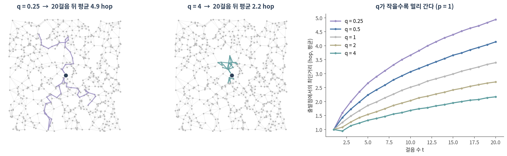
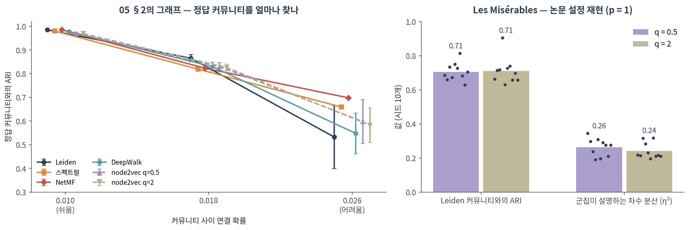

::: {.callout-note collapse="true"}
## 🎯 학습 목표

이 챕터를 마치면 다음을 할 수 있습니다.

-   노드 임베딩을 encoder–decoder로 설명하고, ⚠️ **유사도를 무엇으로 정의하느냐**가 결과를 정한다는 것을 말할 수 있다
-   DeepWalk·node2vec의 절차(랜덤워크 → word2vec)를 설명하고, p·q가 걸음을 어떻게 바꾸는지 실측으로 말할 수 있다
-   랜덤워크 임베딩이 행렬 분해이며 🔗 05의 스펙트럴 방법과 같은 뿌리라는 것을 설명할 수 있다
-   ⚠️ 임베딩 좌표 하나하나에는 의미가 없고 **노드 사이의 관계만** 의미가 있다는 것을 숫자로 보일 수 있다
-   얕은 임베딩의 한계를 들고, **12**의 그래프 신경망이 왜 필요한지 말할 수 있다
:::

> 🤔 **생각해볼 질문**
>
> PPI 네트워크의 유전자 2만 개를 각각 128차원 벡터로 바꿨다는 논문이 있습니다. TP53 벡터의 12번째 숫자는 무엇을 뜻할까요?

------------------------------------------------------------------------

## 1. 노드를 벡터로 🪢 {#c11-s1}

### 1) 왜 벡터인가 {#c11-s1-1}

-   08·09의 모델은 **벡터**를 입력으로 받습니다. 그래프 위의 노드를 분류하거나 군집하려면 노드마다 벡터가 필요합니다
-   Part 1에서는 그 벡터를 **사람이 골랐습니다** — 차수, 뭉침 계수, 중심성 (🔗 [03 §3](03_metrics.qmd#c03-s3))
-   **노드 임베딩**은 그 특징을 **학습**합니다. 08에서 은닉층이 상호작용 특징을 스스로 만든 것과 같은 발상입니다

### 2) encoder–decoder 틀 {#c11-s1-2}

> **encoder**: 노드 v → 벡터 z_v   **decoder**: z_u · z_v ≈ **유사도(u, v)**

-   **encoder** — 가장 단순한 형태는 표 조회입니다. 노드 수 × d 크기의 행렬 Z에서 v번째 행을 꺼냅니다 ("얕은 임베딩")
-   **decoder** — 두 벡터의 내적이 두 노드의 유사도를 재현하도록 Z를 학습합니다 (Hamilton et al. 2017)
-   ⚠️ 그러므로 **"유사도"를 어떻게 정의하느냐가 전부**입니다

| 유사도의 정의 | 뜻 | 대표 방법 |
|--------------------------|--------------------------------|------------------------|
| 엣지가 있다 | 바로 이웃이면 비슷하다 | 라플라시안 고유맵 (🔗 [05 §4](05_community.qmd#c05-s4)) |
| 짧은 랜덤워크에서 함께 나타난다 | 몇 걸음 안에 자주 만나면 비슷하다 | DeepWalk, node2vec |
| 연결 구조의 모양이 같다 | 멀리 있어도 같은 역할이면 비슷하다 | struc2vec (Ribeiro et al. 2017) |

-   💡 01에서 "엣지는 선택이었다"고 했습니다. 임베딩에서는 **"비슷하다"의 정의**가 그 선택입니다

------------------------------------------------------------------------

## 2. DeepWalk와 node2vec 🚶 {#c11-s2}

### 1) 랜덤워크를 문장으로 {#c11-s2-1}

-   **word2vec** — 문장 안에서 가까이 나오는 단어는 비슷한 벡터를 갖게 학습합니다 (Mikolov et al. 2013). 은닉층 하나짜리 얕은 신경망입니다
-   **DeepWalk**(Perozzi et al. 2014)의 발상: 노드에서 출발한 **랜덤워크를 문장**으로, **노드를 단어**로 보자

1.  노드마다 랜덤워크를 r번, 길이 l로 걷는다 (이 챕터: 10번 × 40걸음)
2.  걸음 안에서 창 k 이내에 함께 나온 노드 쌍 = "비슷한 쌍". 무작위로 뽑은 노드 = "비슷하지 않은 쌍" (negative sampling)
3.  비슷한 쌍의 내적은 크게, 무작위 쌍의 내적은 작게 되도록 Z를 경사하강으로 학습 (skip-gram)

-   🔗 [06 §2](06_propagation.qmd#c06-s2)의 RWR과 같은 랜덤워크입니다. RWR은 걸음의 **도착 확률**을 점수로 썼고, DeepWalk는 걸음에서 **함께 나타나는 빈도**를 벡터로 압축합니다

### 2) node2vec — 걸음에 성향을 준다 {#c11-s2-2}

{fig-align="center"}

방금 t에서 v로 왔을 때, 다음 노드 x로 갈 가중치 (Grover & Leskovec 2016):

| x는 | 가중치 | 파라미터의 뜻 |
|--------------------|:--------:|-----------------------------------------|
| 방금 떠나온 t | 1/p | **p (return)** — 작으면 왔던 곳으로 자주 돌아감 |
| t의 이웃 | 1 | — |
| t에서 더 먼 노드 | 1/q | **q (in-out)** — 작으면 바깥으로 뻗어 나감(DFS 성향), 크면 근처를 맴돎(BFS 성향) |

-   p = q = 1이면 DeepWalk의 균일한 랜덤워크입니다
-   **실측 (그림 오른쪽)** — 20걸음 뒤 출발점과의 평균 거리: q = 0.25에서 **4.94 hop**, q = 1에서 3.40, q = 4에서 **2.17**
-   → q는 임베딩이 "얼마나 넓은 이웃"을 비슷하다고 볼지를 정하는 손잡이입니다

### 3) ⚠️ p, q의 교과서적 해석은 재현되지 않았다 {#c11-s2-3}

-   node2vec 논문은 Les Misérables 등장인물 그래프에서 **q = 0.5는 커뮤니티**를, **q = 2는 구조적 역할**을 잡는다고 보였습니다 (d = 16, k-means)
-   논문에 적힌 설정(d = 16, 노드마다 걸음 10 × 80, 창 10, 1 epoch, p = 1)으로 k-means 6개 군집을 만들어 시드 10개로 재봤습니다

| | q = 0.5 | q = 2 | 기대했던 방향 |
|----------------------------------|:---------:|:---------:|--------------------|
| Leiden 커뮤니티와의 ARI | 0.705 ± 0.053 | 0.711 ± 0.077 | q = 2에서 낮아져야 |
| 군집이 설명하는 차수 분산 (η², 역할의 대리 지표) | 0.263 ± 0.052 | 0.241 ± 0.046 | q = 2에서 높아져야 |

{fig-align="center"}

-   ⚠️ 두 설정의 군집은 **거의 같았습니다.** q = 2가 역할을 더 잡는다는 해석은 이 측정에서는 보이지 않았습니다
-   후속 연구도 기존 노드 임베딩 방법들이 강한 의미의 구조적 역할을 잡지 못한다고 보고했습니다 (Ribeiro et al. 2017). 랜덤워크는 가까운 노드끼리만 함께 나타나므로, 멀리 떨어진 같은 역할의 노드를 가깝게 두기 어렵습니다
-   ✅ "이 q는 역할을 잡는다"는 문장을 쓰려면 **자기 데이터에서 재보세요.** p, q는 🔗 [05 §3](05_community.qmd#c05-s3)의 resolution, 🔗 [06 §2](06_propagation.qmd#c06-s2)의 α와 같은 종류의 손잡이입니다

------------------------------------------------------------------------

## 3. 임베딩은 행렬 분해다 🧮 {#c11-s3}

### 1) 같은 뿌리 {#c11-s3-1}

-   Qiu et al.(2018)은 DeepWalk·LINE·node2vec이 **특정 행렬을 암묵적으로 분해**하고 있음을 보였습니다. DeepWalk(창 T, 음성 샘플 b)의 경우:

$$
\log\!\left(\frac{\operatorname{vol}(G)}{bT}\left(\sum_{r=1}^{T} (D^{-1}A)^r\right) D^{-1}\right)
$$

-   D⁻¹A는 🔗 [06 §2](06_propagation.qmd#c06-s2)의 한 걸음 이동 행렬입니다. 1\~T걸음 이동 확률을 더해 로그를 씌운 행렬 = "창 T 안에서 함께 나타날 확률"
-   그러니 랜덤워크를 걷고 신경망을 학습하는 대신, **이 행렬을 직접 만들어 SVD**해도 됩니다 (NetMF)
-   T = 1(바로 이웃만)이면 차수로 정규화한 인접 행렬이 남습니다. 🔗 [05 §4](05_community.qmd#c05-s4)의 정규화 라플라시안과 같은 재료이고, 그 고유벡터로 만든 임베딩이 라플라시안 고유맵입니다 (Belkin & Niyogi 2003)
-   💡 즉 스펙트럴 클러스터링 → 라플라시안 고유맵 → DeepWalk → node2vec은 **"몇 걸음까지를 이웃으로 볼 것인가"만 다른** 한 가족입니다

### 2) 실측 — 05의 그래프에서 {#c11-s3-2}

위 그림 왼쪽. 커뮤니티 사이 연결 확률에 따른 **정답 커뮤니티와의 ARI**:

| 방법 | 무엇을 하나 | 0.010 (쉬움) | 0.018 | 0.026 (어려움) |
|----------------------|------------------------|:------:|:------:|:------:|
| Leiden (🔗 05 §2) | 모듈성 최적화 | 0.985 | **0.865** | 0.532 ± 0.133 |
| 스펙트럴 (🔗 05 §4) | 라플라시안 고유벡터 6개 | 0.980 | 0.819 | 0.659 |
| NetMF | 위 행렬(T = 5)을 SVD | **0.985** | 0.823 | **0.698** |
| DeepWalk | 랜덤워크 + word2vec | 0.978 | 0.830 | 0.548 ± 0.086 |
| node2vec q = 0.5 | 바깥으로 뻗는 걸음 | 0.970 | 0.831 | 0.598 ± 0.093 |
| node2vec q = 2 | 근처를 맴도는 걸음 | 0.969 | 0.826 | 0.582 ± 0.074 |

-   구조가 뚜렷하거나 중간일 때는 **여섯 방법이 거의 같습니다** (0.018에서 0.82–0.87)
-   💡 랜덤워크 + 신경망이 새로운 정보를 만든 것이 아닙니다. **같은 그래프 구조를 다른 방식으로 분해**한 것입니다
-   ⚠️ 가장 어려운 조건의 차이는 조심해서 읽어야 합니다. 임베딩 + k-means에는 **정답 개수(6)를 알려줬고**, Leiden은 개수를 스스로 정했습니다 (시드 5개 중 한 번은 8개). 비교 조건이 같지 않습니다 (🔗 [09 §3](09_training.qmd#c09-s3))

### 3) ⚠️ 좌표에는 의미가 없다 {#c11-s3-3}

같은 그래프(연결 확률 0.018)에 **시드만 바꿔** DeepWalk를 두 번 돌렸습니다.

| 두 임베딩 비교 | 값 |
|----------------------------------------|:------:|
| 같은 번호 좌표끼리의 상관 (32개 좌표의 \|r\| 평균) | **0.14** |
| 모든 노드 쌍의 코사인 유사도끼리의 상관 | **0.83** |
| k-means 군집끼리의 ARI | 0.92 |

-   decoder는 **내적(각도)**만 봅니다. 공간 전체를 돌려도 내적은 같으므로, 시드가 바뀌면 좌표계가 통째로 돌아갑니다
-   → 🤔 질문의 답: **TP53 벡터의 12번째 숫자에는 의미가 없습니다.** 의미가 있는 것은 "TP53과 가까운 유전자는 누구인가"입니다
-   ⚠️ 그러므로 서로 다르게 학습한 두 임베딩(다른 조직, 다른 시점의 네트워크)의 좌표를 직접 비교하면 안 됩니다
-   ✅ 보고할 것은 좌표가 아니라 **관계**(최근접 이웃, 군집, 유사도)이고, 그것도 시드를 바꿔 유지되는지 확인합니다

::: {.callout-tip collapse="true"}
## 🐍 실습 — karate club에서 node2vec 직접 짜고 05와 비교하기

Colab에서 실행합니다. `!pip install -q gensim python-igraph leidenalg` 먼저 ([90. Colab 환경 설정](90_colab_setup.qmd)). 몇 초면 끝납니다.

```python
import numpy as np, networkx as nx
import igraph as ig, leidenalg as la
from gensim.models import Word2Vec
from sklearn.cluster import KMeans
from sklearn.metrics import adjusted_rand_score as ari

G = nx.karate_club_graph()
club = np.array([G.nodes[v]["club"] == "Officer" for v in G], dtype=int)  # 실제로 갈라진 두 모임

# ── 1. node2vec 랜덤워크: 직전 노드로 1/p, 직전 노드의 이웃으로 1, 더 먼 곳으로 1/q ──
def walks(G, p=1.0, q=1.0, n_walks=10, length=40, seed=0):
    rng = np.random.default_rng(seed)
    out = []
    for _ in range(n_walks):
        for s in rng.permutation(list(G)):
            w = [s]
            while len(w) < length:
                nb = list(G.neighbors(w[-1]))
                if len(w) == 1:
                    w.append(nb[rng.integers(len(nb))]); continue
                prev = w[-2]
                wt = np.array([1 / p if x == prev else 1.0 if G.has_edge(x, prev) else 1 / q
                               for x in nb])
                w.append(nb[rng.choice(len(nb), p=wt / wt.sum())])
            out.append([str(x) for x in w])          # word2vec은 "단어"를 받으므로 문자열로
    return out

def node2vec(G, p=1.0, q=1.0, dim=16, seed=0):
    m = Word2Vec(walks(G, p, q, seed=seed), vector_size=dim, window=5, min_count=0,
                 sg=1, negative=5, epochs=5, workers=1, seed=seed)  # workers=1이어야 재현됨
    return np.array([m.wv[str(v)] for v in G])

def kmeans(Z, k):
    Z = Z / np.linalg.norm(Z, axis=1, keepdims=True)
    return KMeans(k, n_init=10, random_state=0).fit_predict(Z)

# ── 2. 05의 방법들과 비교: 실제 두 모임을 얼마나 맞히나 ─────────────────
L = nx.normalized_laplacian_matrix(G).toarray()
fiedler = (np.linalg.eigh(L)[1][:, 1] > 0).astype(int)                 # 05 §4
leiden = np.array(la.find_partition(ig.Graph.from_networkx(G),
                  la.RBConfigurationVertexPartition, resolution_parameter=1.0,
                  seed=0).membership)                                  # 05 §2
print(f"피들러 벡터 부호     ARI {ari(club, fiedler):.3f}")
print(f"Leiden ({leiden.max() + 1}개 커뮤니티)  ARI {ari(club, leiden):.3f}")
for p, q in [(1, 1), (1, 0.5), (1, 2)]:
    Z = node2vec(G, p, q)
    print(f"node2vec p={p} q={q:<3}  두 모임 ARI {ari(club, kmeans(Z, 2)):.3f}   "
          f"Leiden과의 ARI {ari(leiden, kmeans(Z, leiden.max() + 1)):.3f}")

# ── 3. ⚠️ 시드만 바꾸면: 좌표는 달라지고 관계는 남는다 ─────────────────
Za, Zb = node2vec(G, seed=0), node2vec(G, seed=1)
unit = lambda Z: Z / np.linalg.norm(Z, axis=1, keepdims=True)
iu = np.triu_indices(len(Za), 1)
coord_r = np.mean([abs(np.corrcoef(Za[:, j], Zb[:, j])[0, 1]) for j in range(Za.shape[1])])
sim_r = np.corrcoef((unit(Za) @ unit(Za).T)[iu], (unit(Zb) @ unit(Zb).T)[iu])[0, 1]
print(f"같은 번호 좌표끼리 |상관| 평균 {coord_r:.3f}   노드 쌍 유사도끼리 상관 {sim_r:.3f}")
```

**확인할 것:**

-   피들러 벡터 부호(05 §4) ARI 0.882, Leiden 4개 커뮤니티 ARI 0.465 — Leiden은 두 모임을 더 잘게 나눴기 때문에 낮게 나옵니다
-   node2vec p = 1, q = 1과 q = 2는 두 모임 ARI 0.882로 피들러 벡터와 같고, q = 0.5는 0.772
-   Leiden과의 ARI는 q = 2에서 0.923, q = 1에서 0.558 — 같은 그래프라도 q에 따라 "비슷함"의 범위가 바뀝니다. 시드를 바꿔 이 차이가 유지되는지 확인해보세요
-   마지막 줄: 같은 번호 좌표끼리 \|상관\| 0.581, 노드 쌍 유사도끼리 상관 0.962 — 관계는 남고 좌표는 흔들립니다
-   `workers=1`을 지우고 두 번 돌려보세요. 숫자가 실행마다 조금씩 달라집니다 — gensim word2vec은 여러 스레드로 돌면 시드를 고정해도 재현되지 않습니다
:::

------------------------------------------------------------------------

## 4. 얕은 임베딩의 한계 → GNN 🚧 {#c11-s4}

### 1) 한계 네 가지 {#c11-s4-1}

-   ⚠️ **transductive** — 학습 때 본 노드에만 벡터가 있습니다. 새 유전자, 새 환자를 넣으려면 **처음부터 다시** 학습해야 하고, 그러면 §3-3처럼 좌표계가 바뀝니다
-   ⚠️ **노드 특징을 못 씁니다** — 발현량, 서열, GO 주석이 있어도 임베딩은 연결 구조만 봅니다
-   ⚠️ **파라미터가 노드 수에 비례합니다** — 노드마다 자기 벡터를 따로 가집니다. 유전자 2만 개 × 128차원 = **256만 개**. 노드끼리 아무것도 공유하지 않습니다 (🔗 [10 §1](10_architectures.qmd#c10-s1-2)의 가중치 공유와 반대)
-   ⚠️ **그래프마다 재학습** — 조직별 네트워크 10개면 임베딩 10개, 서로 비교할 좌표계가 없습니다

### 2) 다음 챕터로 {#c11-s4-2}

| | 얕은 임베딩 (이 챕터) | 그래프 신경망 (**12**) |
|--------------------|------------------------|--------------------------------|
| encoder | 표 조회 — 노드마다 벡터 | **이웃 정보를 모으는 함수** — 모든 노드가 같은 가중치를 공유 |
| 노드 특징 | 못 씀 | 입력으로 씀 |
| 새 노드 | 다시 학습 | 이웃만 있으면 바로 계산 (**inductive**) |
| 파라미터 | 노드 수 × d | 노드 수와 무관 |

-   💡 생물의학 네트워크 벤치마크에서도 그래프 임베딩은 생물학적 특징 없이 기존 방법과 **비슷한** 성능을 냈고, 생물학적 특징을 **보완하는** 표현으로 쓸 수 있다고 정리됐습니다 (Yue et al. 2020) — "더 낫다"가 아니라 "보완한다"입니다
-   → **12**에서는 encoder를 "이웃의 벡터를 모아 변환하는 함수"로 바꿉니다. 🔗 [06 §1](06_propagation.qmd#c06-s1-2)의 "이웃에게서 받아 나를 갱신한다"에 학습을 붙인 것입니다

------------------------------------------------------------------------

## 📝 요약

-   노드 임베딩 = encoder(노드 → 벡터) + decoder(내적 ≈ 유사도). ⚠️ **유사도의 정의**가 결과를 정합니다
-   DeepWalk는 랜덤워크를 문장, 노드를 단어로 보고 word2vec을 학습합니다
-   node2vec의 q는 걸음의 반경을 바꿉니다 — 20걸음 뒤 평균 4.94 hop(q = 0.25) vs 2.17 hop(q = 4)
-   ⚠️ "q > 1이면 구조적 역할"이라는 해석은 논문 설정으로 재현해도 보이지 않았습니다 (q = 0.5와 2의 군집이 거의 같음)
-   랜덤워크 임베딩은 행렬 분해이고(NetMF), 05의 스펙트럴 방법과 같은 가족입니다. 05의 그래프에서 여섯 방법의 ARI는 중간 난이도에서 0.82–0.87로 비슷했습니다
-   ⚠️ 방법을 비교할 때는 조건을 맞춥니다 — k-means에 정답 개수를 알려주면 Leiden과 공정한 비교가 아닙니다
-   ⚠️ 좌표에는 의미가 없습니다. 시드만 바꿔도 좌표끼리 상관 0.14, 노드 쌍 유사도는 0.83 유지
-   한계: transductive, 노드 특징 못 씀, 파라미터가 노드 수에 비례, 그래프마다 재학습 → **12**의 GNN

------------------------------------------------------------------------

## ➕ 더 읽을거리

### 노드 임베딩

Perozzi B, Al-Rfou R, Skiena S. [*DeepWalk: online learning of social representations.*](https://doi.org/10.1145/2623330.2623732) KDD. 2014.\
Grover A, Leskovec J. [*node2vec: scalable feature learning for networks.*](https://doi.org/10.1145/2939672.2939754) KDD. 2016.\
Tang J, et al. [*LINE: large-scale information network embedding.*](https://doi.org/10.1145/2736277.2741093) WWW. 2015.\
Ribeiro LFR, Saverese PHP, Figueiredo DR. [*struc2vec: learning node representations from structural identity.*](https://doi.org/10.1145/3097983.3098061) KDD. 2017.\
Mikolov T, et al. [*Efficient estimation of word representations in vector space.*](https://arxiv.org/abs/1301.3781) ICLR Workshop. 2013. (word2vec)

### 행렬 분해와 스펙트럴 방법

Qiu J, et al. [*Network embedding as matrix factorization: unifying DeepWalk, LINE, PTE, and node2vec.*](https://doi.org/10.1145/3159652.3159706) WSDM. 2018.\
Belkin M, Niyogi P. [*Laplacian eigenmaps for dimensionality reduction and data representation.*](https://doi.org/10.1162/089976603321780317) Neural Comput. 2003.

### 정리와 생물의학 응용

Hamilton WL, Ying R, Leskovec J. [*Representation learning on graphs: methods and applications.*](https://arxiv.org/abs/1709.05584) IEEE Data Eng Bull. 2017.\
Hamilton WL. [*Graph Representation Learning.*](https://doi.org/10.1007/978-3-031-01588-5) Springer (Synthesis Lectures on AI and ML); 2020.\
Yue X, et al. [*Graph embedding on biomedical networks: methods, applications and evaluations.*](https://doi.org/10.1093/bioinformatics/btz718) Bioinformatics. 2020.

### 도구

Řehůřek R, Sojka P. [*Software framework for topic modelling with large corpora.*](https://is.muni.cz/publication/884893/en) LREC Workshop. 2010. (gensim) · [`gensim.models.Word2Vec`](https://radimrehurek.com/gensim/models/word2vec.html)
