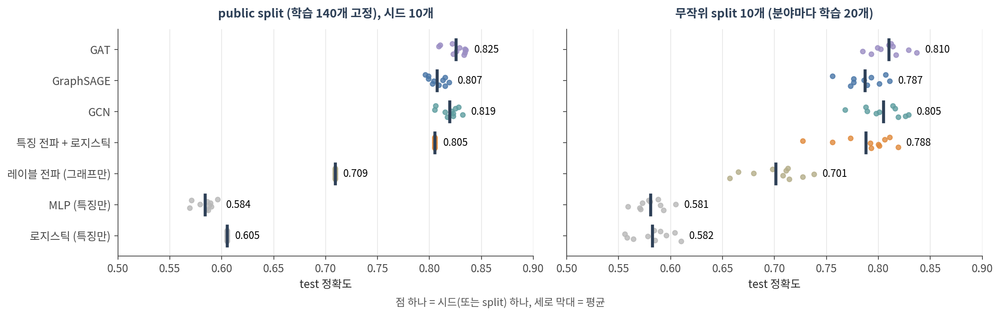
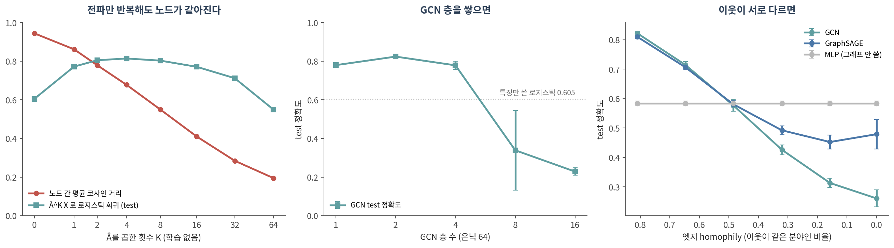

::: {.callout-note collapse="true"}
## 🎯 학습 목표

이 챕터를 마치면 다음을 할 수 있습니다.

-   메시지 전달을 aggregate + update로 설명하고, 🔗 06의 RWR과 무엇이 같고 무엇이 다른지 말할 수 있다
-   CNN을 그래프에 그대로 쓸 수 없는 이유를 말할 수 있다
-   GCN·GraphSAGE·GAT·GIN이 이웃을 모으는 방식의 차이를 표로 비교할 수 있다
-   ⚠️ GNN을 **특징만 쓴 모델, 그래프만 쓴 모델**과 같은 split에서 비교할 수 있다
-   ⚠️ 과평활화·과압축·heterophily가 무엇이고 언제 그래프가 오히려 해가 되는지 실측으로 말할 수 있다
-   1-WL 검정으로 GNN이 구별하지 못하는 그래프가 있다는 것을 보일 수 있다
:::

> 🤔 **생각해볼 질문**
>
> PPI 네트워크 위의 GNN으로 질병 유전자를 예측했더니 성능이 아주 좋았습니다. 그 성능 중 얼마가 "그래프" 덕분이고, 얼마가 "신경망" 덕분일까요?

------------------------------------------------------------------------

## 1. 메시지 전달 📨 {#c12-s1}

### 1) 왜 CNN을 그래프에 그대로 못 쓰나 {#c12-s1-1}

-   🔗 [10 §1](10_architectures.qmd#c10-s1-2)의 CNN 필터는 **격자**를 가정합니다. 모든 위치에 왼쪽·오른쪽 이웃이 정해진 수만큼 있고, 순서가 있습니다
-   그래프에는 둘 다 없습니다
    -   **이웃 수가 노드마다 다릅니다** — 차수 1인 노드와 수백인 허브가 공존합니다 (🔗 [03 §1](03_metrics.qmd#c03-s1))
    -   **이웃에 순서가 없습니다** — "첫 번째 이웃"이라는 것이 없으니 필터의 칸에 대응시킬 수 없습니다
-   인접 행렬을 통째로 MLP에 넣으면? 노드 번호를 바꾸기만 해도 출력이 바뀌고, 노드가 하나 늘면 입력 크기가 바뀝니다
-   ✅ 해법: 이웃을 **순서와 무관한 함수**(합, 평균, 최댓값)로 모읍니다. 이웃이 몇 개든, 어떤 순서든 결과가 같습니다

### 2) aggregate + update {#c12-s1-2}

한 층에서 노드 v의 표현 h_v는:

$$
h_v^{(k+1)} = \text{UPDATE}\Big(h_v^{(k)},\; \text{AGGREGATE}\big(\{h_u^{(k)} : u \in N(v)\}\big)\Big)
$$

-   **aggregate** — 이웃들의 현재 표현을 모읍니다 (평균, 합, 어텐션 가중 평균)
-   **update** — 모은 것과 내 표현을 합쳐 학습되는 행렬 W를 곱하고 활성함수를 씌웁니다
-   층 하나 = 한 걸음. **k층을 쌓으면 k-hop 이웃까지** 봅니다
-   W는 **모든 노드가 공유**합니다 — 10의 가중치 공유를 그래프에 옮긴 것. 그래서 파라미터 수가 노드 수와 무관하고, 새 노드에도 바로 적용됩니다 (🔗 [11 §4](11_node_embedding.qmd#c11-s4)의 한계 해결)
-   이 틀을 메시지 전달(message passing)이라 부릅니다 (Gilmer et al. 2017)

### 3) RWR에 학습을 끼우면 {#c12-s1-3}

🔗 [06 §2](06_propagation.qmd#c06-s2)의 RWR과 GCN 층을 나란히 놓으면:

| | 한 번의 갱신 | 학습되는 것 |
|--------------------------|-------------------------------|----------------------|
| RWR / 레이블 전파 (06) | p ← α·Â p + (1 − α)·p₀ | 없음 (α만 고름) |
| 특징 전파 + 로지스틱 (SGC) | Â^K X 를 만든 뒤 로지스틱 회귀 | 마지막 W 하나 |
| **GCN** | H ← σ(Â H W) | 층마다 W |

-   **Â** = 자기 루프를 더하고 차수로 정규화한 인접 행렬. 곱하면 "나와 이웃의 평균"이 됩니다 — RWR의 한 걸음과 같은 연산입니다
-   GCN은 여기에 **W(특징 변환)와 σ(비선형)**를 끼웠습니다 (Kipf & Welling 2017)
-   🔗 [08 §1](08_nn_basics.qmd#c08-s1-2)의 교훈대로 σ를 빼면 층들이 접혀 Â^K X W 하나가 됩니다. 실제로 비선형을 모두 빼고 가중치를 하나로 접은 SGC는 여러 과제에서 정확도가 떨어지지 않았습니다 (Wu et al. 2019)
-   반대 방향으로, GCN과 PageRank의 관계를 이용해 **개인화 PageRank(= RWR)로 전파**하는 모델도 있습니다 (APPNP; Gasteiger et al. 2019)
-   💡 🔗 [06 §1](06_propagation.qmd#c06-s1-2)에서 "이웃에게서 받아 나를 갱신하고 반복한다"가 relational classification·belief propagation의 공통 뼈대라고 했습니다. GNN은 그 뼈대에 **학습되는 W**를 붙인 것입니다

------------------------------------------------------------------------

## 2. GCN · GraphSAGE · GAT 🧩 {#c12-s2}

### 1) 이웃을 모으는 네 가지 방식 {#c12-s2-1}

| 모델 | 이웃을 어떻게 모으나 | 나 자신은 | 특징 | 원 논문 |
|------------|------------------------------|--------------------|------------------------|--------------------|
| **GCN** | 차수로 정규화한 평균 | 자기 루프로 이웃과 함께 섞음 | 스펙트럴 그래프 합성곱의 1차 근사에서 출발, 계산량이 엣지 수에 비례 | Kipf & Welling 2017 |
| **GraphSAGE** | 이웃(표본)의 평균·최댓값 등 | 내 표현을 **따로** 변환해 합침 | 노드별 벡터 대신 **함수**를 배움 → 처음 보는 노드에도 적용 | Hamilton et al. 2017 |
| **GAT** | 어텐션 가중 평균 — 이웃마다 다른 가중치 (🔗 [10 §3](10_architectures.qmd#c10-s3)) | 자기 루프 | 가중치를 입력에서 계산 | Veličković et al. 2018 |
| **GIN** | **합** + MLP | (1 + ε)배로 더함 | §3-4의 WL 검정만큼 구별 가능 | Xu et al. 2019 |

-   💡 차이는 **aggregate를 어떻게 하느냐** 하나입니다. 모두 §1-2의 틀 안에 있습니다
-   ⚠️ 이름보다 **나 자신을 이웃과 섞느냐, 따로 두느냐**가 중요할 때가 있습니다 → §3-3

### 2) 실측 — Cora {#c12-s2-2}

{fig-align="center"}

| 모델 | 무엇을 쓰나 | public split (시드 10개) | 무작위 split 10개 |
|------------------------|--------------------|:----------------:|:----------------:|
| 로지스틱 회귀 | 노드 특징만 | 0.605 | 0.582 ± 0.019 |
| MLP | 노드 특징만 | 0.584 ± 0.009 | 0.581 ± 0.013 |
| 레이블 전파 (06의 RWR) | 그래프만 | 0.709 | 0.701 ± 0.026 |
| 특징 전파 + 로지스틱 (SGC) | 둘 다, 학습되는 W 하나 | 0.805 | 0.788 ± 0.028 |
| **GCN** | 둘 다 | 0.819 ± 0.009 | 0.805 ± 0.019 |
| GraphSAGE | 둘 다 | 0.807 ± 0.008 | 0.787 ± 0.017 |
| **GAT** | 둘 다 | **0.825** ± 0.010 | **0.810** ± 0.016 |

*(로지스틱 회귀·레이블 전파·SGC는 public split에서 결정적이라 한 번)*

-   ✅ **Cora에서는 그래프가 크게 도왔습니다.** 특징만 쓴 로지스틱 회귀 0.605 → GCN 0.819 (+0.21). 인용 엣지의 81%가 같은 분야끼리라서입니다 (엣지 homophily 0.81)
-   💡 **그 이득의 대부분은 전파 자체에서 왔습니다.** 비선형도 층별 W도 없는 SGC가 0.805로, 로지스틱 회귀에서 GCN까지 거리의 93%를 갔습니다. 특징 없이 그래프만 쓴 레이블 전파도 0.709
-   ⚠️ **GCN과 GAT의 차이는 split에 따라 달라졌습니다.** public split에서는 GAT가 10번 중 7번 앞서고 1번 같았지만(평균 +0.006), 무작위 split 10개에서는 1위가 GAT 5번, GCN 4번, SGC 1번이었습니다
-   public split 하나로 모델 순위를 매기면 결론이 뒤집힐 수 있고, 모든 모델을 공정하게 튜닝하면 더 단순한 GNN이 복잡한 모델을 이기기도 한다는 보고가 있습니다 (Shchur et al. 2018)
-   ✅ 09 §3의 규칙이 그대로 적용됩니다 — **특징만 쓴 모델, 그래프만 쓴 모델**을 같은 split에 놓고, split을 여러 번 바꿔 봅니다

::: {.callout-tip collapse="true"}
## 🐍 실습 — PyG 2.x로 Cora: 로지스틱 회귀 · MLP · GCN · GAT를 같은 split에서

Colab에서 실행합니다. `!pip install -q torch-geometric` 먼저 ([90. Colab 환경 설정](90_colab_setup.qmd)). CPU에서는 GAT 때문에 몇 분 걸립니다.

⚠️ **예전 PyG 1.x 노트북을 그대로 쓰지 마세요**

-   `torch-1.7.0+cu102` 같은 특정 버전용 wheel 주소로 `torch-scatter`, `torch-sparse`, `torch-cluster`를 따로 설치하던 셀은 지금의 Colab에서 맞지 않습니다
-   ✅ 이 실습은 `pip install torch-geometric` 하나로 돌아갑니다 (torch-scatter·torch-sparse 없이 확인)
-   미니배치 로더는 PyG 2.x에서 `torch_geometric.loader.DataLoader`입니다

```python
import numpy as np, torch, torch.nn as nn, torch.nn.functional as F
from torch_geometric.datasets import Planetoid
import torch_geometric.transforms as T
from torch_geometric.nn import GCNConv, GATConv, GINConv, global_add_pool
from torch_geometric.utils import homophily, to_undirected
from sklearn.linear_model import LogisticRegression

# ── 1. Cora: 논문 2,708편, 인용 엣지, 단어 특징 1,433개, 분야 7개 ─────────
data = Planetoid("data", "Cora", transform=T.NormalizeFeatures())[0]
print(data)
print("엣지 homophily:", round(homophily(data.edge_index, data.y), 3))   # 이웃끼리 같은 분야 비율
tr, va, te = data.train_mask, data.val_mask, data.test_mask          # 140 / 500 / 1,000

# ── 2. baseline: 그래프 없이 노드 특징만 ───────────────────────────────
X, y = data.x.numpy(), data.y.numpy()
logit = max((LogisticRegression(C=C, max_iter=5000).fit(X[tr], y[tr]) for C in (0.1, 1, 10, 100)),
            key=lambda m: m.score(X[va], y[va]))                     # C는 validation으로
print(f"로지스틱 회귀 (특징만)  test {logit.score(X[te], y[te]):.3f}")

# ── 3. 같은 뼈대의 세 모델: MLP / GCN / GAT ─────────────────────────────
class Net(nn.Module):
    def __init__(self, kind, i=1433, h=16, o=7):
        super().__init__()
        self.kind, self.p = kind, (0.6 if kind == "gat" else 0.5)
        if kind == "mlp":
            self.l1, self.l2 = nn.Linear(i, 64), nn.Linear(64, o)
        elif kind == "gcn":
            self.l1, self.l2 = GCNConv(i, h), GCNConv(h, o)
        else:   # GAT: 어텐션 head 8개 x 8차원
            self.l1 = GATConv(i, 8, heads=8, dropout=0.6)
            self.l2 = GATConv(64, o, heads=1, dropout=0.6)
    def forward(self, x, ei):
        layer = (lambda l, x: l(x)) if self.kind == "mlp" else (lambda l, x: l(x, ei))
        x = F.dropout(x, self.p, self.training)
        x = F.elu(layer(self.l1, x)) if self.kind == "gat" else F.relu(layer(self.l1, x))
        return layer(self.l2, F.dropout(x, self.p, self.training))

def run(kind, seed, epochs=200):
    torch.manual_seed(seed)
    model = Net(kind)
    opt = torch.optim.Adam(model.parameters(), lr=0.005 if kind == "gat" else 0.01,
                           weight_decay=5e-4)
    best = (0, 0)
    for epoch in range(epochs):
        model.train(); opt.zero_grad()
        out = model(data.x, data.edge_index)
        F.cross_entropy(out[tr], data.y[tr]).backward(); opt.step()
        model.eval()
        with torch.no_grad():
            pred = model(data.x, data.edge_index).argmax(1)
        v, t = [(pred[m] == data.y[m]).float().mean().item() for m in (va, te)]
        if v > best[0]:
            best = (v, t)                    # validation이 가장 좋을 때의 test만 기록
    return best[1]

for kind in ["mlp", "gcn", "gat"]:
    accs = [run(kind, s) for s in range(5)]
    print(f"{kind.upper():4s} test {np.mean(accs):.3f} ± {np.std(accs):.3f}")

# ── 4. ⚠️ 1-WL의 한계: 육각형 하나 vs 삼각형 두 개 ──────────────────────
hexagon = to_undirected(torch.tensor([[0, 1, 2, 3, 4, 5], [1, 2, 3, 4, 5, 0]]))
triangles = to_undirected(torch.tensor([[0, 1, 2, 3, 4, 5], [1, 2, 0, 4, 5, 3]]))
torch.manual_seed(0)
mlp = lambda i: nn.Sequential(nn.Linear(i, 16), nn.ReLU(), nn.Linear(16, 16))
gin1, gin2 = GINConv(mlp(1)), GINConv(mlp(16))           # 합으로 모으는 GNN (Xu et al. 2019)
batch = torch.zeros(6, dtype=torch.long)
for name, ei in [("육각형 1개  (삼각형 0개)", hexagon), ("삼각형 2개 (삼각형 2개)", triangles)]:
    h = gin2(F.relu(gin1(torch.ones(6, 1), ei)), ei)
    print(name, global_add_pool(h, batch)[0, :3].detach().numpy().round(4))
```

**확인할 것:**

-   `엣지 homophily: 0.81` — 인용 엣지의 81%가 같은 분야끼리입니다. GNN이 잘 될 조건입니다
-   로지스틱 회귀 0.605, MLP 0.584 ± 0.008, GCN 0.822 ± 0.006, GAT 0.830 ± 0.005 (시드 5개) — 위 표와 같은 순서입니다. GPU에서는 소수점 셋째 자리가 조금 다를 수 있습니다
-   마지막 두 줄: 육각형과 삼각형 두 개의 그래프 벡터가 **소수점 넷째 자리까지 같습니다** (`[-3.3077 -0.4282 -2.8304]`) → §3-4
-   `Planetoid(..., split="random")`으로 바꿔 보세요. GCN과 GAT의 차이가 유지되나요?
-   `data.edge_index`를 무작위로 섞은 그래프(`torch_geometric.utils.to_undirected(torch.randint(0, 2708, (2, 5278)))`)로 GCN을 돌려 보세요. 특징만 쓴 로지스틱 회귀보다 나은가요?
:::

------------------------------------------------------------------------

## 3. ⚠️ GNN이 잘 못하는 것 🚧 {#c12-s3}

{fig-align="center"}

### 1) 과평활화 (over-smoothing) {#c12-s3-1}

-   GCN의 한 층은 사실 **라플라시안 평활화**의 한 형태이고, 그래서 층을 많이 쌓으면 과평활화가 생길 수 있습니다 (Li et al. 2018)
-   평균을 계속 내면 결국 모두 같은 값이 됩니다. 🔗 [06 §2](06_propagation.qmd#c06-s2)에서 α를 1에 가깝게 하면 RWR 점수가 차수만 따라갔던 것과 같은 현상입니다

**실측 (그림 왼쪽)** — 학습 없이 Â만 반복해서 곱했을 때:

| K (곱한 횟수) | 0 | 1 | 2 | 4 | 8 | 16 | 32 | 64 |
|--------------------------|:----:|:----:|:----:|:----:|:----:|:----:|:----:|:----:|
| 노드 간 평균 코사인 거리 | 0.94 | 0.86 | 0.78 | 0.68 | 0.55 | 0.41 | 0.28 | **0.19** |
| 로지스틱 회귀 test 정확도 | 0.605 | 0.772 | 0.805 | **0.814** | 0.803 | 0.771 | 0.712 | **0.549** |

-   몇 걸음은 **도움**이 됩니다 (0.605 → 0.814, K = 4). 이웃의 특징이 섞이며 잡음이 줄어듭니다
-   ⚠️ 그 이상은 **해롭습니다.** 노드들이 서로 닮아가고(거리 0.94 → 0.19), K = 64에서는 특징만 쓴 모델보다도 나빠집니다

**GCN 층을 쌓으면 (그림 가운데, 시드 5개)**

| 층 수 | 1 | 2 | 4 | 8 | 16 |
|------------------|:----:|:----:|:----:|:----:|:----:|
| test 정확도 | 0.780 | **0.824** | 0.779 ± 0.021 | 0.339 ± 0.206 | 0.228 ± 0.019 |

-   2층이 가장 좋았고, 8층부터는 **특징만 쓴 로지스틱 회귀(0.605)보다도 못했습니다.** Kipf & Welling(2017)의 기본 구성도 2층입니다
-   ⚠️ 깊은 GCN이 무너진 데에는 과평활화와 함께 **학습 자체의 어려움**(🔗 [08 §2](08_nn_basics.qmd#c08-s2)의 기울기 소실 — 이 실험은 층을 건너뛰는 연결 없이 층마다 dropout)이 섞여 있습니다. 왼쪽 그림은 학습 없이도 평활화가 일어난다는 것을 따로 보여줍니다

### 2) 과압축 (over-squashing) {#c12-s3-2}

-   k층 GNN은 k-hop 이웃을 봅니다. 그런데 k-hop 이웃의 수는 k에 따라 **기하급수적으로** 늘고, 그 정보가 **고정된 크기의 벡터 하나**로 눌려 들어갑니다
-   그 결과 먼 노드에서 온 메시지가 제대로 전달되지 못해, **먼 거리 상호작용**에 달린 과제에서 성능이 나빠집니다 (Alon & Yahav 2021)
-   생물학 예로 옮기면: 신호 전달 경로의 상류와 하류가 여러 단계 떨어져 있을 때
-   해법의 한 방향이 모든 노드 쌍을 직접 잇는 어텐션 — **13**의 그래프 트랜스포머입니다

### 3) homophily가 깨질 때 {#c12-s3-3}

-   GNN은 🔗 [06 §1](06_propagation.qmd#c06-s1-1)의 **"이웃은 서로 비슷하다"** 가정 위에 서 있습니다. 이웃과 섞는 것이 도움이 되려면 이웃이 나와 같은 부류여야 합니다
-   이 가정이 깨진 그래프(heterophily)에서는 많은 GNN이 **그래프를 쓰지 않는 MLP보다 못했고**, 나와 이웃의 표현을 **따로 두는** 설계 등이 도움이 됐습니다 (Zhu et al. 2020)

**실측 (그림 오른쪽)** — Cora의 인용 엣지를 일정 비율씩 다른 분야 논문끼리의 무작위 엣지로 바꿨습니다 (엣지 수 유지, 시드 5개)

| 바꾼 엣지 비율 | 0 | 20% | 40% | 60% | 80% | 100% |
|----------------------|:----:|:----:|:----:|:----:|:----:|:----:|
| 엣지 homophily | 0.81 | 0.65 | 0.49 | 0.32 | 0.16 | 0.00 |
| GCN | **0.822** | 0.715 | 0.577 | 0.426 | 0.313 | 0.261 |
| GraphSAGE | 0.810 | 0.707 | 0.581 | 0.492 | 0.452 | 0.479 |
| MLP (그래프 안 씀) | 0.584 | 0.584 | 0.584 | **0.584** | **0.584** | **0.584** |

-   ⚠️ homophily가 0.49 근처로 내려오자 **GCN이 그래프를 쓰지 않는 MLP보다 못해졌습니다** (0.577 vs 0.584). 그 아래로는 그래프가 순수한 해입니다
-   나 자신을 이웃과 **따로** 변환하는 GraphSAGE는 덜 무너졌지만(homophily 0에서 0.479 vs GCN 0.261), 그래도 MLP보다 낮았습니다
-   이 실험은 다른 분야끼리 **무작위로** 이은 극단적인 조작입니다. 실제 heterophily 그래프에서는 "어떤 부류가 어떤 부류와 붙는지"에 규칙이 있어 결과가 다를 수 있습니다

-   ⚠️ 반대 방향의 경고도 있습니다. 널리 쓰이던 heterophily 벤치마크 두 개(Squirrel, Chameleon)에는 중복 노드가 많아 train–test 누수가 있었고, 새로 만든 heterophily 그래프에서는 **표준 GNN이 전용 모델보다 거의 언제나 나았습니다** (Platonov et al. 2023) — 벤치마크 자체도 검증 대상입니다
-   ⚠️ 그리고 GNN은 그래프를 **무시하는 편이 나을 때도 그래프를 쓰는** 경향이 있습니다 (Bechler-Speicher et al. 2024). 그래프가 도움이 되는지는 모델이 알려주지 않습니다 — **특징만 쓴 baseline**이 알려줍니다
-   ✅ GNN을 쓰기 전에 **자기 그래프의 homophily**를 먼저 재보세요. PyG의 `torch_geometric.utils.homophily` 한 줄입니다

### 4) WL 검정 — 구별할 수 없는 그래프 {#c12-s3-4}

-   **1-WL 검정**(Weisfeiler & Leman 1968): 모든 노드에 같은 색을 칠하고, "내 색 + 이웃 색들의 모음"으로 새 색을 정하기를 반복합니다. 두 그래프의 색 분포가 다르면 서로 다른 그래프입니다
-   메시지 전달의 aggregate + update는 **이 절차와 같은 모양**입니다. 그래서 메시지 전달 GNN은 1-WL이 구별하지 못하는 그래프를 구별할 수 없고, 합으로 모으는 GIN이 그 상한에 도달합니다 (Xu et al. 2019; Morris et al. 2019)
-   ⚠️ 예: **육각형 하나**와 **삼각형 두 개**. 둘 다 노드 6개, 모든 노드의 차수가 2입니다. 어떤 노드든 "차수 2인 이웃 둘"을 보므로 모든 노드가 끝까지 같은 색입니다
    -   §2 실습의 마지막 블록에서 GIN은 두 그래프에 **소수점 넷째 자리까지 같은 벡터**를 냅니다
    -   그런데 한쪽은 삼각형이 0개, 다른 쪽은 2개입니다. 🔗 [04 §3](04_random_null.qmd#c04-s3)의 모티프, 🔗 [03 §2](03_metrics.qmd#c03-s2)의 뭉침 계수를 이런 GNN은 **셀 수 없습니다**
-   이 한계를 넘으려는 시도가 고차 GNN(Morris et al. 2019), 위치·구조 인코딩을 넣은 그래프 트랜스포머(**13**)입니다

------------------------------------------------------------------------

## 📝 요약

-   메시지 전달 = 이웃을 순서와 무관하게 모으고(aggregate) 학습되는 W로 갱신(update). k층이면 k-hop까지 봅니다
-   GCN 층은 06의 RWR 한 걸음에 W와 비선형을 끼운 것입니다. W를 모든 노드가 공유하므로 새 노드에도 적용됩니다
-   GCN·GraphSAGE·GAT·GIN의 차이는 aggregate 방식 하나 — 평균, 나 자신을 따로, 어텐션, 합
-   Cora에서 그래프는 크게 도왔고(특징만 0.605 → GCN 0.819), 그 이득의 대부분은 **전파 자체**에서 왔습니다 (SGC 0.805)
-   ⚠️ GCN과 GAT의 순위는 split에 따라 바뀌었습니다. 특징만·그래프만 쓴 baseline과 여러 split이 필요합니다
-   ⚠️ 과평활화: 전파를 반복하면 노드가 같아집니다 (거리 0.94 → 0.19). GCN은 2층이 가장 좋았고 8층부터 무너졌습니다
-   과압축: 먼 이웃의 정보가 고정된 크기의 벡터로 눌려 먼 거리 상호작용을 놓칩니다
-   ⚠️ 이웃이 서로 다르면(homophily 0.49 이하) GCN은 그래프를 안 쓴 MLP보다 못했습니다. **자기 그래프의 homophily를 먼저 재세요**
-   ⚠️ 메시지 전달 GNN은 1-WL이 구별 못 하는 그래프를 구별하지 못합니다 — 육각형과 삼각형 두 개, 즉 삼각형 수를 셀 수 없습니다

------------------------------------------------------------------------

## ➕ 더 읽을거리

### 메시지 전달과 대표 모델

Gilmer J, et al. [*Neural message passing for quantum chemistry.*](https://proceedings.mlr.press/v70/gilmer17a.html) ICML. 2017.\
Kipf TN, Welling M. [*Semi-supervised classification with graph convolutional networks.*](https://arxiv.org/abs/1609.02907) ICLR. 2017. (GCN)\
Hamilton WL, Ying R, Leskovec J. [*Inductive representation learning on large graphs.*](https://proceedings.neurips.cc/paper/2017/hash/5dd9db5e033da9c6fb5ba83c7a7ebea9-Abstract.html) NeurIPS. 2017. (GraphSAGE)\
Veličković P, et al. [*Graph attention networks.*](https://arxiv.org/abs/1710.10903) ICLR. 2018. (GAT)\
Xu K, Hu W, Leskovec J, Jegelka S. [*How powerful are graph neural networks?*](https://arxiv.org/abs/1810.00826) ICLR. 2019. (GIN)\
Wu F, et al. [*Simplifying graph convolutional networks.*](https://proceedings.mlr.press/v97/wu19e.html) ICML. 2019. (SGC)\
Gasteiger J, Bojchevski A, Günnemann S. [*Predict then propagate: graph neural networks meet personalized PageRank.*](https://arxiv.org/abs/1810.05997) ICLR. 2019. (APPNP)

### 표현력과 한계

Weisfeiler B, Leman A. *A reduction of a graph to a canonical form and an algebra arising during this reduction.* Nauchno-Technicheskaya Informatsia. 1968. ([영어 번역](http://boris.weisfeiler.com/papers.html))\
Morris C, et al. [*Weisfeiler and Leman go neural: higher-order graph neural networks.*](https://doi.org/10.1609/aaai.v33i01.33014602) AAAI. 2019.\
Li Q, Han Z, Wu XM. [*Deeper insights into graph convolutional networks for semi-supervised learning.*](https://doi.org/10.1609/aaai.v32i1.11604) AAAI. 2018. (과평활화)\
Oono K, Suzuki T. [*Graph neural networks exponentially lose expressive power for node classification.*](https://openreview.net/forum?id=S1ldO2EFPr) ICLR. 2020.\
Alon U, Yahav E. [*On the bottleneck of graph neural networks and its practical implications.*](https://openreview.net/forum?id=i80OPhOCVH2) ICLR. 2021. (과압축)\
Zhu J, et al. [*Beyond homophily in graph neural networks: current limitations and effective designs.*](https://proceedings.neurips.cc/paper/2020/hash/58ae23d878a47004366189884c2f8440-Abstract.html) NeurIPS. 2020.\
Platonov O, et al. [*A critical look at the evaluation of GNNs under heterophily: are we really making progress?*](https://arxiv.org/abs/2302.11640) ICLR. 2023.\
Bechler-Speicher M, et al. [*Graph neural networks use graphs when they shouldn't.*](https://proceedings.mlr.press/v235/bechler-speicher24a.html) ICML. 2024.

### 평가

Shchur O, Mumme M, Bojchevski A, Günnemann S. [*Pitfalls of graph neural network evaluation.*](https://arxiv.org/abs/1811.05868) NeurIPS Workshop on Relational Representation Learning. 2018.

### 이 챕터의 데이터와 도구

Sen P, et al. [*Collective classification in network data.*](https://doi.org/10.1609/aimag.v29i3.2157) AI Magazine. 2008. (Cora)\
Yang Z, Cohen WW, Salakhutdinov R. [*Revisiting semi-supervised learning with graph embeddings.*](https://proceedings.mlr.press/v48/yanga16.html) ICML. 2016. (public split)\
Fey M, Lenssen JE. [*Fast graph representation learning with PyTorch Geometric.*](https://arxiv.org/abs/1903.02428) ICLR Workshop. 2019. · [PyG 문서](https://pytorch-geometric.readthedocs.io/)
