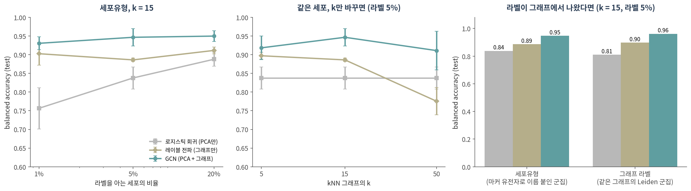

::: {.callout-note collapse="true"}
## 🎯 학습 목표

이 챕터를 마치면 다음을 할 수 있습니다.

-   분자·지식 그래프·공간 전사체·단일세포에서 **엣지가 어디서 왔는지** 구분할 수 있다
-   그래프 딥러닝의 최근 흐름(그래프 트랜스포머, 이종 그래프, 관계형 딥러닝, 지식 그래프 foundation model, LLM + 그래프, 생성 모델)을 한 문장씩 설명할 수 있다
-   ⚠️ GNN 논문의 성능 숫자를 읽기 전에 확인할 체크리스트를 쓸 수 있다
-   ⚠️ 그래프로 만든 라벨을 같은 그래프로 예측하는 **순환**을 알아볼 수 있다
-   강의 전체의 세 가지 주제를 자기 분석에 적용할 수 있다
:::

> 🤔 **생각해볼 질문**
>
> 리뷰어로서 "GNN으로 세포유형을 95% 정확도로 분류했다"는 원고를 받았습니다. 무엇부터 물어보시겠습니까?

------------------------------------------------------------------------

## 1. 생물학에서 그래프는 어디서 오나 🧬 {#c13-s1}

### 1) 네 가지 응용, 네 가지 엣지 {#c13-s1-1}

| 응용 | 노드 | 엣지는 어디서 왔나 | 예 |
|--------------|------------|------------------------------------|--------------------------------|
| **분자** | 원자 | 화학 결합 — 정의된 엣지 | 분자 그래프 합성곱 모델(Yang et al. 2019), 항생제 후보 halicin(Stokes et al. 2020) |
| **지식 그래프** | 약물·단백질·질병·표현형 | DB가 모은 관계 — 🔗 [07 §2](07_practice.qmd#c07-s2)의 연구 편향을 물려받음 | Decagon(Zitnik et al. 2018), TxGNN(Huang et al. 2024) |
| **공간 전사체** | spot 또는 세포 | 물리적 거리 — 반경 또는 k를 우리가 정함 | STAGATE(Dong & Zhang 2022), GraphST(Long et al. 2023) |
| **단일세포** | 세포 | 발현이 비슷한 세포끼리 — **k를 우리가 정함** (🔗 [01 §3](01_why_networks.qmd#c01-s3)) | scGNN(Wang et al. 2021) |

-   💡 위에서 아래로 갈수록 엣지가 **측정에서 멀어지고 선택에 가까워집니다.** 화학 결합은 정의이고, PPI는 측정 + 편향이며, 세포 kNN 그래프는 우리가 만든 것입니다 (주제 ①)
-   **분자** — Yang et al.(2019)의 그래프 합성곱 모델은 고정된 분자 기술자(descriptor)를 쓰는 모델과 같거나 나은 성능을 보고했습니다. Stokes et al.(2020)은 항균 활성을 예측하는 심층 신경망을 학습해 여러 화합물 라이브러리를 훑었고, Drug Repurposing Hub에서 기존 항생제와 구조가 다른 halicin을 찾았습니다
-   **지식 그래프** — Decagon은 단백질–단백질, 약물–표적, 그리고 부작용 종류마다 다른 엣지로 표현한 약물–약물 관계를 한 그래프에 넣고 GCN으로 병용 부작용을 예측했습니다. TxGNN은 의학 지식 그래프로 학습해 질병 17,080개에 대해 약물의 적응증·금기를 순위 매깁니다
-   **공간 전사체** — STAGATE는 그래프 어텐션 오토인코더로 이웃 spot 간 유사도를 적응적으로 배우고(🔗 [10 §3](10_architectures.qmd#c10-s3)), GraphST는 공간적으로 인접한 spot의 표현을 가깝게 만드는 대조 학습을 GNN과 결합합니다

### 2) ⚠️ 벤치마크는 뭐라고 하나 {#c13-s1-2}

-   **공간 전사체 군집화** — 공간·조직 정보를 더하면 일부 데이터에서는 정확도가 올랐지만, 발현만 쓴 군집화보다 **일관되게** 낫지는 않았습니다 (Cheng et al. 2023)
    -   다른 벤치마크에서는 모든 데이터에 가장 좋은 단일 방법이 없었고(Kang et al. 2025), 평균 순위 1위는 GNN이 아닌 베이지안 통계 방법이었습니다(Hu et al. 2024)
-   **단일세포 foundation model** — Geneformer와 scGPT를 추가 학습 없이(zero-shot) 평가하자, 일부 경우 더 단순한 방법에 뒤졌습니다 (Kedzierska et al. 2025)
-   **유전자 교란 효과 예측** — 딥러닝 모델 여러 개 중 어느 것도 단순한 선형 baseline을 넘지 못했습니다 (Ahlmann-Eltze et al. 2025)
-   ✅ 09 §3의 결론이 그대로입니다 — **누가 이길지는 재봐야 압니다.** 새 방법이 나쁘다는 뜻이 아니라, 비교 없이 믿을 수 없다는 뜻입니다

------------------------------------------------------------------------

## 2. 최근 흐름 🔭 {#c13-s2}

### 1) 무엇이 새로 나왔나 {#c13-s2-1}

Stanford CS224W(2025년 가을)의 후반부 강의 제목이 지금의 흐름을 잘 보여줍니다 — 그래프 트랜스포머, 이종 그래프, 지식 그래프, 관계형 딥러닝, 지식 그래프 foundation model, LLM + GNN, 에이전트 + 그래프, 그래프 생성 모델.

| 흐름 | 한 줄 요약 | 무엇을 풀려고 하나 | 대표 |
|-----------------|------------------------------------|----------------------------|--------------------|
| **그래프 트랜스포머** | 트랜스포머의 어텐션을 그래프로 — 그래프 구조는 **위치·구조 인코딩**으로 넣음 | 먼 노드 사이의 정보 전달, 메시지 전달의 표현력 한계 (🔗 [12 §3](12_gnn.qmd#c12-s3)) | Dwivedi & Bresson 2021; Ying et al. 2021; Rampášek et al. 2022 |
| **이종 그래프** | 노드·엣지 종류가 여럿 (약물–표적–질병) | 관계 종류마다 다른 의미 | R-GCN (Schlichtkrull et al. 2018) |
| **관계형 딥러닝** | 관계형 DB의 행 = 노드, 테이블 간 키 = 엣지인 시간·이종 그래프 | 테이블을 손으로 합치는 특징 공학 | Fey et al. 2024; RelBench (Robinson et al. 2024) |
| **KG foundation model** | 여러 지식 그래프로 한 번 학습, 처음 보는 그래프에 바로 적용 | 그래프마다 재학습 (🔗 [11 §4](11_node_embedding.qmd#c11-s4)) | ULTRA (Galkin et al. 2024) |
| **LLM + 그래프** | LLM이 예측기·인코더·정렬기로 그래프와 결합 | 텍스트가 붙은 그래프 | Jin et al. 2024 (정리) |

-   **그래프 트랜스포머의 위치 인코딩** — Dwivedi & Bresson(2021)은 어텐션을 이웃 연결에 맞추고, 라플라시안 고유벡터를 위치 인코딩으로 썼습니다. 🔗 [05 §4](05_community.qmd#c05-s4)의 피들러 벡터가 여기서 다시 나옵니다
-   Graphormer는 그래프의 구조 정보를 모델에 효과적으로 인코딩하는 것이 핵심이라고 했고(Ying et al. 2021), GraphGPS는 위치·구조 인코딩 + 국소 메시지 전달 + **전역 어텐션**의 세 재료를 조합하는 "레시피"로 정리했습니다 (Rampášek et al. 2022)
-   **ULTRA**는 57개 지식 그래프에서 링크 예측을 시험했고, 사전학습한 모델 하나의 zero-shot 성능이 그래프별로 학습한 강한 baseline과 비슷하거나 나은 경우가 많았다고 보고했습니다
-   **graph foundation model** — 대규모 그래프 데이터로 사전학습해 다양한 그래프 과제에 맞춰 쓰는 모델이라는 구상입니다 (Liu et al. 2025). 단일세포 쪽의 foundation model(§1-2)과 같은 기대와 같은 검증 과제를 안고 있습니다

### 2) 생성 모델 — 한 단락 {#c13-s2-2}

-   지금까지는 그래프가 **주어졌을 때** 예측했습니다. 생성 모델은 **그래프 자체를 만듭니다**
-   GraphRNN은 그래프 생성을 노드와 엣지를 차례로 만드는 순서열로 분해한 자기회귀 모델입니다 (You et al. 2018)
-   확산(diffusion) 모델은 노이즈를 조금씩 걷어내며 생성합니다. 범주형 노드·엣지를 다루는 DiGress(Vignac et al. 2023), 3차원 좌표와 원자 종류를 함께 다루며 회전·이동에 등변인 분자 생성 EDM(Hoogeboom et al. 2022), 구조 예측망 RoseTTAFold를 단백질 구조 노이즈 제거로 미세조정해 결합 단백질까지 설계한 RFdiffusion(Watson et al. 2023)
-   ⚠️ 생성 모델의 평가는 예측 모델보다 어렵습니다. "그럴듯한 분자"와 "실제로 합성되고 작동하는 분자" 사이에는 실험이 있습니다

------------------------------------------------------------------------

## 3. ⚠️ 논문 읽는 눈 🧐 {#c13-s3}

### 1) 체크리스트 {#c13-s3-1}

GNN 논문(또는 자기 원고)에서 성능 숫자를 보면, 결론을 읽기 전에 이것부터 확인합니다.

| 확인할 것 | 왜 | 강의에서 |
|--------------------------------------|------------------------------------------|--------------|
| ✅ **그래프 없는 baseline**이 있는가 (로지스틱 회귀, 랜덤 포레스트, MLP) | 그래프가 보탠 몫을 알려면 빼 봐야 합니다 | 🔗 [09 §3](09_training.qmd#c09-s3), 🔗 [12 §2](12_gnn.qmd#c12-s2) |
| ✅ **그래프만 쓴 baseline**이 있는가 (레이블 전파, RWR) | 학습이 보탠 몫을 알려면 | 🔗 [06 §2](06_propagation.qmd#c06-s2), 12 §2 |
| ✅ **그래프를 어떻게 만들었나** — k, 임계값, DB와 버전, 채널 | 엣지는 선택이었다. 바꾸면 결과가 바뀌는가 | 🔗 [01 §3](01_why_networks.qmd#c01-s3), 🔗 [07 §1](07_practice.qmd#c07-s1) |
| ✅ **n은 무엇인가** — 세포인가, 환자인가 | 환자 20명의 세포 2만 개는 n = 20 | 🔗 [09 §1](09_training.qmd#c09-s1-3) |
| ✅ **어떻게 나눴나** — 무작위 노드인가, 새 환자·새 질병인가 | 이웃이 train에 있으면 test는 쉬워집니다 | 09 §1, 12 §2 |
| ✅ **라벨은 어디서 왔나** | 그래프로 만든 라벨은 그래프가 잘 맞힙니다 | §3-2 |
| ✅ split·시드를 **여러 번** 바꿨나 | 한 split의 순위는 뒤집힙니다 | 12 §2 |
| ❌ "GNN을 썼다" | 방법의 이름은 성능의 근거가 아닙니다 | 🔗 [10 §4](10_architectures.qmd#c10-s4) |
| ❌ 임베딩·UMAP 그림 | 그림은 측정이 아닙니다 | 🔗 [10 §2](10_architectures.qmd#c10-s2-3) |

-   **baseline** — 구조를 쓰지 않는 baseline과 비교해 보니, 일부 그래프 분류 데이터에서는 GNN이 구조 정보를 아직 활용하지 못하고 있었습니다 (Errica et al. 2020)
-   **n** — 단일세포 차등발현에서 가장 널리 쓰이는 방법들은 생물학적 차이가 없는데도 수백 개의 차등발현 유전자를 찾아냈습니다 (Squair et al. 2021). 세포를 독립 표본으로 세는 문제는 🔗 [09 §1](09_training.qmd#c09-s1-3)의 pseudoreplication입니다
-   **누수** — 머신러닝을 도입한 17개 분야에서 누수가 발견됐고, 294편의 논문에 영향을 주었으며 일부는 지나치게 낙관적인 결론으로 이어졌습니다 (Kapoor & Narayanan 2023)
-   **split** — TxGNN이 스스로 "엄격한 zero-shot 평가"를 내세운 이유가 이것입니다. 무작위로 엣지를 가리면 같은 질병의 다른 약물이 train에 남아 있습니다

### 2) 실측 — "GNN으로 세포유형을 분류했다" {#c13-s3-2}

{fig-align="center"}

🤔 질문의 원고를 직접 만들어 봤습니다. PBMC 3k 세포의 kNN 그래프(k = 15) 위에서 세포유형 8개를 분류합니다.

| 라벨을 아는 세포 | 로지스틱 회귀 (PCA만) | 레이블 전파 (그래프만) | GCN (PCA + 그래프) |
|--------------------|:------------:|:------------:|:------------:|
| 1% (28개) | 0.757 ± 0.055 | 0.903 ± 0.031 | **0.931** ± 0.017 |
| 5% (133개) | 0.838 ± 0.030 | 0.886 ± 0.005 | **0.947** ± 0.023 |
| 20% (527개) | 0.888 ± 0.019 | 0.912 ± 0.009 | **0.950** ± 0.015 |

*(balanced accuracy)*

-   원고의 문장은 **사실**입니다. GCN은 라벨 5%로 0.947을 냈고, 그래프 없는 baseline과 학습 없는 baseline을 모두 이겼습니다
-   이제 §3-1의 체크리스트를 대 봅니다

**✅ 라벨은 어디서 왔나** — 이 데이터의 세포유형은 PCA 공간의 kNN 그래프(k = 10) 위 군집에 마커 유전자로 이름을 붙인 것입니다 (🔗 [10 §2](10_architectures.qmd#c10-s2-3)). 그래서 같은 그래프를 Leiden으로 나눈, **생물학적 이름이 없는** 군집 6개를 라벨로 줘 봤습니다 (그림 오른쪽, 라벨 5%).

| 라벨 | 로지스틱 회귀 | 레이블 전파 | GCN |
|--------------------------------|:------:|:------:|:------:|
| 세포유형 (마커로 이름 붙인 군집) | 0.838 | 0.886 | 0.947 |
| 그래프 라벨 (같은 그래프의 Leiden 군집) | 0.810 | 0.898 | **0.961** |

-   ⚠️ GCN은 **이름 없는 그래프 군집을 세포유형보다 더 잘** 맞혔습니다 (라벨 1%에서도 0.961)
-   그래프와 라벨이 같은 재료(PCA 공간의 이웃)에서 나왔으니, 높은 정확도는 "GCN이 세포 생물학을 배웠다"가 아니라 "그래프가 자기 군집을 다시 찾았다"일 수 있습니다
-   ✅ 그래프와 **독립적으로** 정한 라벨로 검증해야 이 순환을 벗어납니다

**✅ 그래프를 어떻게 만들었나** — 라벨 5%에서 k만 바꾸면 (그림 가운데):

| k | 5 | 15 | 50 |
|--------------------------|:------:|:------:|:------:|
| 세포유형 homophily | 0.926 | 0.902 | 0.856 |
| 레이블 전파 | 0.897 | 0.886 | **0.776** |
| GCN | 0.919 | **0.947** | 0.911 |

-   ⚠️ k 하나로 레이블 전파는 0.12, GCN은 0.04가 움직였습니다. k를 적지 않은 결과는 재현할 수 없습니다 (🔗 [01 §3](01_why_networks.qmd#c01-s3), 주제 ①)

**✅ n은 무엇인가** — PBMC 3k는 **건강한 기증자 한 명**의 세포입니다. 세포 2,638개로 잰 0.95는 "이 사람의 세포끼리"의 정확도이고, 새 기증자나 다른 batch에서도 유지되는지는 이 실험이 아무것도 말해주지 않습니다. 기증자 기준으로 n = 1입니다 (🔗 [09 §1](09_training.qmd#c09-s1-3))

-   💡 그래프가 쓸모없다는 결론이 아닙니다. 이 데이터에서 GCN은 두 baseline을 모두 이겼습니다. 다만 **그 숫자가 무엇을 증명하는지**는 라벨의 출처, 그래프의 k, n을 함께 봐야 정해집니다

::: {.callout-tip collapse="true"}
## 🐍 실습 — PBMC 3k: 세포 kNN 그래프 → PyG → GCN, 그리고 baseline 둘

Colab에서 실행합니다. `!pip install -q scanpy torch-geometric python-igraph leidenalg` 먼저 ([90. Colab 환경 설정](90_colab_setup.qmd)). 1–2분 걸립니다.

```python
import warnings; warnings.filterwarnings("ignore")
import numpy as np, scanpy as sc, torch, torch.nn.functional as F
import igraph as ig, leidenalg as la
from torch_geometric.data import Data
from torch_geometric.nn import GCNConv
from torch_geometric.utils import homophily
from sklearn.neighbors import kneighbors_graph
from sklearn.linear_model import LogisticRegression
from sklearn.metrics import balanced_accuracy_score as bacc

# ── 1. PBMC 3k: 세포 2,638개, PCA 50차원, 세포유형 8개 ──────────────────
adata = sc.datasets.pbmc3k_processed()
Z = adata.obsm["X_pca"].astype("float32")
y = np.unique(adata.obs["louvain"].astype(str), return_inverse=True)[1]

def knn_graph(k):                                    # ⚠️ k는 우리가 정하는 숫자
    A = kneighbors_graph(Z, k, include_self=False)
    A = ((A + A.T) > 0).tocoo()                      # 대칭화
    return torch.tensor(np.vstack([A.row, A.col]), dtype=torch.long)

for k in (5, 15, 50):
    print(f"k={k:2d}  세포유형 homophily {homophily(knn_graph(k), torch.tensor(y)):.3f}")
ei = knn_graph(15)
data = Data(x=torch.tensor(Z), edge_index=ei)
print(data)

# ── 2. 세포의 5%만 라벨을 안다고 하자 (유형마다 최소 1개) ────────────────
def split(y, frac=0.05, seed=0):
    rng = np.random.default_rng(seed)
    tr = np.concatenate([rng.permutation(np.where(y == c)[0])[:max(1, round(frac * (y == c).sum()))]
                         for c in np.unique(y)])
    rest = rng.permutation(np.setdiff1d(np.arange(len(y)), tr))
    return tr, rest[:263], rest[263:]                # train / validation / test

class GCN(torch.nn.Module):
    def __init__(self, i, o, h=64):
        super().__init__(); self.c1, self.c2 = GCNConv(i, h), GCNConv(h, o)
    def forward(self, x, ei):
        x = F.dropout(F.relu(self.c1(F.dropout(x, 0.5, self.training), ei)), 0.5, self.training)
        return self.c2(x, ei)

def compare(y, seed=0):
    tr, va, te = split(y, seed=seed)
    out = {}
    # (a) 그래프 없이 PCA만
    lr = LogisticRegression(max_iter=5000).fit(Z[tr], y[tr])
    out["로지스틱 회귀 (PCA만)"] = bacc(y[te], lr.predict(Z[te]))
    # (b) 특징 없이 그래프만: 06의 레이블 전파
    A = torch.sparse_coo_tensor(ei, torch.ones(ei.shape[1]), (len(y), len(y)))
    deg = torch.sparse.sum(A, 1).to_dense()
    Y0 = torch.zeros(len(y), y.max() + 1); Y0[tr, y[tr]] = 1
    Y = Y0.clone()
    for _ in range(50):
        Y = 0.9 * torch.sparse.mm(A, Y) / deg[:, None] + 0.1 * Y0
    out["레이블 전파 (그래프만)"] = bacc(y[te], Y.argmax(1).numpy()[te])
    # (c) GCN: 둘 다
    torch.manual_seed(seed)
    m = GCN(Z.shape[1], y.max() + 1)
    opt = torch.optim.Adam(m.parameters(), lr=0.01, weight_decay=5e-4)
    yt, best = torch.tensor(y), (-1, 0)
    for epoch in range(200):
        m.train(); opt.zero_grad()
        F.cross_entropy(m(data.x, ei)[tr], yt[tr]).backward(); opt.step()
        m.eval()
        with torch.no_grad():
            p = m(data.x, ei).argmax(1).numpy()
        if bacc(y[va], p[va]) > best[0]:
            best = (bacc(y[va], p[va]), bacc(y[te], p[te]))
    out["GCN (PCA + 그래프)"] = best[1]
    return out

print("\n세포유형 (학습 라벨 5%)")
for name, v in compare(y).items():
    print(f"  {name:16s} balanced accuracy {v:.3f}")

# ── 3. ⚠️ 라벨을 같은 그래프로 만들면 ────────────────────────────────────
e = ei.t().numpy(); e = e[e[:, 0] < e[:, 1]]
y_graph = np.array(la.find_partition(ig.Graph(n=len(Z), edges=e.tolist()),
                                     la.RBConfigurationVertexPartition,
                                     resolution_parameter=1.0, seed=0).membership)
print(f"\n그래프로 만든 라벨 ({y_graph.max() + 1}개 군집, 생물학적 이름 없음)")
for name, v in compare(y_graph).items():
    print(f"  {name:16s} balanced accuracy {v:.3f}")
```

**확인할 것:**

-   처음 세 줄: k를 5 → 15 → 50으로 키우면 homophily가 0.926 → 0.902 → 0.856으로 떨어집니다. 이웃을 넓게 잡을수록 다른 유형이 섞입니다
-   세포유형(라벨 5%, 시드 0): 로지스틱 회귀 0.842, 레이블 전파 0.792, GCN 0.947
-   그래프로 만든 라벨(6개 군집): 로지스틱 회귀 0.809, 레이블 전파 0.729, GCN **0.955** — 이름 없는 군집을 더 잘 맞힙니다
-   이 실습의 레이블 전파는 α = 0.9로 고정했습니다(위 표는 validation으로 고름). 그래서 숫자가 조금 다릅니다. `0.9`를 0.5, 0.99로 바꿔 보세요
-   `split(y, seed=seed)`의 시드를 바꿔 보세요. 세 모델의 순서가 유지되나요?
:::


------------------------------------------------------------------------

## 📝 요약

-   생물학의 그래프는 엣지의 출처가 제각각입니다 — 분자(정의된 결합) → 지식 그래프(DB가 모은 관계, 연구 편향) → 공간 전사체(거리와 반경) → 단일세포(우리가 정한 k). 아래로 갈수록 **선택**에 가깝습니다
-   ⚠️ 벤치마크들은 그래프·딥러닝 방법이 단순한 방법보다 **일관되게** 낫지는 않다고 보고합니다 (공간 군집화, 단일세포 foundation model, 교란 효과 예측)
-   최근 흐름: 그래프 트랜스포머(라플라시안 고유벡터 위치 인코딩), 이종 그래프, 관계형 딥러닝, 지식 그래프 foundation model, LLM + 그래프, 그래프 생성 모델(자기회귀, 확산)
-   ⚠️ GNN 논문의 숫자는 **그래프 없는 baseline, 그래프만 쓴 baseline, 그래프 구성(k·임계값·DB), n, split, 라벨의 출처**와 함께 읽습니다
-   PBMC 3k에서 GCN은 라벨 5%로 0.947 — 로지스틱 회귀(0.838)와 레이블 전파(0.886)를 모두 이겼습니다
-   ⚠️ 그러나 같은 그래프로 만든 **이름 없는 군집**은 0.961로 더 잘 맞혔습니다. 라벨이 그래프에서 나왔다면 정확도는 순환입니다
-   ⚠️ k만 바꿔도 레이블 전파는 0.12 움직였고, 기증자는 한 명(n = 1)이었습니다
-   ❌ "GNN을 썼다"는 성능의 근거가 아니고, 임베딩 그림은 측정이 아닙니다

------------------------------------------------------------------------

## 🗺️ 강의를 마치며

Part 1을 관통한 질문은 이것이었습니다.

> **이 네트워크를 조금 다르게 만들었어도, 나는 같은 문장을 말할 수 있는가?**

Part 2는 여기에 한 줄을 보탭니다.

> **이 모델을 같은 조건의 단순한 모델 옆에 놓아도, 나는 같은 문장을 말할 수 있는가?**

-   08 — 신경망과 선형 모델의 차이는 활성함수 하나다
-   09 — 누수 없이 나누고 같은 조건에서 비교해야 숫자가 된다. 누가 이길지는 재봐야 안다
-   10 — 아키텍처는 가정이다. 가정이 데이터와 맞을 때만 이득이다
-   11 — "비슷하다"의 정의가 임베딩을 정하고, 좌표에는 의미가 없다
-   12 — GNN은 전파에 학습을 붙인 것이다. 이득의 대부분은 전파에서 오고, 이웃이 다르면 해가 된다
-   13 — 논문의 숫자는 baseline·그래프 구성·n·라벨의 출처와 함께 읽는다

**세 가지 주제, 다시**

| 주제 | Part 1 | Part 2 |
|------------------------|----------------------------|------------------------------------------|
| **① 엣지는 선택이었다** | 01 임계값 하나가 모듈을 바꿈 | 11 p·q가 "이웃"의 반경을 바꿈 · 12 이웃이 다르면 GCN이 MLP보다 못함 · 13 kNN의 k |
| **② null 없이는 어떤 숫자도 의미가 없다** | 04 차수 보존 재배선 | 08 ln 2 · 09 다수 클래스 0.20 · 12 특징만 쓴 로지스틱 0.605와 레이블 전파 0.709 · 13 그래프 없는 baseline |
| **③ 그림은 측정이 아니다** | 07 레이아웃은 데이터가 아니다 | 10 UMAP은 모두 깔끔했지만 수치는 달랐다 · 11 좌표는 시드마다 돈다 · 13 임베딩 그림은 근거가 아니다 |

💡 방법은 앞으로도 계속 바뀝니다. 이 강의에서 다룬 모델 중 몇은 몇 년 뒤 교과서에서 빠질 것입니다. 그래도 위 두 질문과 세 가지 주제는 다음 방법에도 그대로 쓸 수 있습니다.

------------------------------------------------------------------------

## ➕ 더 읽을거리

### 생물의학 응용

Li MM, Huang K, Zitnik M. [*Graph representation learning in biomedicine and healthcare.*](https://doi.org/10.1038/s41551-022-00942-x) Nat Biomed Eng. 2022.\
Zitnik M, et al. [*Current and future directions in network biology.*](https://doi.org/10.1093/bioadv/vbae099) Bioinform Adv. 2024.\
Yang K, et al. [*Analyzing learned molecular representations for property prediction.*](https://doi.org/10.1021/acs.jcim.9b00237) J Chem Inf Model. 2019.\
Stokes JM, et al. [*A deep learning approach to antibiotic discovery.*](https://doi.org/10.1016/j.cell.2020.01.021) Cell. 2020.\
Zitnik M, Agrawal M, Leskovec J. [*Modeling polypharmacy side effects with graph convolutional networks.*](https://doi.org/10.1093/bioinformatics/bty294) Bioinformatics. 2018. (Decagon)\
Huang K, et al. [*A foundation model for clinician-centered drug repurposing.*](https://doi.org/10.1038/s41591-024-03233-x) Nat Med. 2024. (TxGNN)\
Chandak P, Huang K, Zitnik M. [*Building a knowledge graph to enable precision medicine.*](https://doi.org/10.1038/s41597-023-01960-3) Sci Data. 2023. (PrimeKG)\
Dong K, Zhang S. [*Deciphering spatial domains from spatially resolved transcriptomics with an adaptive graph attention auto-encoder.*](https://doi.org/10.1038/s41467-022-29439-6) Nat Commun. 2022. (STAGATE)\
Long Y, et al. [*Spatially informed clustering, integration, and deconvolution of spatial transcriptomics with GraphST.*](https://doi.org/10.1038/s41467-023-36796-3) Nat Commun. 2023.\
Wang J, et al. [*scGNN is a novel graph neural network framework for single-cell RNA-Seq analyses.*](https://doi.org/10.1038/s41467-021-22197-x) Nat Commun. 2021.

### 벤치마크 — 단순한 방법과의 비교

Cheng A, et al. [*Benchmarking cell-type clustering methods for spatially resolved transcriptomics data.*](https://doi.org/10.1093/bib/bbac475) Brief Bioinform. 2023.\
Hu Y, et al. [*Benchmarking clustering, alignment, and integration methods for spatial transcriptomics.*](https://doi.org/10.1186/s13059-024-03361-0) Genome Biol. 2024.\
Kang L, et al. [*Benchmarking computational methods for detecting spatial domains and domain-specific spatially variable genes from spatial transcriptomics data.*](https://doi.org/10.1093/nar/gkaf303) Nucleic Acids Res. 2025.\
Theodoris CV, et al. [*Transfer learning enables predictions in network biology.*](https://doi.org/10.1038/s41586-023-06139-9) Nature. 2023. (Geneformer)\
Cui H, et al. [*scGPT: toward building a foundation model for single-cell multi-omics using generative AI.*](https://doi.org/10.1038/s41592-024-02201-0) Nat Methods. 2024.\
Kedzierska KZ, et al. [*Zero-shot evaluation reveals limitations of single-cell foundation models.*](https://doi.org/10.1186/s13059-025-03574-x) Genome Biol. 2025.\
Ahlmann-Eltze C, Huber W, Anders S. [*Deep-learning-based gene perturbation effect prediction does not yet outperform simple linear baselines.*](https://doi.org/10.1038/s41592-025-02772-6) Nat Methods. 2025.

### 최근 흐름

Stanford [CS224W: Machine Learning with Graphs](https://web.stanford.edu/class/cs224w/) (2025년 가을 강의 목록)\
Dwivedi VP, Bresson X. [*A generalization of transformer networks to graphs.*](https://arxiv.org/abs/2012.09699) AAAI Workshop on Deep Learning on Graphs. 2021.\
Ying C, et al. [*Do transformers really perform badly for graph representation?*](https://proceedings.neurips.cc/paper/2021/hash/f1c1592588411002af340cbaedd6fc33-Abstract.html) NeurIPS. 2021. (Graphormer)\
Rampášek L, et al. [*Recipe for a general, powerful, scalable graph transformer.*](https://proceedings.neurips.cc/paper_files/paper/2022/hash/5d4834a159f1547b267a05a4e2b7cf5e-Abstract-Conference.html) NeurIPS. 2022. (GraphGPS)\
Schlichtkrull M, et al. [*Modeling relational data with graph convolutional networks.*](https://doi.org/10.1007/978-3-319-93417-4_38) ESWC. 2018. (R-GCN)\
Fey M, et al. [*Position: relational deep learning — graph representation learning on relational databases.*](https://proceedings.mlr.press/v235/fey24a.html) ICML. 2024.\
Robinson J, et al. [*RelBench: a benchmark for deep learning on relational databases.*](https://proceedings.neurips.cc/paper_files/paper/2024/hash/25cd345233c65fac1fec0ce61d0f7836-Abstract-Datasets_and_Benchmarks_Track.html) NeurIPS Datasets and Benchmarks. 2024.\
Galkin M, et al. [*Towards foundation models for knowledge graph reasoning.*](https://arxiv.org/abs/2310.04562) ICLR. 2024. (ULTRA)\
Jin B, et al. [*Large language models on graphs: a comprehensive survey.*](https://doi.org/10.1109/TKDE.2024.3469578) IEEE TKDE. 2024.\
Liu J, et al. [*Graph foundation models: concepts, opportunities and challenges.*](https://doi.org/10.1109/TPAMI.2025.3548729) IEEE TPAMI. 2025.

### 생성 모델

You J, et al. [*GraphRNN: generating realistic graphs with deep auto-regressive models.*](https://proceedings.mlr.press/v80/you18a.html) ICML. 2018.\
Vignac C, et al. [*DiGress: discrete denoising diffusion for graph generation.*](https://openreview.net/forum?id=UaAD-Nu86WX) ICLR. 2023.\
Hoogeboom E, et al. [*Equivariant diffusion for molecule generation in 3D.*](https://proceedings.mlr.press/v162/hoogeboom22a.html) ICML. 2022.\
Watson JL, et al. [*De novo design of protein structure and function with RFdiffusion.*](https://doi.org/10.1038/s41586-023-06415-8) Nature. 2023.

### 평가와 재현성

Errica F, Podda M, Bacciu D, Micheli A. [*A fair comparison of graph neural networks for graph classification.*](https://arxiv.org/abs/1912.09893) ICLR. 2020.\
Kapoor S, Narayanan A. [*Leakage and the reproducibility crisis in machine-learning-based science.*](https://doi.org/10.1016/j.patter.2023.100804) Patterns. 2023.\
Squair JW, et al. [*Confronting false discoveries in single-cell differential expression.*](https://doi.org/10.1038/s41467-021-25960-2) Nat Commun. 2021.
